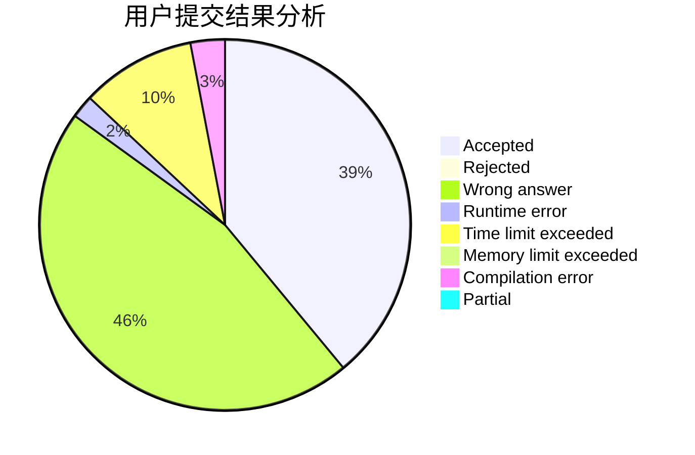
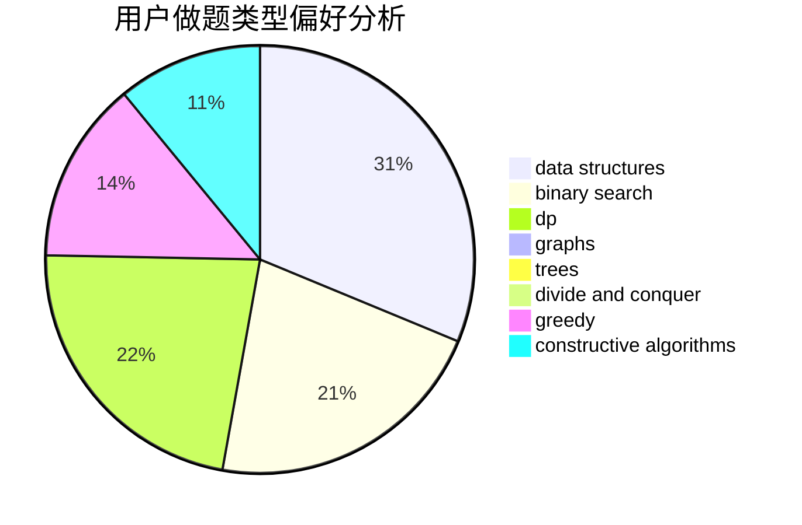
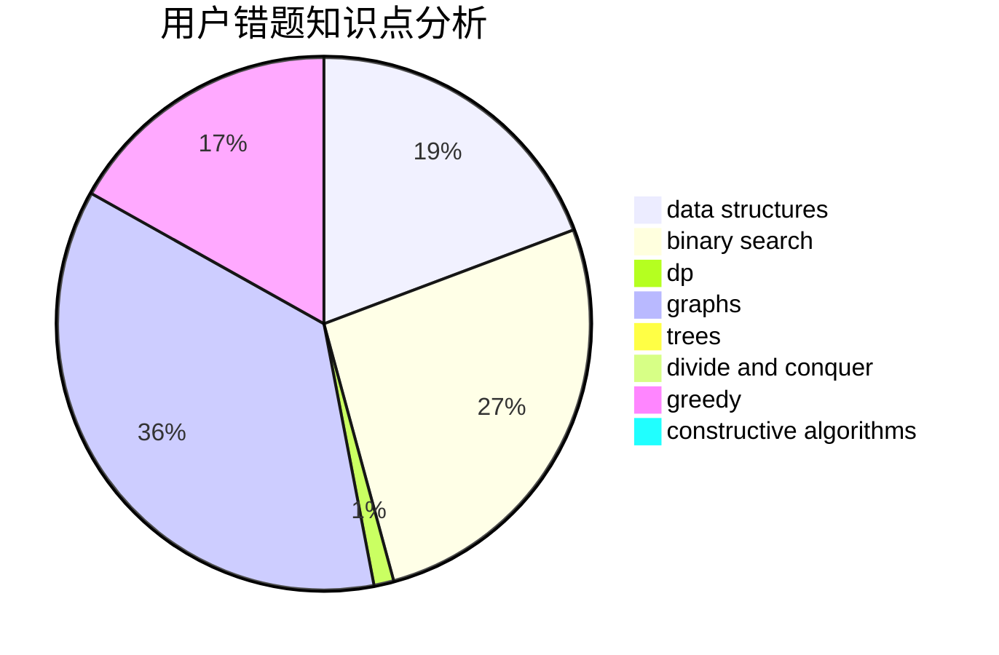

# ZZUPeanut

<!-- tabs:start -->

#### **用户提交结果分析**

#### **用户做题类型偏好分析**

#### **用户错题知识点分析**

<!-- tabs:end -->
# 推荐题目
[414B](https://codeforces.com/contest/414/problem/B)		combinatorics,
                        dp,
                        number theory		  
[1059A](https://codeforces.com/contest/1059/problem/A)		implementation		  
[285E](https://codeforces.com/contest/285/problem/E)		combinatorics,
                        dp,
                        math		  
[575A](https://codeforces.com/contest/575/problem/A)		data structures,
                        math,
                        matrices		  
[392A](https://codeforces.com/contest/392/problem/A)		math		  
[1252F](https://codeforces.com/contest/1252/problem/F)		hashing,
                        trees		  
[215E](https://codeforces.com/contest/215/problem/E)		combinatorics,
                        dp,
                        number theory		  
[750E](https://codeforces.com/contest/750/problem/E)		data structures,
                        divide and conquer,
                        dp,
                        matrices		  
[1419F](https://codeforces.com/contest/1419/problem/F)		binary search,
                        data structures,
                        dfs and similar,
                        dsu,
                        graphs,
                        implementation		  
[152D](https://codeforces.com/contest/152/problem/D)		brute force		  
