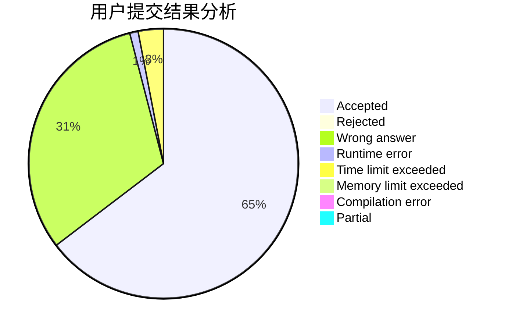
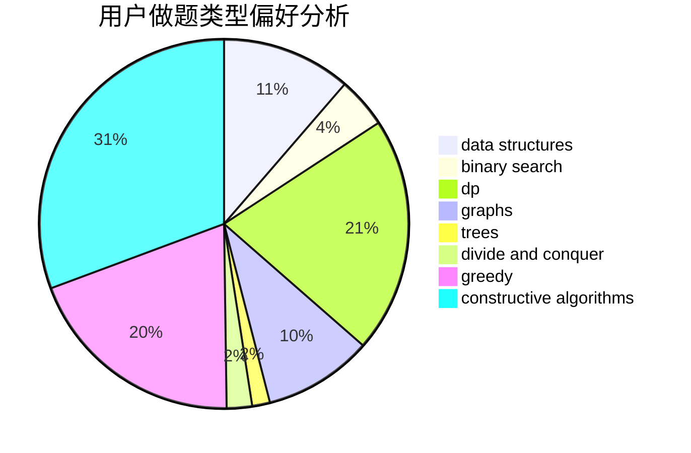
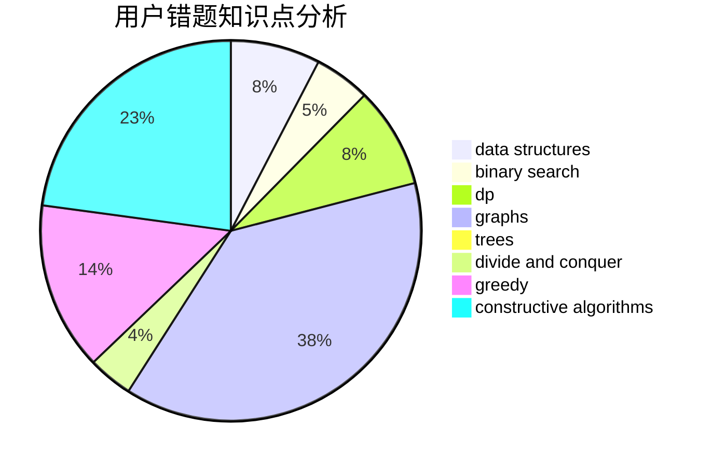

# ZZU_KrySt4l

<!-- tabs:start -->

#### **用户提交结果分析**

#### **用户做题类型偏好分析**

#### **用户错题知识点分析**

<!-- tabs:end -->
# 推荐题目
[814C](https://codeforces.com/contest/814/problem/C)		brute force,
                        dp,
                        strings,
                        two pointers		  
[936A](https://codeforces.com/contest/936/problem/A)		binary search,
                        implementation,
                        math		  
[598A](https://codeforces.com/contest/598/problem/A)		math		  
[938B](https://codeforces.com/contest/938/problem/B)		brute force,
                        greedy		  
[1187C](https://codeforces.com/contest/1187/problem/C)		constructive algorithms,
                        greedy,
                        implementation		  
[1339A](https://codeforces.com/contest/1339/problem/A)		brute force,
                        dp,
                        implementation,
                        math		  
[916E](https://codeforces.com/contest/916/problem/E)		data structures,
                        trees		  
[682D](https://codeforces.com/contest/682/problem/D)		dp,
                        strings		  
[1159A](https://codeforces.com/contest/1159/problem/A)		implementation,
                        math		  
[1493F](https://codeforces.com/contest/1493/problem/F)		bitmasks,
                        interactive,
                        number theory		  
