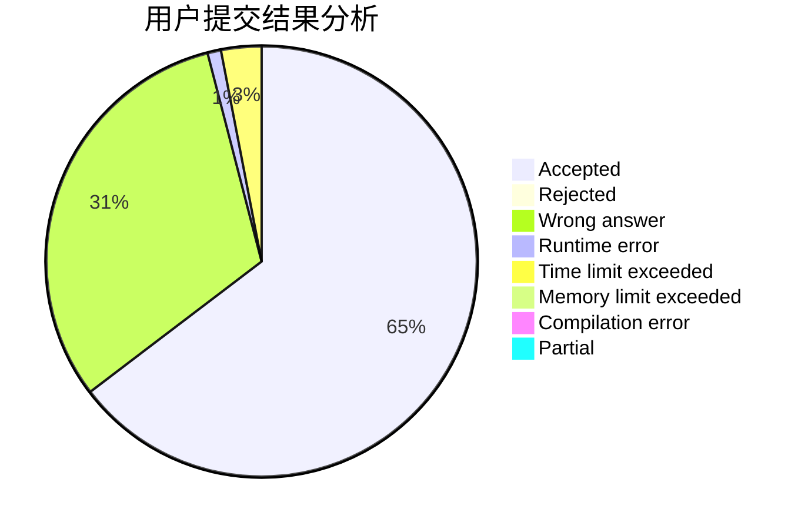
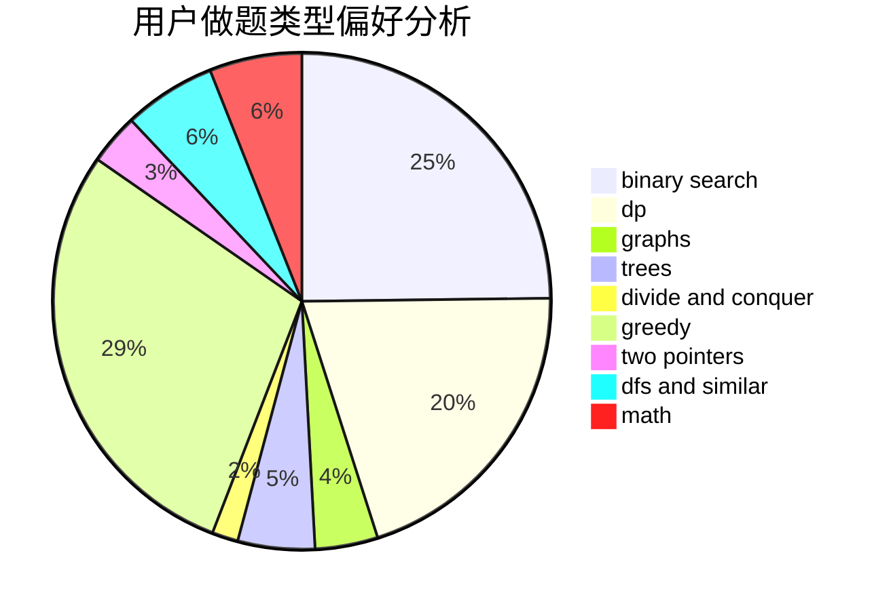

# ZZU_KrySt4l

<!-- tabs:start -->

#### **用户提交结果分析**

#### **用户做题类型偏好分析**

<!-- tabs:end -->
# 推荐题目
[833A](https://codeforces.com/contest/833/problem/A)
[9581](https://codeforces.com/contest/958/problem/1)
[615D](https://codeforces.com/contest/615/problem/D)
[95A](https://codeforces.com/contest/95/problem/A)
[1190E](https://codeforces.com/contest/1190/problem/E)
[1346A](https://codeforces.com/contest/1346/problem/A)
[937A](https://codeforces.com/contest/937/problem/A)
[706E](https://codeforces.com/contest/706/problem/E)
[1161E](https://codeforces.com/contest/1161/problem/E)
[1501F](https://codeforces.com/contest/1501/problem/F)
