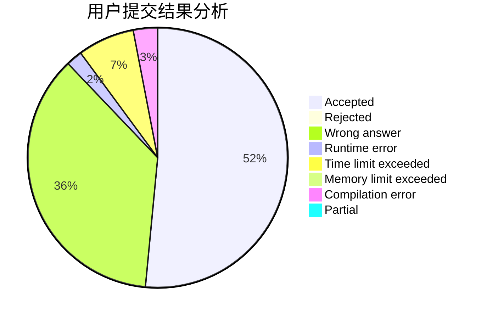
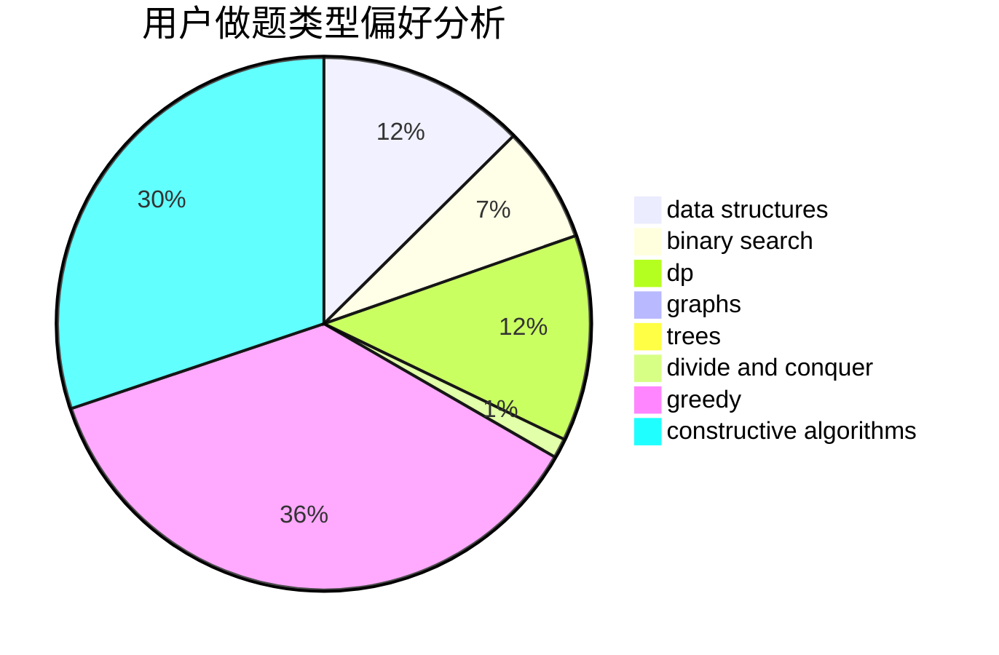

# ZZ_author

<!-- tabs:start -->

#### **用户提交结果分析**

#### **用户做题类型偏好分析**

#### **用户错题知识点分析**

<!-- tabs:end -->
# 推荐题目
[1342D](https://codeforces.com/contest/1342/problem/D)		binary search,
                        constructive algorithms,
                        data structures,
                        greedy,
                        sortings,
                        two pointers		  
[819B](https://codeforces.com/contest/819/problem/B)		data structures,
                        implementation,
                        math		  
[1178F2](https://codeforces.com/contest/1178F/problem/2)		dp		  
[478B](https://codeforces.com/contest/478/problem/B)		combinatorics,
                        constructive algorithms,
                        greedy,
                        math		  
[1149C](https://codeforces.com/contest/1149/problem/C)		data structures,
                        implementation,
                        trees		  
[13D](https://codeforces.com/contest/13/problem/D)		dp,
                        geometry		  
[1357A5](https://codeforces.com/contest/1357A/problem/5)		nan		  
[212E](https://codeforces.com/contest/212/problem/E)		dfs and similar,
                        dp,
                        trees		  
[46F](https://codeforces.com/contest/46/problem/F)		dsu,
                        graphs		  
[24E](https://codeforces.com/contest/24/problem/E)		binary search		  
