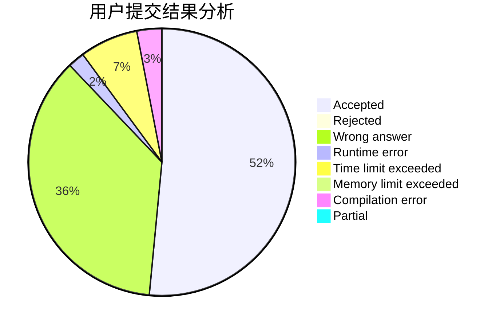
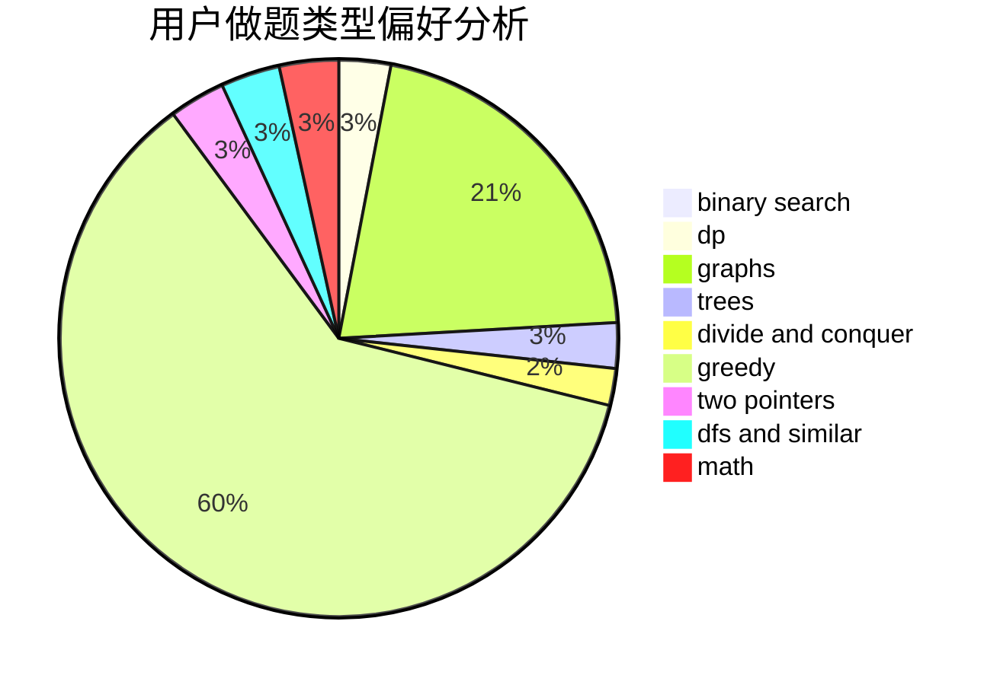

# ZZ_author

<!-- tabs:start -->

#### **用户提交结果分析**

#### **用户做题类型偏好分析**

<!-- tabs:end -->
# 推荐题目
[1349B](https://codeforces.com/contest/1349/problem/B)
[839B](https://codeforces.com/contest/839/problem/B)
[1181B](https://codeforces.com/contest/1181/problem/B)
[498B](https://codeforces.com/contest/498/problem/B)
[1151A](https://codeforces.com/contest/1151/problem/A)
[1409D](https://codeforces.com/contest/1409/problem/D)
[1364A](https://codeforces.com/contest/1364/problem/A)
[232D](https://codeforces.com/contest/232/problem/D)
[489E](https://codeforces.com/contest/489/problem/E)
[269B](https://codeforces.com/contest/269/problem/B)
