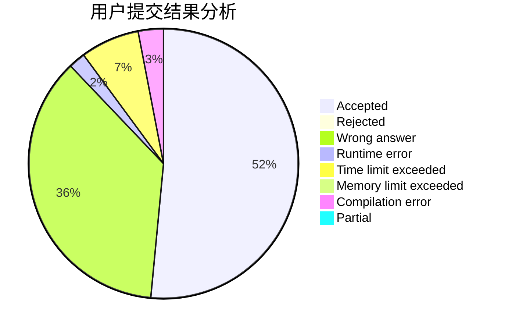
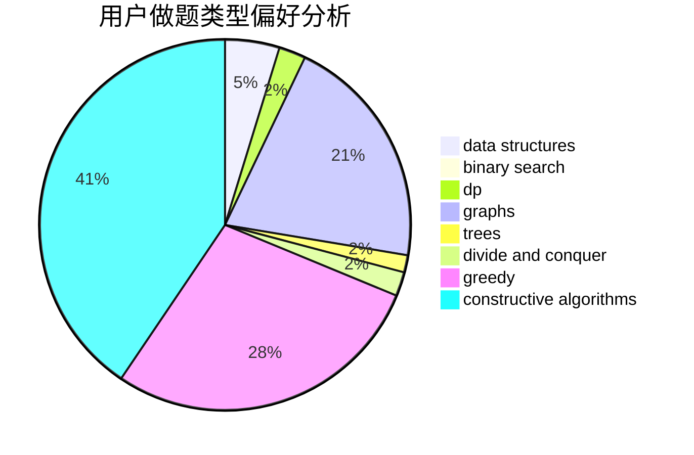

# ZZ_author

<!-- tabs:start -->

#### **用户提交结果分析**

#### **用户做题类型偏好分析**

#### **用户错题知识点分析**

<!-- tabs:end -->
# 推荐题目
[1349B](https://codeforces.com/contest/1349/problem/B)		constructive algorithms,
                        greedy,
                        math		  
[839B](https://codeforces.com/contest/839/problem/B)		brute force,
                        greedy,
                        implementation		  
[1181B](https://codeforces.com/contest/1181/problem/B)		greedy,
                        implementation,
                        strings		  
[498B](https://codeforces.com/contest/498/problem/B)		dp,
                        probabilities,
                        two pointers		  
[1151A](https://codeforces.com/contest/1151/problem/A)		brute force,
                        strings		  
[1409D](https://codeforces.com/contest/1409/problem/D)		greedy,
                        math		  
[1364A](https://codeforces.com/contest/1364/problem/A)		brute force,
                        data structures,
                        number theory,
                        two pointers		  
[232D](https://codeforces.com/contest/232/problem/D)		binary search,
                        data structures,
                        string suffix structures		  
[489E](https://codeforces.com/contest/489/problem/E)		binary search,
                        dp		  
[269B](https://codeforces.com/contest/269/problem/B)		dp		  
