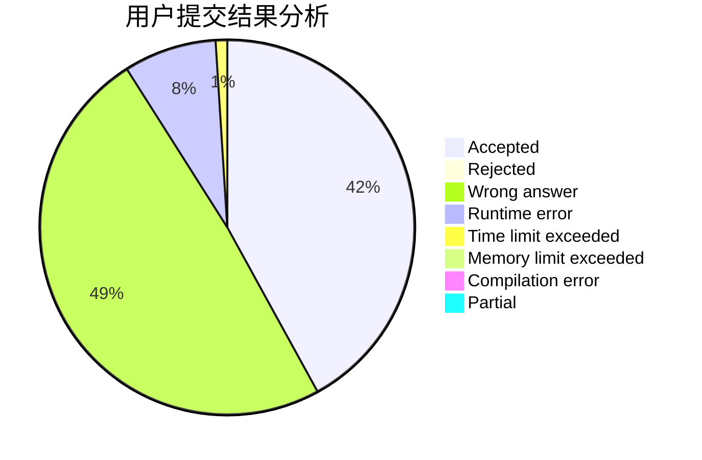
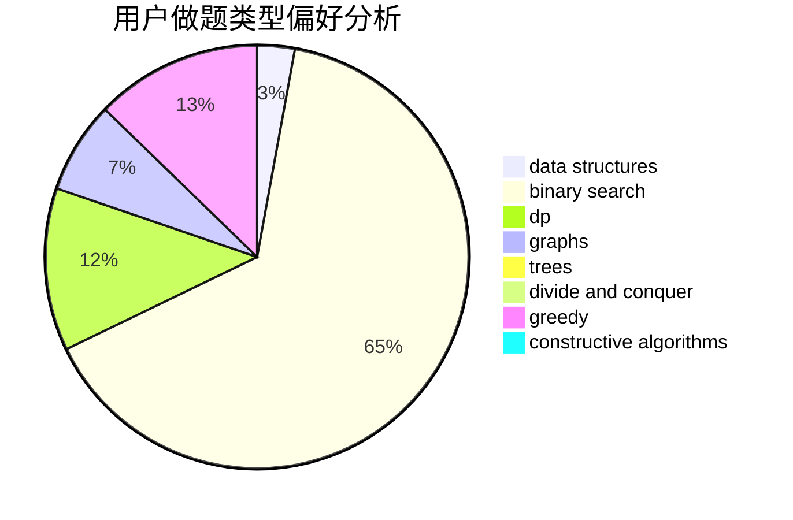

# Zabreture

<!-- tabs:start -->

#### **用户提交结果分析**

#### **用户做题类型偏好分析**

#### **用户错题知识点分析**

<!-- tabs:end -->
# 推荐题目
[424E](https://codeforces.com/contest/424/problem/E)		dfs and similar,
                        dp,
                        probabilities		  
[1183F](https://codeforces.com/contest/1183/problem/F)		brute force,
                        math,
                        sortings		  
[1136E](https://codeforces.com/contest/1136/problem/E)		binary search,
                        data structures		  
[822A](https://codeforces.com/contest/822/problem/A)		implementation,
                        math,
                        number theory		  
[952E](https://codeforces.com/contest/952/problem/E)		nan		  
[908B](https://codeforces.com/contest/908/problem/B)		brute force,
                        implementation		  
[894C](https://codeforces.com/contest/894/problem/C)		constructive algorithms,
                        math		  
[1148E](https://codeforces.com/contest/1148/problem/E)		constructive algorithms,
                        greedy,
                        math,
                        sortings,
                        two pointers		  
[1023D](https://codeforces.com/contest/1023/problem/D)		constructive algorithms,
                        data structures		  
[1427H](https://codeforces.com/contest/1427/problem/H)		binary search,
                        games,
                        geometry,
                        ternary search		  
