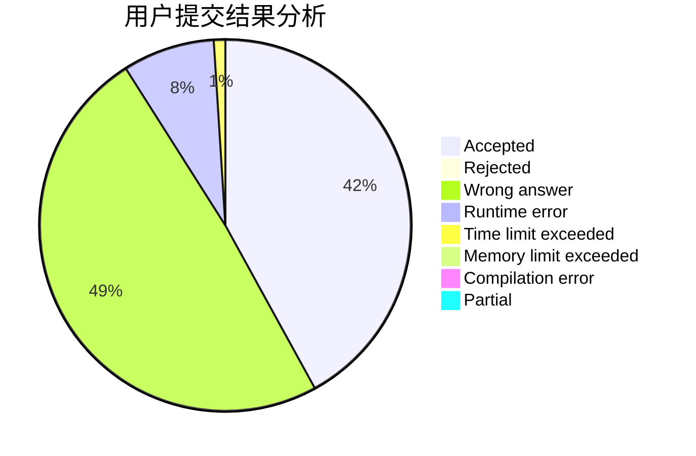
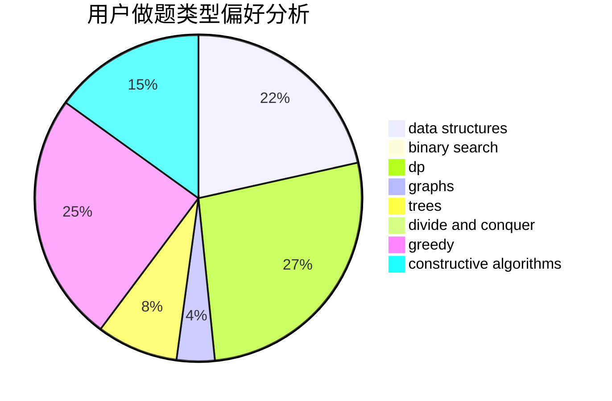

# Zabreture

<!-- tabs:start -->

#### **用户提交结果分析**

#### **用户做题类型偏好分析**

#### **用户错题知识点分析**

<!-- tabs:end -->
# 推荐题目
[448B](https://codeforces.com/contest/448/problem/B)		implementation,
                        strings		  
[1186D](https://codeforces.com/contest/1186/problem/D)		constructive algorithms,
                        greedy,
                        math		  
[1139A](https://codeforces.com/contest/1139/problem/A)		implementation,
                        strings		  
[841D](https://codeforces.com/contest/841/problem/D)		dsu,graphs,sortings,trees		  
[975D](https://codeforces.com/contest/975/problem/D)		geometry,
                        math		  
[922C](https://codeforces.com/contest/922/problem/C)		brute force,
                        number theory		  
[912B](https://codeforces.com/contest/912/problem/B)		bitmasks,
                        constructive algorithms,
                        number theory		  
[114E](https://codeforces.com/contest/114/problem/E)		dsu,graphs,sortings,trees		  
[1023G](https://codeforces.com/contest/1023/problem/G)		data structures,
                        flows,
                        trees		  
[1436F](https://codeforces.com/contest/1436/problem/F)		combinatorics,
                        math,
                        number theory		  
