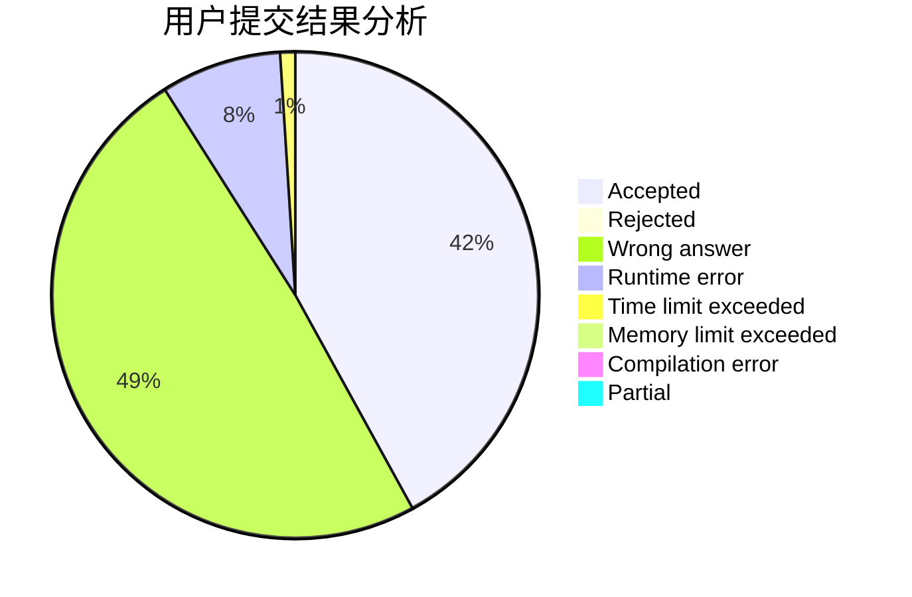
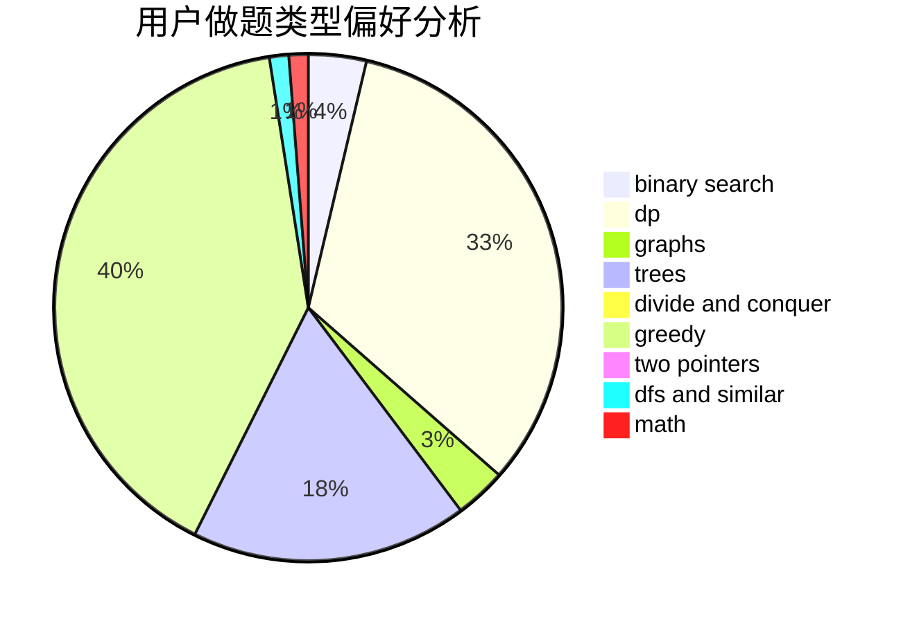

# Zabreture

<!-- tabs:start -->

#### **用户提交结果分析**

#### **用户做题类型偏好分析**

<!-- tabs:end -->
# 推荐题目
[448B](https://codeforces.com/contest/448/problem/B)
[1186D](https://codeforces.com/contest/1186/problem/D)
[1139A](https://codeforces.com/contest/1139/problem/A)
[841D](https://codeforces.com/contest/841/problem/D)
[975D](https://codeforces.com/contest/975/problem/D)
[922C](https://codeforces.com/contest/922/problem/C)
[912B](https://codeforces.com/contest/912/problem/B)
[114E](https://codeforces.com/contest/114/problem/E)
[1023G](https://codeforces.com/contest/1023/problem/G)
[1436F](https://codeforces.com/contest/1436/problem/F)
