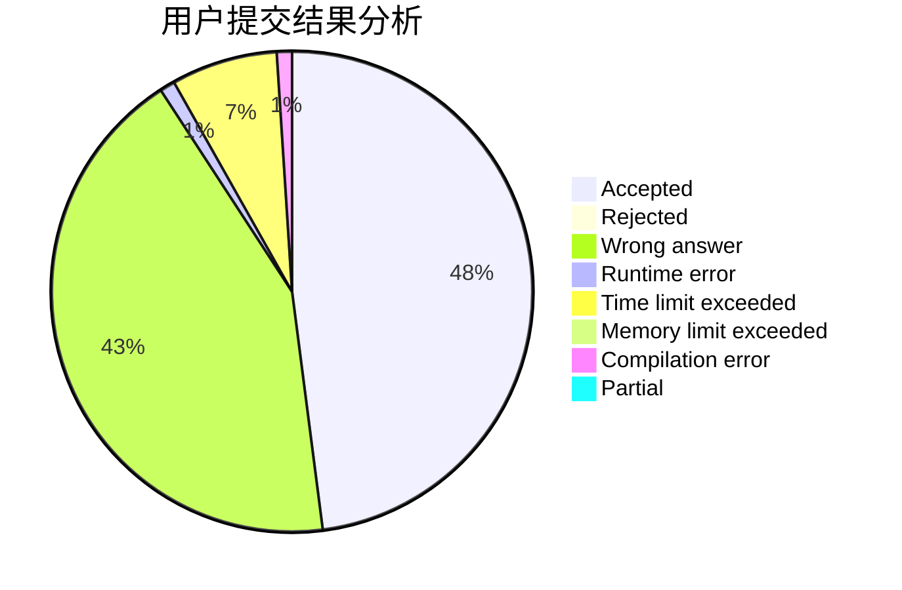
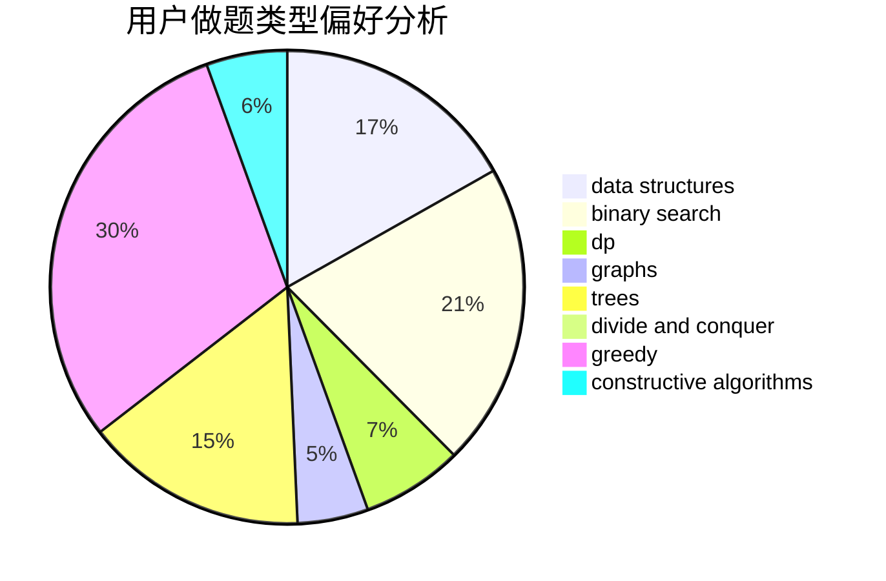
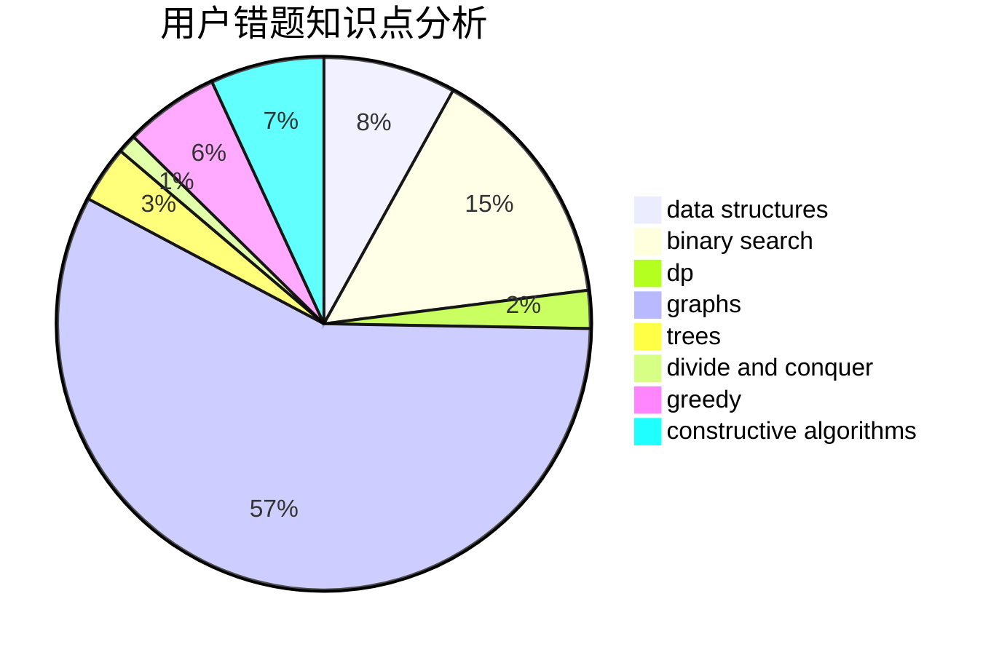

# Zarxdy34
<!-- tabs:start -->
#### **用户提交结果分析**

#### **用户做题类型偏好分析**

#### **用户错题知识点分析**

<!-- tabs:end -->
# 推荐题目
[Tree](http://codeforces.com/problemset/problem/23/E)		dp		  
[Alice, Bob and Chocolate](http://codeforces.com/problemset/problem/6/C)		greedy,
                        two pointers		  
[Magic multisets](http://codeforces.com/problemset/problem/981/G)		data structures		  
[Andryusha and Socks](https://codeforces.com/contest/782/problem/A)		implementation		  
[The Pleasant Walk](http://codeforces.com/problemset/problem/1090/M)		implementation		  
[Cashier](http://codeforces.com/problemset/problem/1059/A)		implementation		  
[Tram](http://codeforces.com/problemset/problem/746/C)		constructive algorithms,
                        implementation,
                        math		  
[Soap Time! - 2](http://codeforces.com/problemset/problem/185/E)		binary search,
                        data structures		  
[Song of the Sirens](http://codeforces.com/problemset/problem/1466/G)		combinatorics,
                        divide and conquer,
                        hashing,
                        math,
                        string suffix structures,
                        strings		  
[The Doors](http://codeforces.com/problemset/problem/1143/A)		implementation		  
<!-- tabs:start -->
#### **data structures**
[Tree](http://codeforces.com/problemset/problem/981/G)		data structures		  
[Alice, Bob and Chocolate](http://codeforces.com/problemset/problem/185/E)		binary search,
                        data structures		  
[Magic multisets](http://codeforces.com/problemset/problem/1073/G)		data structures,
                        string suffix structures		  
[Andryusha and Socks](http://codeforces.com/problemset/problem/1000/C)		data structures,
                        implementation,
                        sortings		  
[The Pleasant Walk](http://codeforces.com/problemset/problem/1098/D)		data structures		  
[Cashier](http://codeforces.com/problemset/problem/1381/A1)		constructive algorithms,
                        data structures,
                        strings		  
[Tram](http://codeforces.com/problemset/problem/187/D)		data structures		  
[Soap Time! - 2](http://codeforces.com/problemset/problem/1469/F)		binary search,
                        data structures,
                        greedy		  
[Song of the Sirens](http://codeforces.com/problemset/problem/1175/B)		data structures,
                        expression parsing,
                        implementation		  
[The Doors](http://codeforces.com/problemset/problem/1458/F)		data structures,
                        trees		  
#### **binary search**
[Tree](http://codeforces.com/problemset/problem/185/E)		binary search,
                        data structures		  
[Alice, Bob and Chocolate](http://codeforces.com/problemset/problem/1469/F)		binary search,
                        data structures,
                        greedy		  
[Magic multisets](http://codeforces.com/problemset/problem/1492/C)		binary search,
                        data structures,
                        dp,
                        greedy,
                        two pointers		  
[Andryusha and Socks](http://codeforces.com/problemset/problem/1463/D)		binary search,
                        constructive algorithms,
                        greedy,
                        two pointers		  
[The Pleasant Walk](http://codeforces.com/problemset/problem/1490/G)		binary search,
                        data structures,
                        math		  
[Cashier](http://codeforces.com/problemset/problem/1479/D)		binary search,
                        bitmasks,
                        brute force,
                        data structures,
                        probabilities,
                        trees		  
[Tram](http://codeforces.com/problemset/problem/1436/E)		binary search,
                        data structures,
                        two pointers		  
[Soap Time! - 2](http://codeforces.com/problemset/problem/1461/D)		binary search,
                        brute force,
                        data structures,
                        divide and conquer,
                        implementation,
                        sortings		  
[Song of the Sirens](http://codeforces.com/problemset/problem/1493/C)		binary search,
                        brute force,
                        constructive algorithms,
                        greedy,
                        strings		  
[The Doors](http://codeforces.com/problemset/problem/1487/D)		binary search,
                        brute force,
                        math,
                        number theory		  
#### **dp**
[Tree](http://codeforces.com/problemset/problem/23/E)		dp		  
[Alice, Bob and Chocolate](http://codeforces.com/problemset/problem/1218/C)		dp		  
[Magic multisets](http://codeforces.com/problemset/problem/354/D)		dp		  
[Andryusha and Socks](http://codeforces.com/problemset/problem/277/D)		dp,
                        probabilities		  
[The Pleasant Walk](http://codeforces.com/problemset/problem/797/B)		dp,
                        greedy,
                        implementation		  
[Cashier](http://codeforces.com/problemset/problem/316/D2)		dp		  
[Tram](http://codeforces.com/problemset/problem/1492/C)		binary search,
                        data structures,
                        dp,
                        greedy,
                        two pointers		  
[Soap Time! - 2](https://codeforces.com/contest/1457/problem/C)		brute force,
                        dp,
                        implementation		  
[Song of the Sirens](http://codeforces.com/problemset/problem/1491/C)		brute force,
                        data structures,
                        dp,
                        greedy,
                        implementation		  
[The Doors](http://codeforces.com/problemset/problem/1437/C)		dp,
                        flows,
                        graph matchings,
                        greedy,
                        math,
                        sortings		  
#### **graph**
[Tree](https://codeforces.com/contest/782/problem/C)		dfs and similar,
                        graphs,
                        greedy,
                        trees		  
[Alice, Bob and Chocolate](http://codeforces.com/problemset/problem/1003/E)		constructive algorithms,
                        graphs		  
[Magic multisets](http://codeforces.com/problemset/problem/1361/E)		dfs and similar,
                        graphs,
                        probabilities,
                        trees		  
[Andryusha and Socks](http://codeforces.com/problemset/problem/1424/M)		graphs,
                        sortings		  
[The Pleasant Walk](http://codeforces.com/problemset/problem/20/C)		graphs,
                        shortest paths		  
[Cashier](http://codeforces.com/problemset/problem/757/F)		data structures,
                        graphs,
                        shortest paths		  
[Tram](http://codeforces.com/problemset/problem/1487/C)		brute force,
                        constructive algorithms,
                        dfs and similar,
                        graphs,
                        greedy,
                        implementation,
                        math		  
[Soap Time! - 2](http://codeforces.com/problemset/problem/1437/C)		dp,
                        flows,
                        graph matchings,
                        greedy,
                        math,
                        sortings		  
[Song of the Sirens](http://codeforces.com/problemset/problem/1470/D)		constructive algorithms,
                        dfs and similar,
                        graph matchings,
                        graphs,
                        greedy		  
[The Doors](http://codeforces.com/problemset/problem/1476/C)		dp,
                        graphs,
                        greedy		  
#### **trees**
[Tree](https://codeforces.com/contest/782/problem/C)		dfs and similar,
                        graphs,
                        greedy,
                        trees		  
[Alice, Bob and Chocolate](http://codeforces.com/problemset/problem/1361/E)		dfs and similar,
                        graphs,
                        probabilities,
                        trees		  
[Magic multisets](http://codeforces.com/problemset/problem/1458/F)		data structures,
                        trees		  
[Andryusha and Socks](http://codeforces.com/problemset/problem/665/E)		data structures,
                        divide and conquer,
                        strings,
                        trees		  
[The Pleasant Walk](http://codeforces.com/problemset/problem/1479/D)		binary search,
                        bitmasks,
                        brute force,
                        data structures,
                        probabilities,
                        trees		  
[Cashier](http://codeforces.com/problemset/problem/1511/C)		brute force,
                        data structures,
                        implementation,
                        trees		  
[Tram](http://codeforces.com/problemset/problem/1499/F)		combinatorics,
                        dfs and similar,
                        dp,
                        trees		  
[Soap Time! - 2](http://codeforces.com/problemset/problem/1491/E)		brute force,
                        dfs and similar,
                        divide and conquer,
                        number theory,
                        trees		  
[Song of the Sirens](http://codeforces.com/problemset/problem/1466/D)		data structures,
                        greedy,
                        sortings,
                        trees		  
[The Doors](http://codeforces.com/problemset/problem/1495/D)		combinatorics,
                        dfs and similar,
                        graphs,
                        math,
                        shortest paths,
                        trees		  
#### **divide and conquer**
[Tree](http://codeforces.com/problemset/problem/1466/G)		combinatorics,
                        divide and conquer,
                        hashing,
                        math,
                        string suffix structures,
                        strings		  
[Alice, Bob and Chocolate](http://codeforces.com/problemset/problem/665/E)		data structures,
                        divide and conquer,
                        strings,
                        trees		  
[Magic multisets](http://codeforces.com/problemset/problem/1461/D)		binary search,
                        brute force,
                        data structures,
                        divide and conquer,
                        implementation,
                        sortings		  
[Andryusha and Socks](http://codeforces.com/problemset/problem/1466/G)		combinatorics,
                        divide and conquer,
                        hashing,
                        math,
                        string suffix structures,
                        strings		  
[The Pleasant Walk](http://codeforces.com/problemset/problem/1490/D)		dfs and similar,
                        divide and conquer,
                        implementation		  
[Cashier](https://codeforces.com/contest/1483/problem/C)		data structures,
                        divide and conquer,
                        dp		  
[Tram](http://codeforces.com/problemset/problem/1491/E)		brute force,
                        dfs and similar,
                        divide and conquer,
                        number theory,
                        trees		  
[Soap Time! - 2](http://codeforces.com/problemset/problem/1303/G)		data structures,
                        divide and conquer,
                        geometry,
                        trees		  
[Song of the Sirens](http://codeforces.com/problemset/problem/1494/D)		constructive algorithms,
                        data structures,
                        dfs and similar,
                        divide and conquer,
                        dsu,
                        greedy,
                        sortings,
                        trees		  
[The Doors](http://codeforces.com/problemset/problem/1482/E)		data structures,
                        divide and conquer,
                        dp		  
#### **greedy**
[Tree](http://codeforces.com/problemset/problem/6/C)		greedy,
                        two pointers		  
[Alice, Bob and Chocolate](https://codeforces.com/contest/782/problem/C)		dfs and similar,
                        graphs,
                        greedy,
                        trees		  
[Magic multisets](http://codeforces.com/problemset/problem/797/B)		dp,
                        greedy,
                        implementation		  
[Andryusha and Socks](http://codeforces.com/problemset/problem/1469/F)		binary search,
                        data structures,
                        greedy		  
[The Pleasant Walk](https://codeforces.com/contest/1293/problem/D)		brute force,
                        constructive algorithms,
                        geometry,
                        greedy,
                        implementation		  
[Cashier](http://codeforces.com/problemset/problem/1469/A)		constructive algorithms,
                        greedy		  
[Tram](http://codeforces.com/problemset/problem/1492/C)		binary search,
                        data structures,
                        dp,
                        greedy,
                        two pointers		  
[Soap Time! - 2](https://codeforces.com/contest/1496/problem/C)		geometry,
                        greedy,
                        math,
                        sortings		  
[Song of the Sirens](http://codeforces.com/problemset/problem/1493/A)		constructive algorithms,
                        greedy		  
[The Doors](http://codeforces.com/problemset/problem/1463/D)		binary search,
                        constructive algorithms,
                        greedy,
                        two pointers		  
#### **constructive algorithms**
[Tree](http://codeforces.com/problemset/problem/746/C)		constructive algorithms,
                        implementation,
                        math		  
[Alice, Bob and Chocolate](http://codeforces.com/problemset/problem/1003/E)		constructive algorithms,
                        graphs		  
[Magic multisets](http://codeforces.com/problemset/problem/171/A)		*special problem,
                        constructive algorithms		  
[Andryusha and Socks](https://codeforces.com/contest/1071/problem/C)		constructive algorithms		  
[The Pleasant Walk](http://codeforces.com/problemset/problem/894/B)		combinatorics,
                        constructive algorithms,
                        math,
                        number theory		  
[Cashier](http://codeforces.com/problemset/problem/1381/A1)		constructive algorithms,
                        data structures,
                        strings		  
[Tram](https://codeforces.com/contest/1293/problem/D)		brute force,
                        constructive algorithms,
                        geometry,
                        greedy,
                        implementation		  
[Soap Time! - 2](http://codeforces.com/problemset/problem/1469/A)		constructive algorithms,
                        greedy		  
[Song of the Sirens](http://codeforces.com/problemset/problem/1493/A)		constructive algorithms,
                        greedy		  
[The Doors](http://codeforces.com/problemset/problem/1463/D)		binary search,
                        constructive algorithms,
                        greedy,
                        two pointers		  
#### **sortings**
[Tree](http://codeforces.com/problemset/problem/1000/C)		data structures,
                        implementation,
                        sortings		  
[Alice, Bob and Chocolate](http://codeforces.com/problemset/problem/1424/M)		graphs,
                        sortings		  
[Magic multisets](https://codeforces.com/contest/1496/problem/C)		geometry,
                        greedy,
                        math,
                        sortings		  
[Andryusha and Socks](http://codeforces.com/problemset/problem/1495/A)		geometry,
                        greedy,
                        math,
                        sortings		  
[The Pleasant Walk](http://codeforces.com/problemset/problem/1497/A)		brute force,
                        data structures,
                        greedy,
                        sortings		  
[Cashier](http://codeforces.com/problemset/problem/1427/A)		math,
                        sortings		  
[Tram](http://codeforces.com/problemset/problem/1461/D)		binary search,
                        brute force,
                        data structures,
                        divide and conquer,
                        implementation,
                        sortings		  
[Soap Time! - 2](http://codeforces.com/problemset/problem/1437/C)		dp,
                        flows,
                        graph matchings,
                        greedy,
                        math,
                        sortings		  
[Song of the Sirens](http://codeforces.com/problemset/problem/1473/A)		greedy,
                        implementation,
                        math,
                        sortings		  
[The Doors](http://codeforces.com/problemset/problem/1486/B)		binary search,
                        geometry,
                        shortest paths,
                        sortings		  
<!-- tabs:end -->
