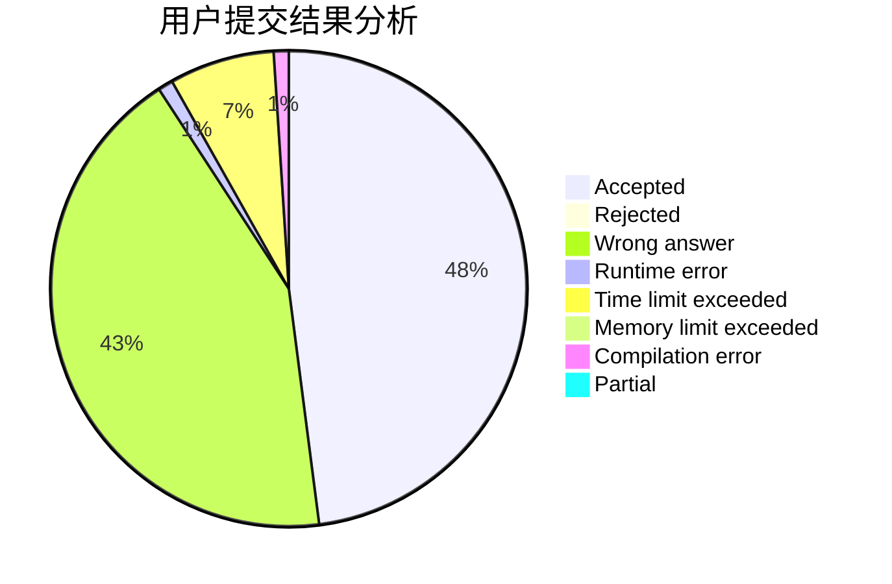
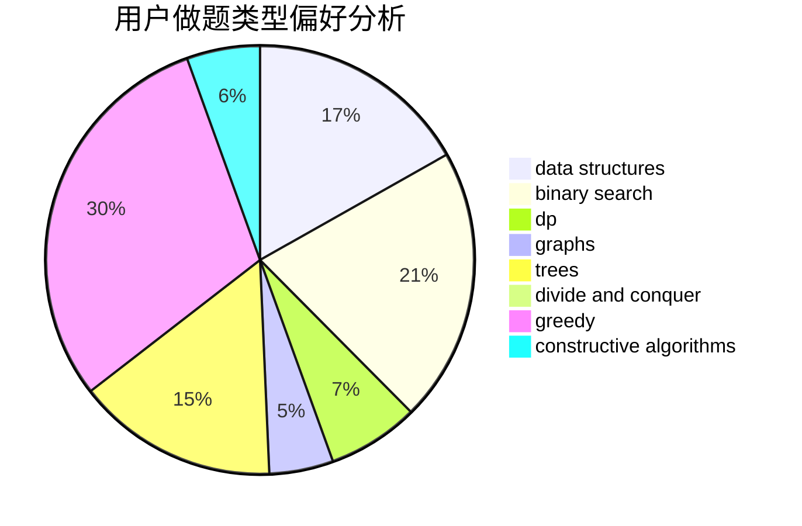
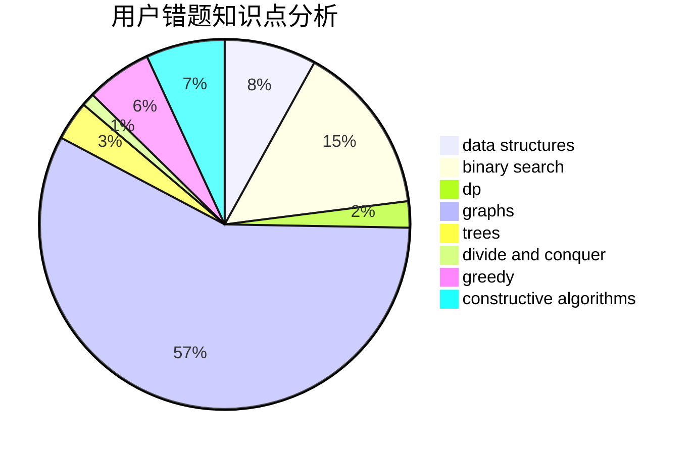

# Zarxdy34

<!-- tabs:start -->

#### **用户提交结果分析**

#### **用户做题类型偏好分析**

#### **用户错题知识点分析**

<!-- tabs:end -->
# 推荐题目
[6C](https://codeforces.com/contest/6/problem/C)		greedy,
                        two pointers		  
[782C](https://codeforces.com/contest/782/problem/C)		dsu,graphs,sortings,trees		  
[1466G](https://codeforces.com/contest/1466/problem/G)		combinatorics,
                        divide and conquer,
                        hashing,
                        math,
                        string suffix structures,
                        strings		  
[1071C](https://codeforces.com/contest/1071/problem/C)		dsu,graphs,sortings,trees		  
[1218C](https://codeforces.com/contest/1218/problem/C)		dp		  
[1175B](https://codeforces.com/contest/1175/problem/B)		data structures,
                        expression parsing,
                        implementation		  
[1059A](https://codeforces.com/contest/1059/problem/A)		implementation		  
[1073G](https://codeforces.com/contest/1073/problem/G)		data structures,
                        string suffix structures		  
[1000C](https://codeforces.com/contest/1000/problem/C)		data structures,
                        implementation,
                        sortings		  
[277D](https://codeforces.com/contest/277/problem/D)		dp,
                        probabilities		  
