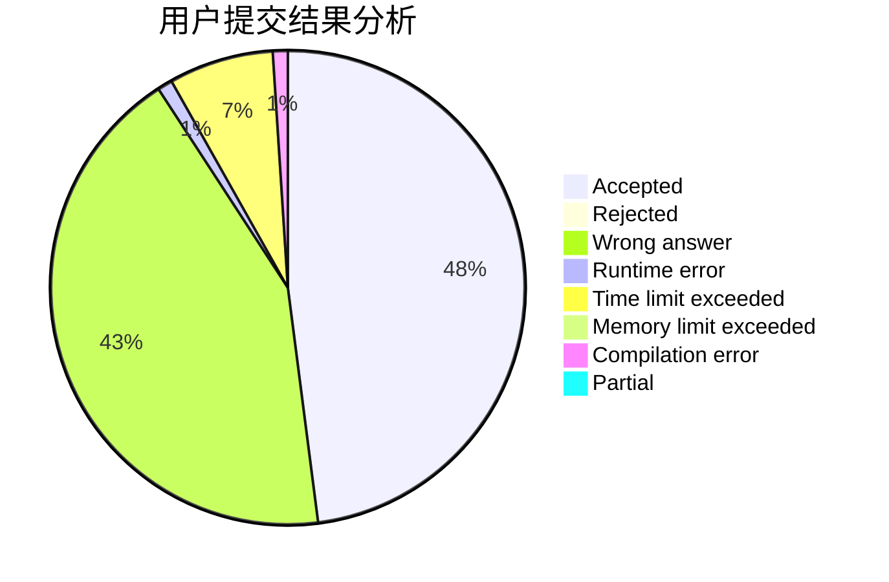
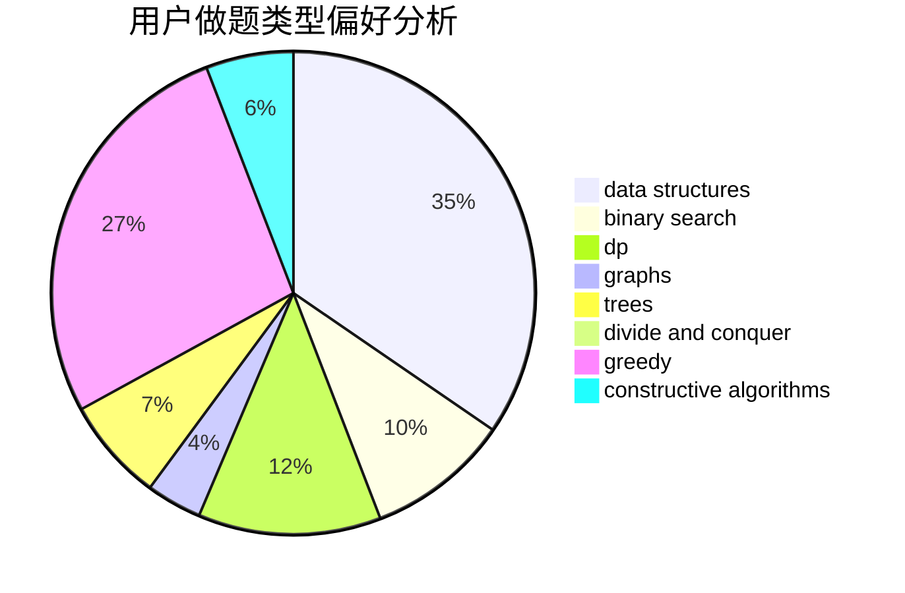
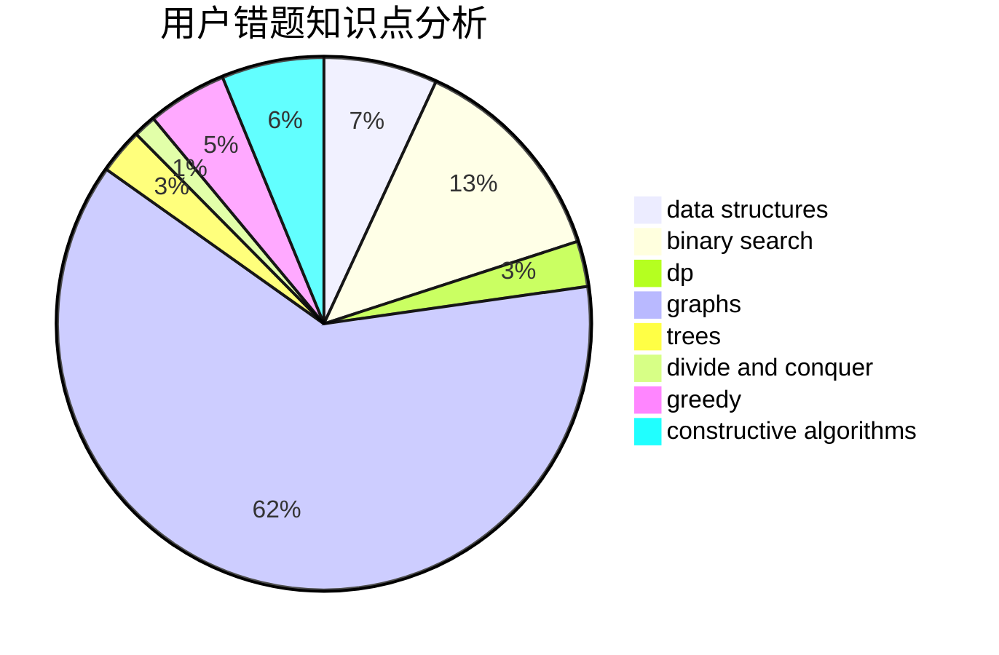

# Zarxdy34

<!-- tabs:start -->

#### **用户提交结果分析**

#### **用户做题类型偏好分析**

#### **用户错题知识点分析**

<!-- tabs:end -->
# 推荐题目
[717E](https://codeforces.com/contest/717/problem/E)		dfs and similar		  
[800B](https://codeforces.com/contest/800/problem/B)		dsu,graphs,sortings,trees		  
[1473G](https://codeforces.com/contest/1473/problem/G)		combinatorics,
                        dp,
                        fft,
                        math		  
[1072B](https://codeforces.com/contest/1072/problem/B)		dsu,graphs,sortings,trees		  
[1225E](https://codeforces.com/contest/1225/problem/E)		binary search,
                        dp		  
[1178B](https://codeforces.com/contest/1178/problem/B)		dp,
                        strings		  
[1059D](https://codeforces.com/contest/1059/problem/D)		binary search,
                        geometry,
                        ternary search		  
[1074C](https://codeforces.com/contest/1074/problem/C)		dsu,graphs,sortings,trees		  
[1000C](https://codeforces.com/contest/1000/problem/C)		data structures,
                        implementation,
                        sortings		  
[292E](https://codeforces.com/contest/292/problem/E)		data structures		  
