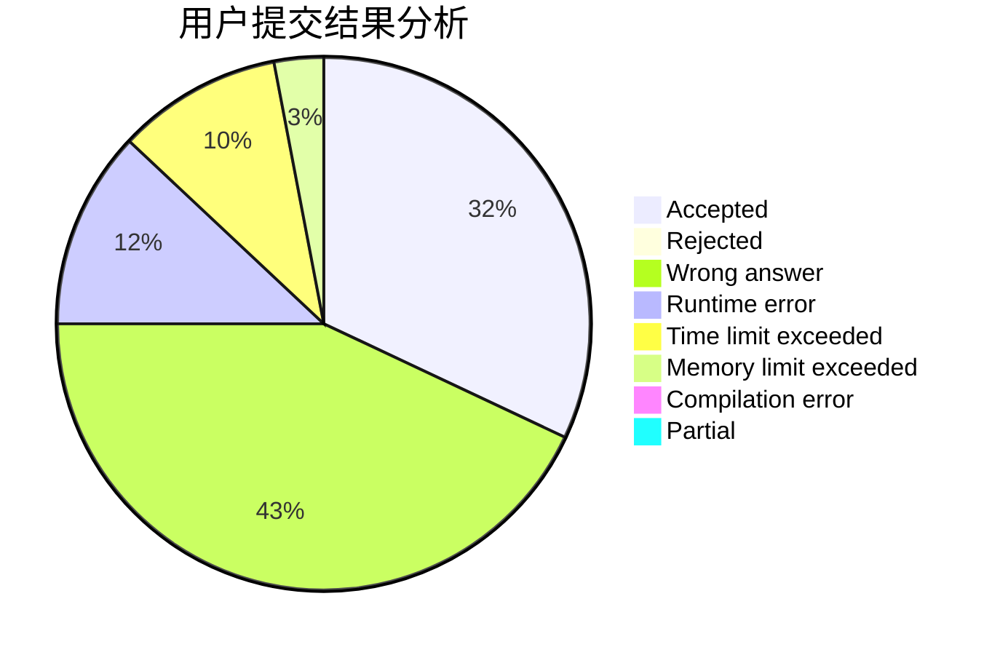
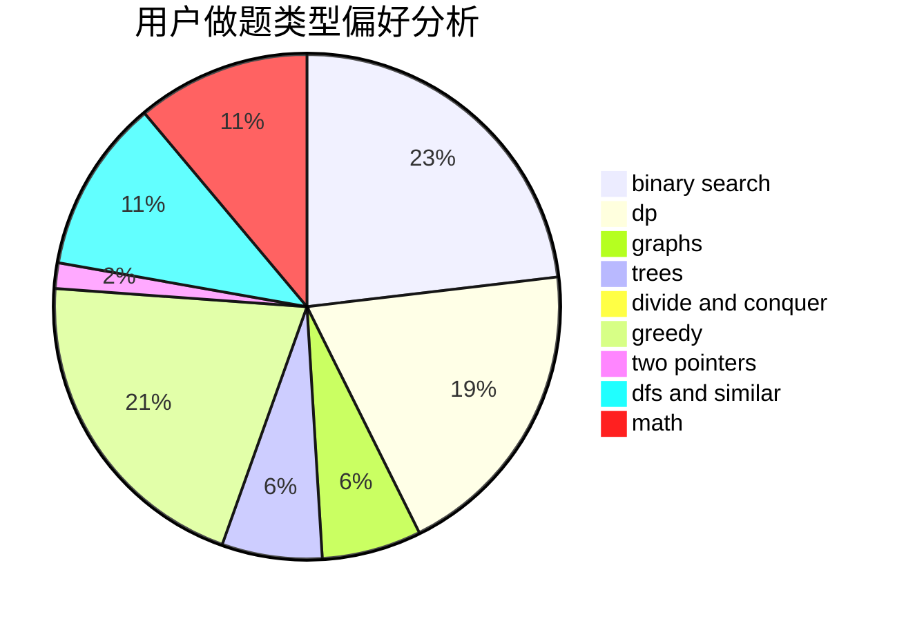

# Zayin

<!-- tabs:start -->

#### **用户提交结果分析**

#### **用户做题类型偏好分析**

<!-- tabs:end -->
# 推荐题目
[1486D](https://codeforces.com/contest/1486/problem/D)
[848C](https://codeforces.com/contest/848/problem/C)
[152E](https://codeforces.com/contest/152/problem/E)
[275B](https://codeforces.com/contest/275/problem/B)
[746C](https://codeforces.com/contest/746/problem/C)
[439D](https://codeforces.com/contest/439/problem/D)
[1210C](https://codeforces.com/contest/1210/problem/C)
[335F](https://codeforces.com/contest/335/problem/F)
[152D](https://codeforces.com/contest/152/problem/D)
[1023G](https://codeforces.com/contest/1023/problem/G)
