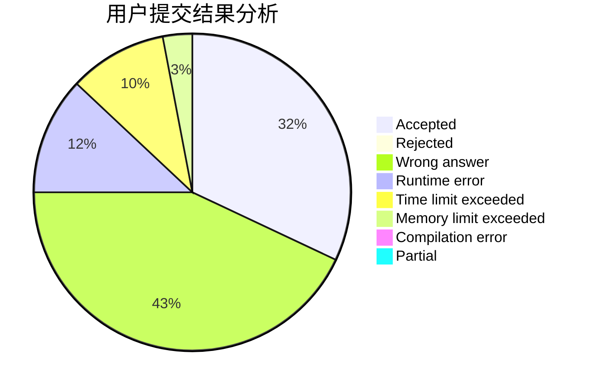
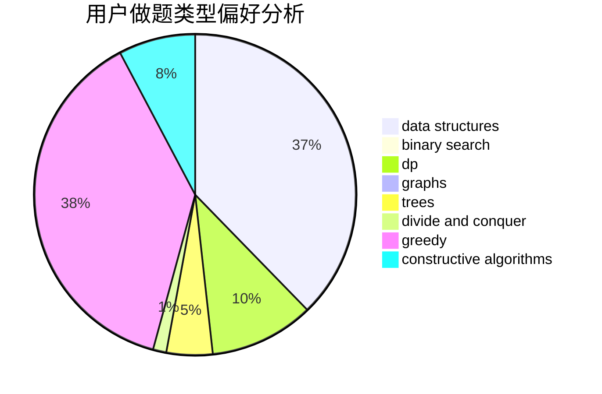

# Zayin

<!-- tabs:start -->

#### **用户提交结果分析**

#### **用户做题类型偏好分析**

#### **用户错题知识点分析**

<!-- tabs:end -->
# 推荐题目
[1486D](https://codeforces.com/contest/1486/problem/D)		binary search,
                        data structures,
                        dp		  
[848C](https://codeforces.com/contest/848/problem/C)		data structures,
                        divide and conquer		  
[152E](https://codeforces.com/contest/152/problem/E)		bitmasks,
                        dp,
                        graphs,
                        trees		  
[275B](https://codeforces.com/contest/275/problem/B)		constructive algorithms,
                        implementation		  
[746C](https://codeforces.com/contest/746/problem/C)		constructive algorithms,
                        implementation,
                        math		  
[439D](https://codeforces.com/contest/439/problem/D)		binary search,
                        sortings,
                        ternary search,
                        two pointers		  
[1210C](https://codeforces.com/contest/1210/problem/C)		math,
                        number theory,
                        trees		  
[335F](https://codeforces.com/contest/335/problem/F)		dp,
                        greedy		  
[152D](https://codeforces.com/contest/152/problem/D)		brute force		  
[1023G](https://codeforces.com/contest/1023/problem/G)		data structures,
                        flows,
                        trees		  
