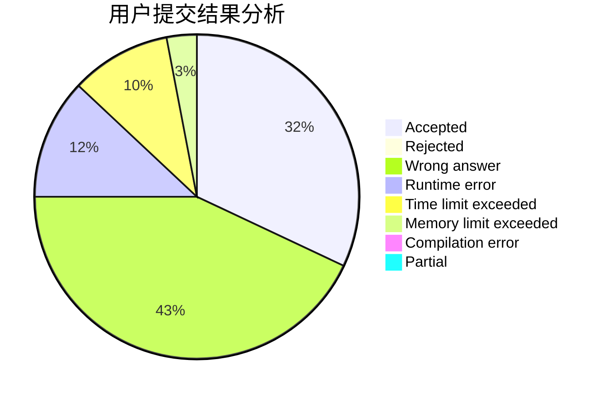
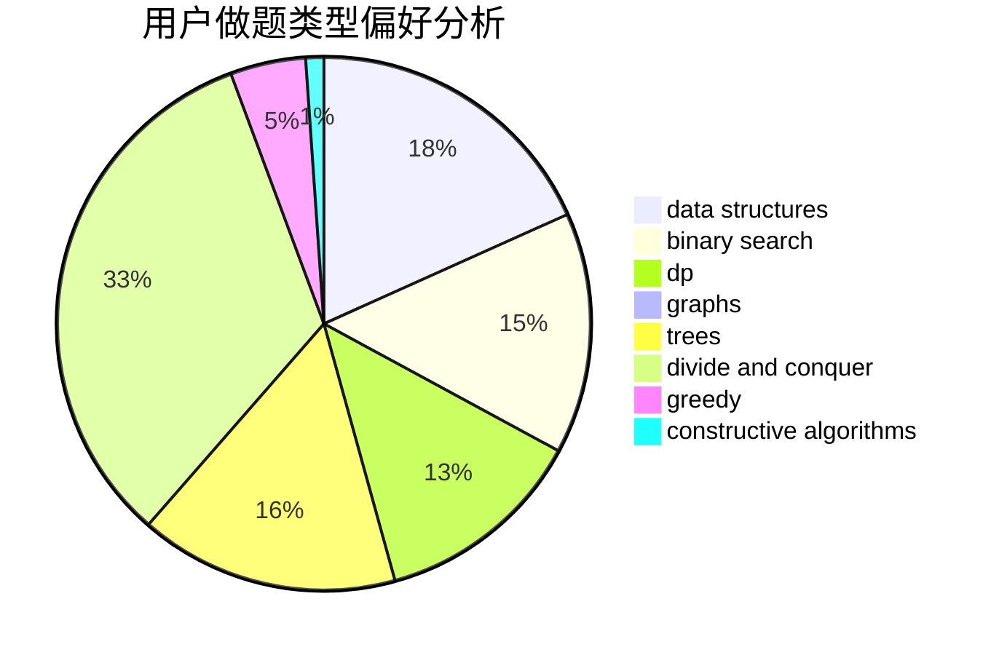

# Zayin

<!-- tabs:start -->

#### **用户提交结果分析**

#### **用户做题类型偏好分析**

#### **用户错题知识点分析**

<!-- tabs:end -->
# 推荐题目
[1477F](https://codeforces.com/contest/1477/problem/F)		combinatorics,
                        fft,
                        math,
                        probabilities		  
[830C](https://codeforces.com/contest/830/problem/C)		brute force,
                        data structures,
                        implementation,
                        math,
                        number theory,
                        sortings,
                        two pointers		  
[1505D](https://codeforces.com/contest/1505/problem/D)		number theory		  
[258C](https://codeforces.com/contest/258/problem/C)		binary search,
                        combinatorics,
                        dp,
                        math		  
[729C](https://codeforces.com/contest/729/problem/C)		binary search,
                        greedy,
                        sortings		  
[414B](https://codeforces.com/contest/414/problem/B)		combinatorics,
                        dp,
                        number theory		  
[1206B](https://codeforces.com/contest/1206/problem/B)		dp,
                        implementation		  
[312A](https://codeforces.com/contest/312/problem/A)		implementation,
                        strings		  
[1505C](https://codeforces.com/contest/1505/problem/C)		implementation		  
[1023D](https://codeforces.com/contest/1023/problem/D)		constructive algorithms,
                        data structures		  
