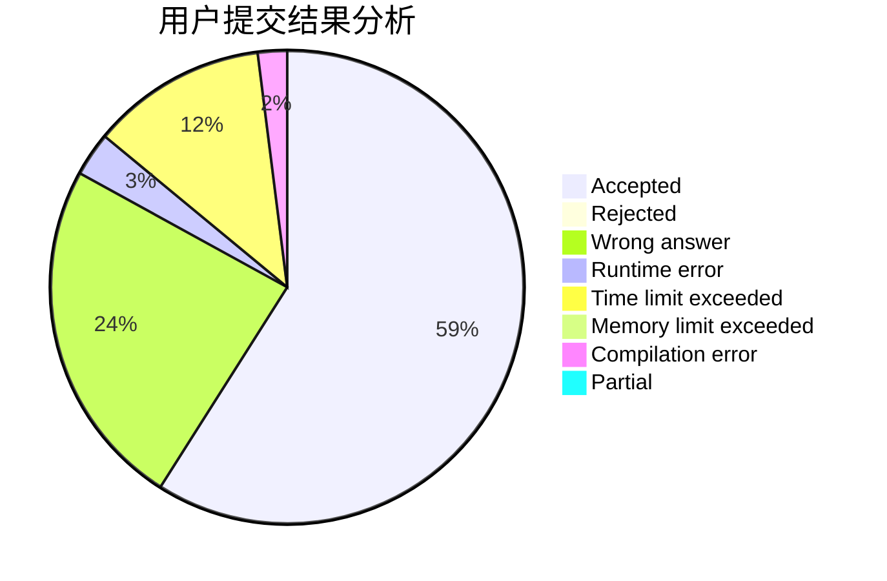
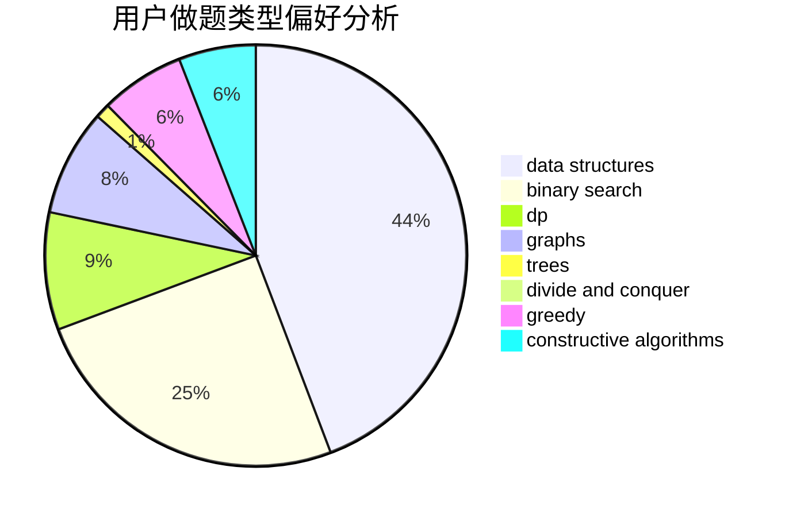

# Alice_Synthesis

<!-- tabs:start -->

#### **用户提交结果分析**

#### **用户做题类型偏好分析**

#### **用户错题知识点分析**

<!-- tabs:end -->
# 推荐题目
[1363D](https://codeforces.com/contest/1363/problem/D)		binary search,
                        implementation,
                        interactive,
                        math		  
[266D](https://codeforces.com/contest/266/problem/D)		graphs,
                        math,
                        shortest paths		  
[1292C](https://codeforces.com/contest/1292/problem/C)		combinatorics,
                        dfs and similar,
                        dp,
                        greedy,
                        trees		  
[195C](https://codeforces.com/contest/195/problem/C)		expression parsing,
                        implementation		  
[268A](https://codeforces.com/contest/268/problem/A)		brute force		  
[1008B](https://codeforces.com/contest/1008/problem/B)		greedy,
                        sortings		  
[165C](https://codeforces.com/contest/165/problem/C)		binary search,
                        brute force,
                        dp,
                        math,
                        strings,
                        two pointers		  
[1237C1](https://codeforces.com/contest/1237C/problem/1)		constructive algorithms,
                        geometry,
                        greedy		  
[266B](https://codeforces.com/contest/266/problem/B)		constructive algorithms,
                        graph matchings,
                        implementation,
                        shortest paths		  
[1450C2](https://codeforces.com/contest/1450C/problem/2)		constructive algorithms,
                        math		  
