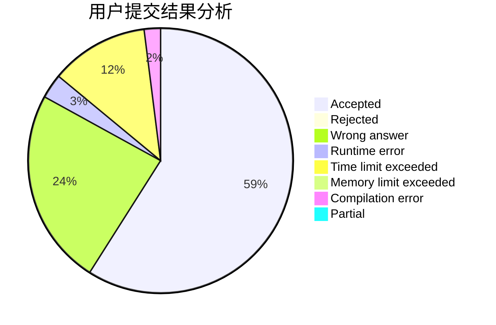
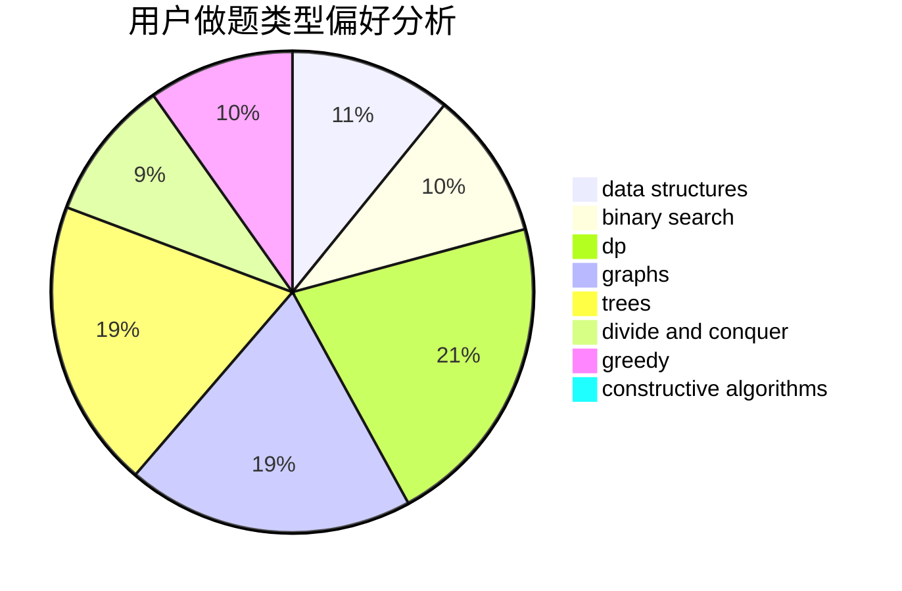

# Alice_Synthesis

<!-- tabs:start -->

#### **用户提交结果分析**

#### **用户做题类型偏好分析**

#### **用户错题知识点分析**

<!-- tabs:end -->
# 推荐题目
[1370C](https://codeforces.com/contest/1370/problem/C)		games,
                        math,
                        number theory		  
[282C](https://codeforces.com/contest/282/problem/C)		constructive algorithms,
                        implementation,
                        math		  
[1299C](https://codeforces.com/contest/1299/problem/C)		data structures,
                        geometry,
                        greedy		  
[218C](https://codeforces.com/contest/218/problem/C)		dsu,graphs,sortings,trees		  
[283B](https://codeforces.com/contest/283/problem/B)		dfs and similar,
                        dp,
                        graphs		  
[1008E](https://codeforces.com/contest/1008/problem/E)		dsu,graphs,sortings,trees		  
[18E](https://codeforces.com/contest/18/problem/E)		dp		  
[1241E](https://codeforces.com/contest/1241/problem/E)		dsu,graphs,sortings,trees		  
[282A](https://codeforces.com/contest/282/problem/A)		implementation		  
[1458F](https://codeforces.com/contest/1458/problem/F)		data structures,
                        trees		  
