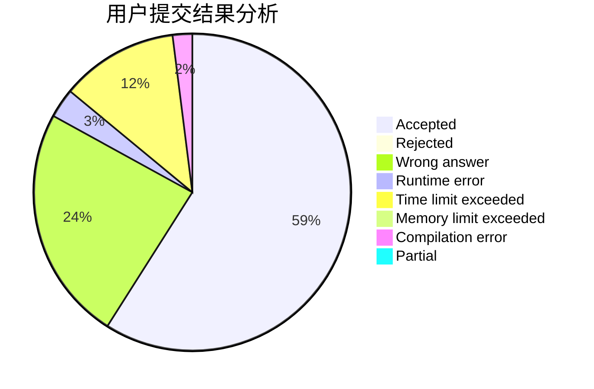
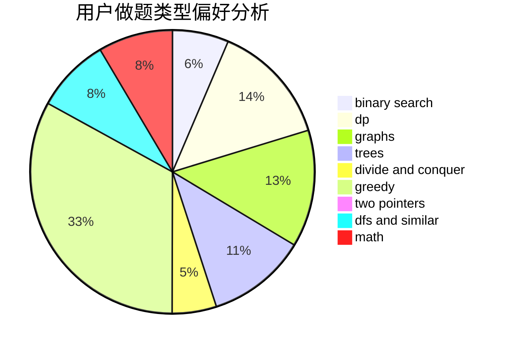

# Alice_Synthesis

<!-- tabs:start -->

#### **用户提交结果分析**

#### **用户做题类型偏好分析**

<!-- tabs:end -->
# 推荐题目
[1370C](https://codeforces.com/contest/1370/problem/C)
[282C](https://codeforces.com/contest/282/problem/C)
[1299C](https://codeforces.com/contest/1299/problem/C)
[218C](https://codeforces.com/contest/218/problem/C)
[283B](https://codeforces.com/contest/283/problem/B)
[1008E](https://codeforces.com/contest/1008/problem/E)
[18E](https://codeforces.com/contest/18/problem/E)
[1241E](https://codeforces.com/contest/1241/problem/E)
[282A](https://codeforces.com/contest/282/problem/A)
[1458F](https://codeforces.com/contest/1458/problem/F)
