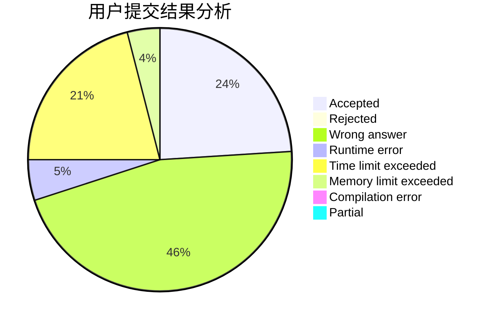
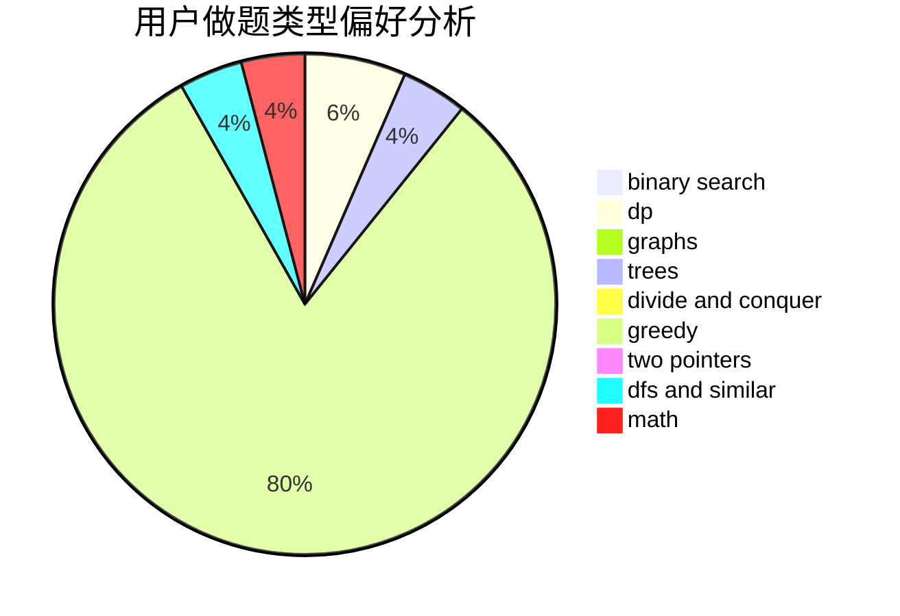

# Zdxfgre

<!-- tabs:start -->

#### **用户提交结果分析**

#### **用户做题类型偏好分析**

<!-- tabs:end -->
# 推荐题目
[1430E](https://codeforces.com/contest/1430/problem/E)
[1257G](https://codeforces.com/contest/1257/problem/G)
[12132](https://codeforces.com/contest/1213/problem/2)
[1267I](https://codeforces.com/contest/1267/problem/I)
[1028A](https://codeforces.com/contest/1028/problem/A)
[815B](https://codeforces.com/contest/815/problem/B)
[722D](https://codeforces.com/contest/722/problem/D)
[988C](https://codeforces.com/contest/988/problem/C)
[227A](https://codeforces.com/contest/227/problem/A)
[618A](https://codeforces.com/contest/618/problem/A)
