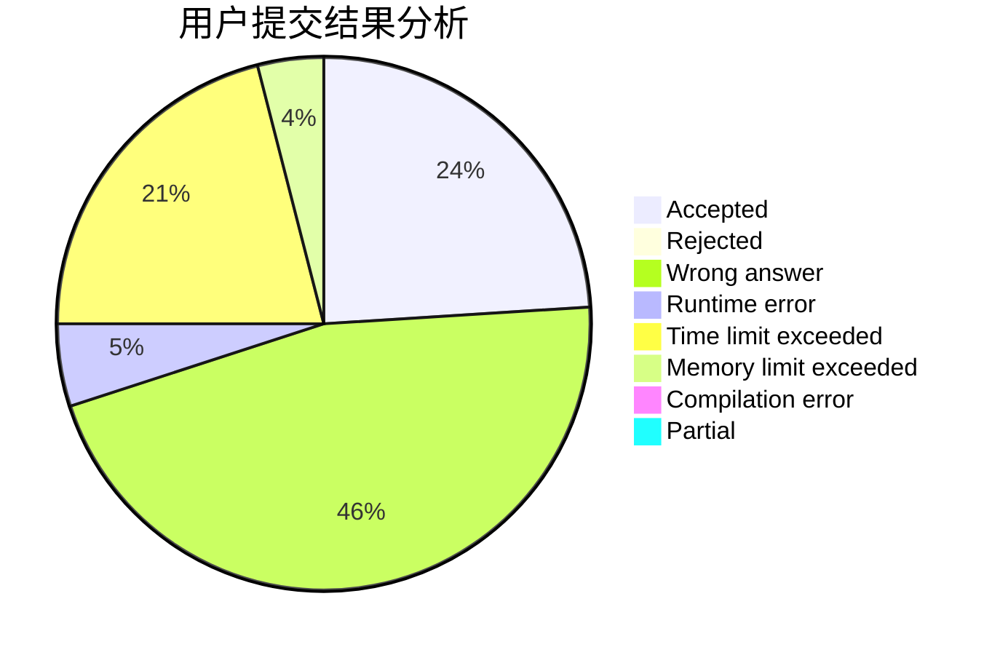
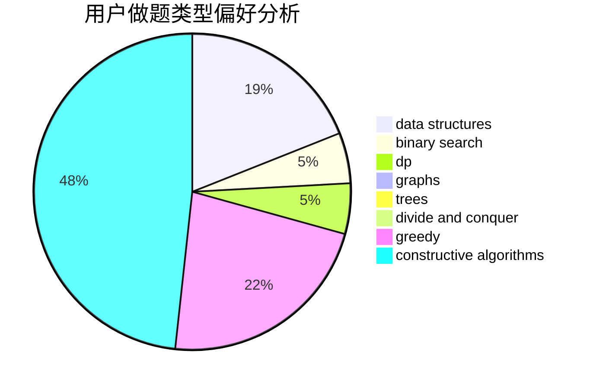
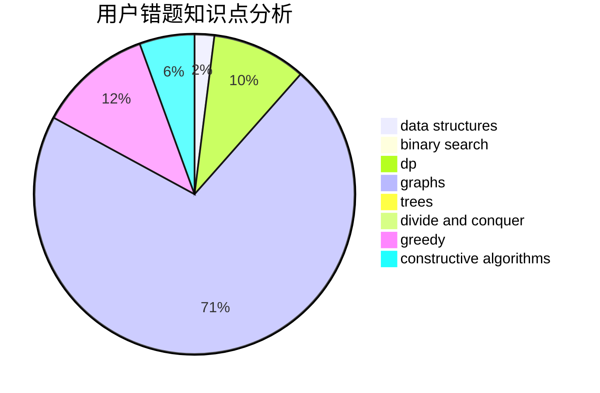

# Zdxfgre

<!-- tabs:start -->

#### **用户提交结果分析**

#### **用户做题类型偏好分析**

#### **用户错题知识点分析**

<!-- tabs:end -->
# 推荐题目
[1430E](https://codeforces.com/contest/1430/problem/E)		data structures,
                        greedy,
                        strings		  
[1257G](https://codeforces.com/contest/1257/problem/G)		divide and conquer,
                        fft,
                        greedy,
                        math,
                        number theory		  
[12132](https://codeforces.com/contest/1213/problem/2)		dsu,graphs,sortings,trees		  
[1267I](https://codeforces.com/contest/1267/problem/I)		brute force,
                        constructive algorithms,
                        implementation,
                        interactive,
                        sortings		  
[1028A](https://codeforces.com/contest/1028/problem/A)		implementation		  
[815B](https://codeforces.com/contest/815/problem/B)		brute force,
                        combinatorics,
                        constructive algorithms,
                        math		  
[722D](https://codeforces.com/contest/722/problem/D)		binary search,
                        data structures,
                        dfs and similar,
                        greedy,
                        strings,
                        trees		  
[988C](https://codeforces.com/contest/988/problem/C)		implementation,
                        sortings		  
[227A](https://codeforces.com/contest/227/problem/A)		geometry		  
[618A](https://codeforces.com/contest/618/problem/A)		implementation		  
