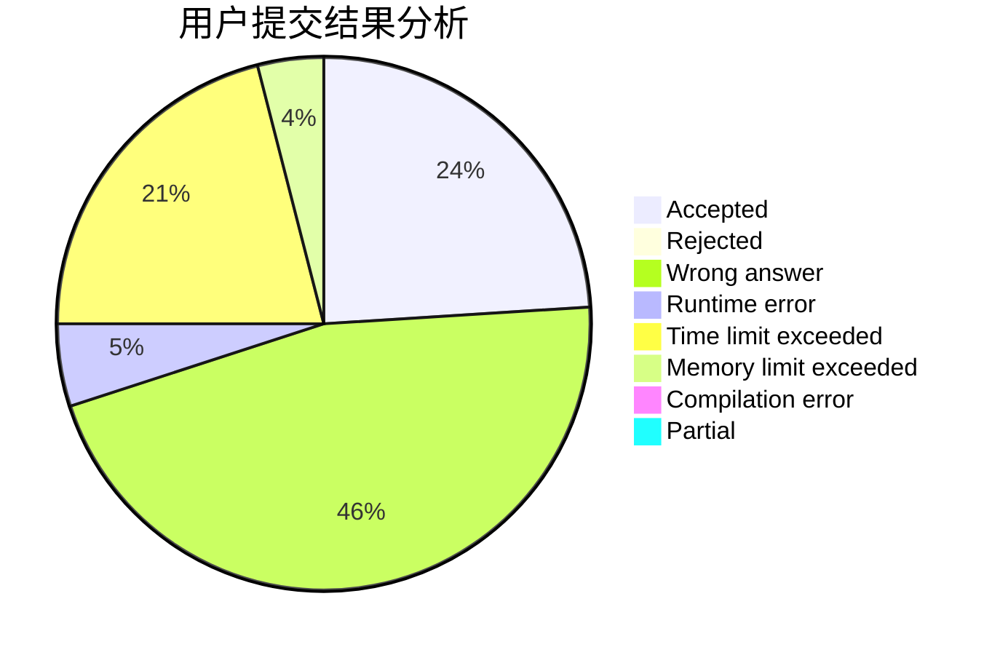
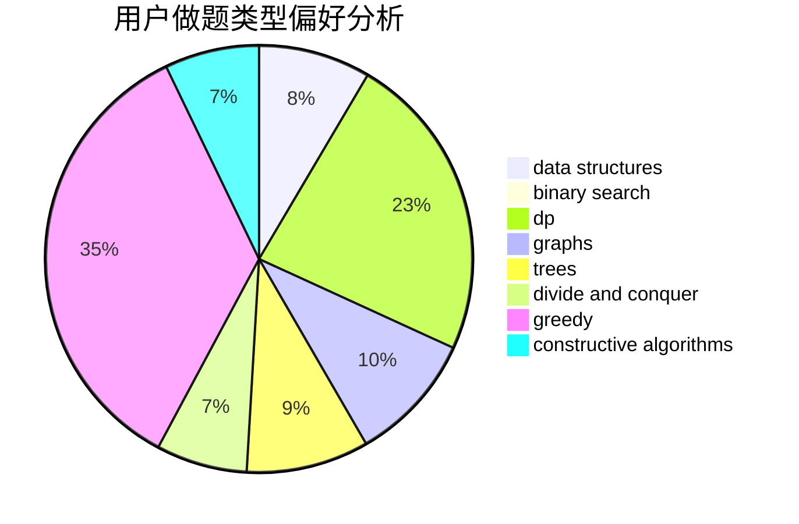

# Zdxfgre

<!-- tabs:start -->

#### **用户提交结果分析**

#### **用户做题类型偏好分析**

#### **用户错题知识点分析**

<!-- tabs:end -->
# 推荐题目
[1423B](https://codeforces.com/contest/1423/problem/B)		binary search,
                        flows,
                        graph matchings,
                        graphs		  
[1252F](https://codeforces.com/contest/1252/problem/F)		hashing,
                        trees		  
[1207D](https://codeforces.com/contest/1207/problem/D)		combinatorics		  
[1262A](https://codeforces.com/contest/1262/problem/A)		dsu,graphs,sortings,trees		  
[1027E](https://codeforces.com/contest/1027/problem/E)		combinatorics,
                        dp,
                        math		  
[800A](https://codeforces.com/contest/800/problem/A)		dsu,graphs,sortings,trees		  
[703C](https://codeforces.com/contest/703/problem/C)		geometry,
                        implementation		  
[966E](https://codeforces.com/contest/966/problem/E)		dsu,graphs,sortings,trees		  
[203B](https://codeforces.com/contest/203/problem/B)		brute force,
                        implementation		  
[599E](https://codeforces.com/contest/599/problem/E)		bitmasks,
                        dp,
                        trees		  
