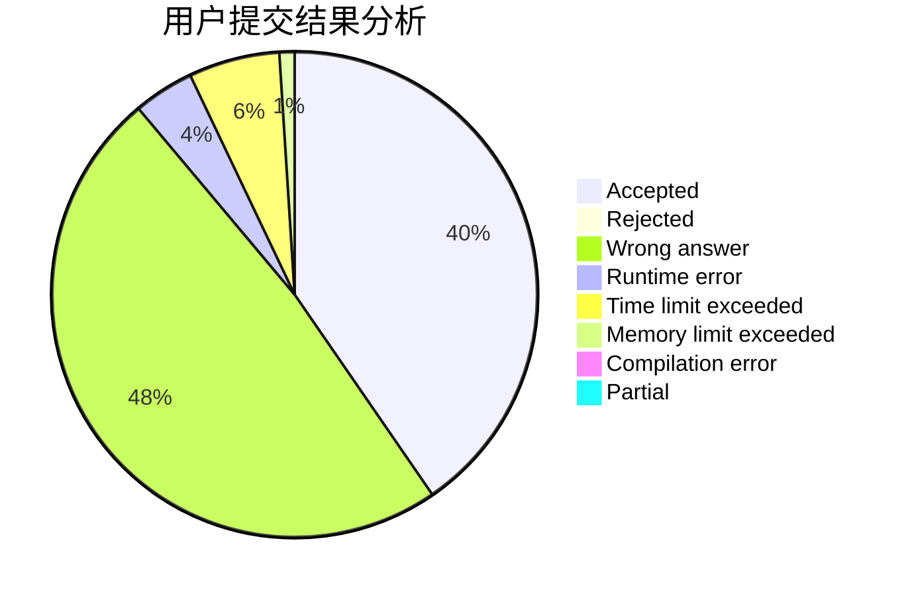
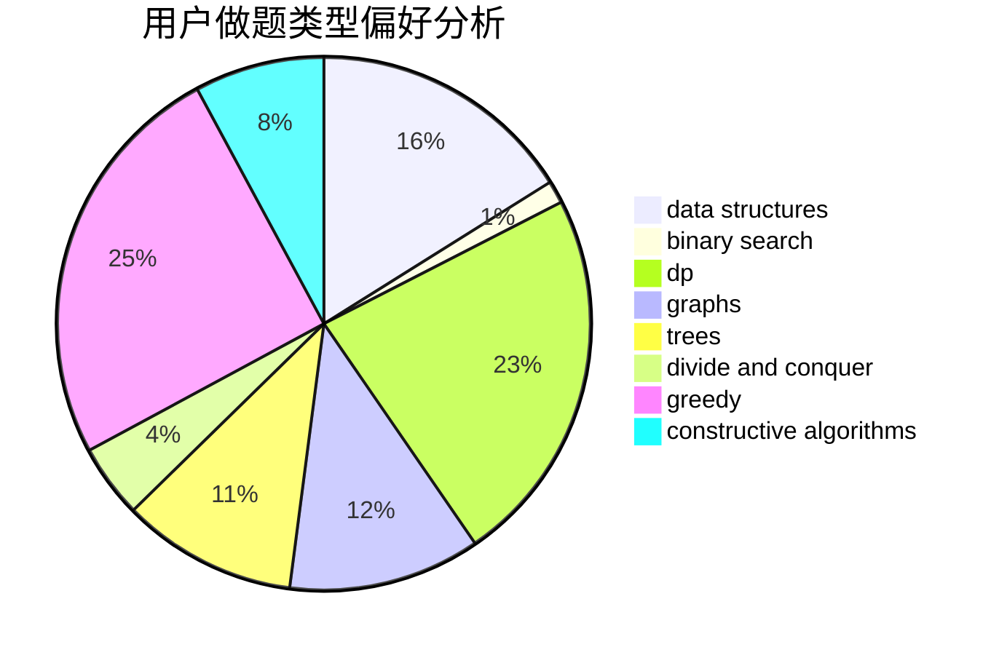
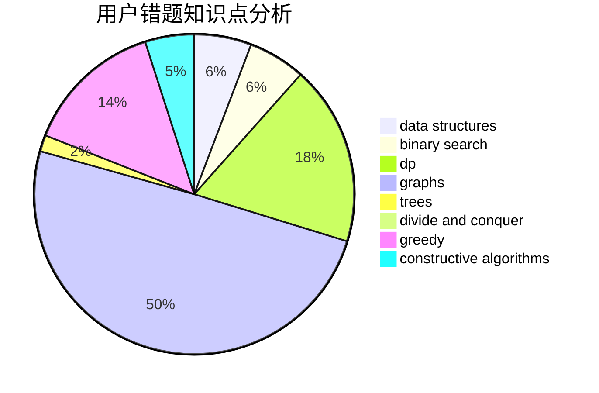

# ZeldaHuang

<!-- tabs:start -->

#### **用户提交结果分析**

#### **用户做题类型偏好分析**

#### **用户错题知识点分析**

<!-- tabs:end -->
# 推荐题目
[865D](https://codeforces.com/contest/865/problem/D)		constructive algorithms,
                        data structures,
                        greedy		  
[629D](https://codeforces.com/contest/629/problem/D)		data structures,
                        dp		  
[1301C](https://codeforces.com/contest/1301/problem/C)		binary search,
                        combinatorics,
                        greedy,
                        math,
                        strings		  
[549E](https://codeforces.com/contest/549/problem/E)		geometry,
                        math		  
[268A](https://codeforces.com/contest/268/problem/A)		brute force		  
[746C](https://codeforces.com/contest/746/problem/C)		constructive algorithms,
                        implementation,
                        math		  
[687A](https://codeforces.com/contest/687/problem/A)		dfs and similar,
                        graphs		  
[284E](https://codeforces.com/contest/284/problem/E)		dsu,graphs,sortings,trees		  
[1252F](https://codeforces.com/contest/1252/problem/F)		hashing,
                        trees		  
[871A](https://codeforces.com/contest/871/problem/A)		dsu,graphs,sortings,trees		  
