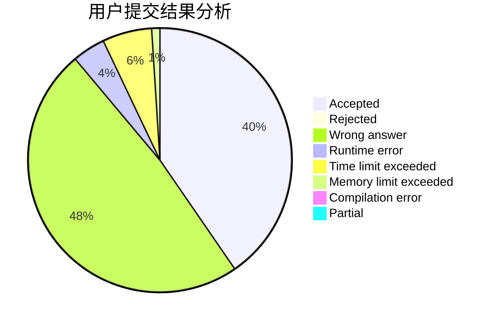
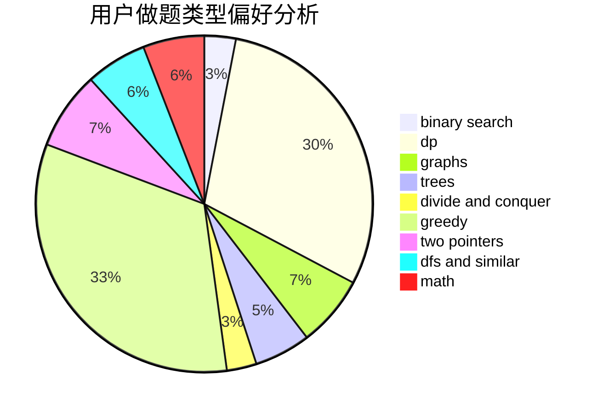

# ZeldaHuang

<!-- tabs:start -->

#### **用户提交结果分析**

#### **用户做题类型偏好分析**

<!-- tabs:end -->
# 推荐题目
[865D](https://codeforces.com/contest/865/problem/D)
[629D](https://codeforces.com/contest/629/problem/D)
[1301C](https://codeforces.com/contest/1301/problem/C)
[549E](https://codeforces.com/contest/549/problem/E)
[268A](https://codeforces.com/contest/268/problem/A)
[746C](https://codeforces.com/contest/746/problem/C)
[687A](https://codeforces.com/contest/687/problem/A)
[284E](https://codeforces.com/contest/284/problem/E)
[1252F](https://codeforces.com/contest/1252/problem/F)
[871A](https://codeforces.com/contest/871/problem/A)
