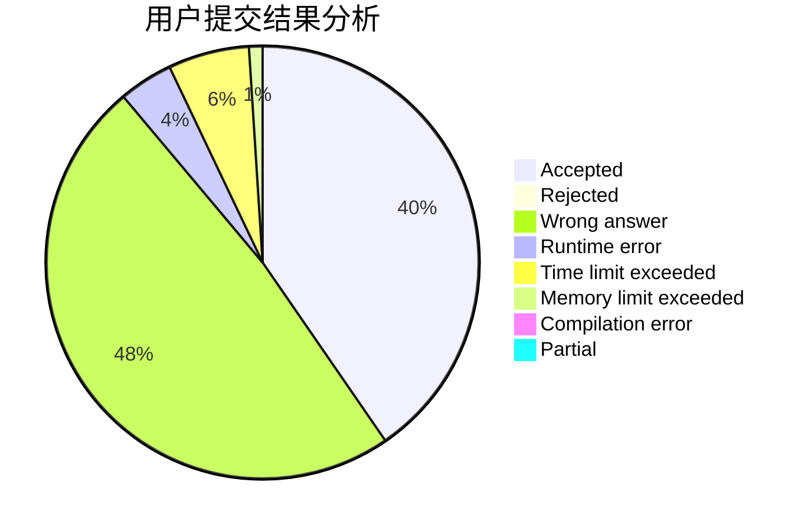
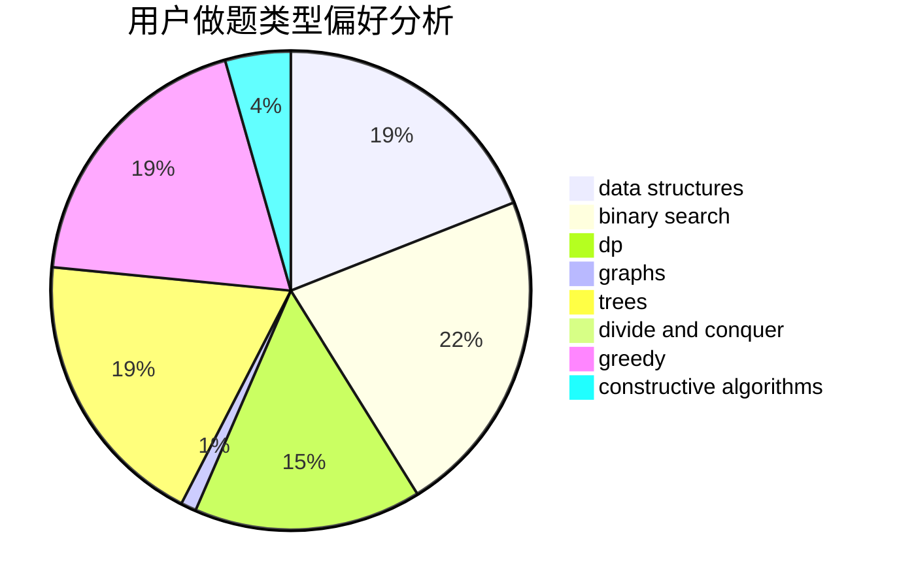
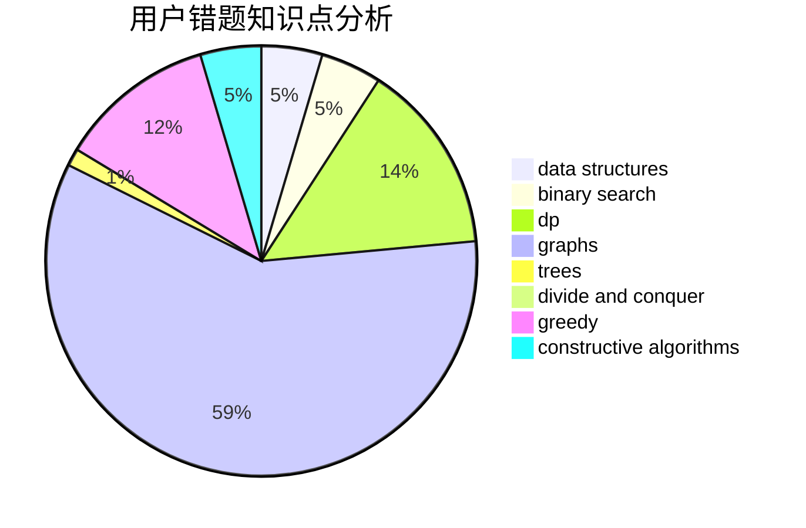

# ZeldaHuang

<!-- tabs:start -->

#### **用户提交结果分析**

#### **用户做题类型偏好分析**

#### **用户错题知识点分析**

<!-- tabs:end -->
# 推荐题目
[847E](https://codeforces.com/contest/847/problem/E)		binary search,
                        dp		  
[610B](https://codeforces.com/contest/610/problem/B)		constructive algorithms,
                        implementation		  
[1294F](https://codeforces.com/contest/1294/problem/F)		dfs and similar,
                        dp,
                        greedy,
                        trees		  
[525B](https://codeforces.com/contest/525/problem/B)		constructive algorithms,
                        greedy,
                        math,
                        strings		  
[246E](https://codeforces.com/contest/246/problem/E)		binary search,
                        data structures,
                        dfs and similar,
                        dp,
                        sortings		  
[729C](https://codeforces.com/contest/729/problem/C)		binary search,
                        greedy,
                        sortings		  
[666A](https://codeforces.com/contest/666/problem/A)		dp,
                        implementation,
                        strings		  
[269B](https://codeforces.com/contest/269/problem/B)		dp		  
[1248D2](https://codeforces.com/contest/1248D/problem/2)		dsu,graphs,sortings,trees		  
[852I](https://codeforces.com/contest/852/problem/I)		brute force,
                        dfs and similar,
                        graphs,
                        trees		  
