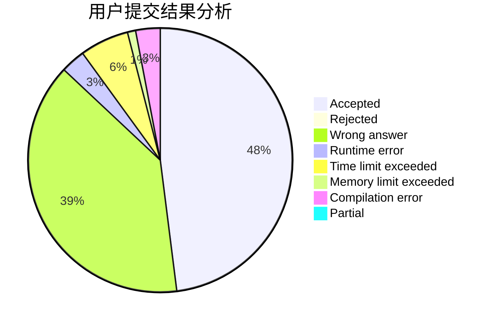
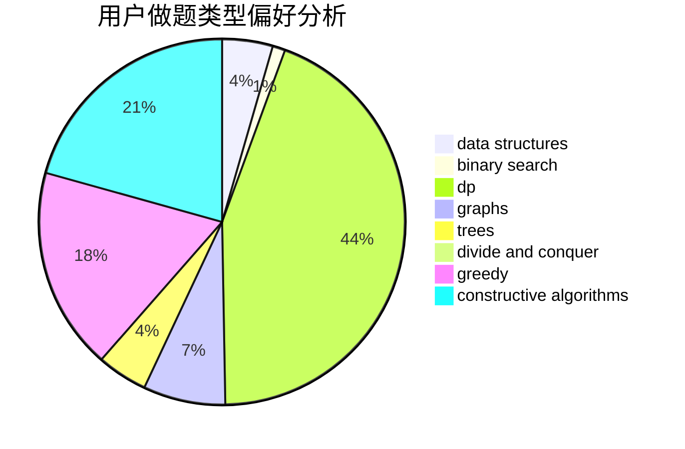
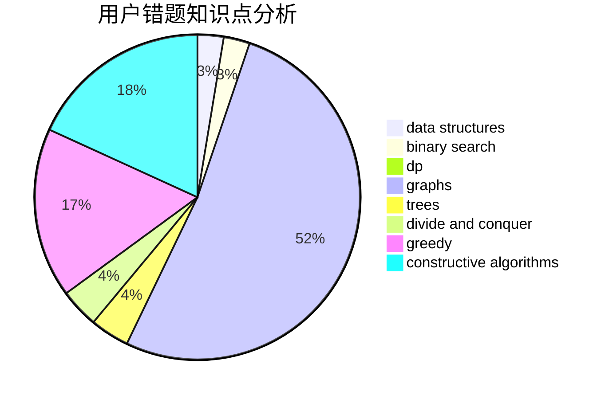

# ZeroHL

<!-- tabs:start -->

#### **用户提交结果分析**

#### **用户做题类型偏好分析**

#### **用户错题知识点分析**

<!-- tabs:end -->
# 推荐题目
[11411](https://codeforces.com/contest/1141/problem/1)		dsu,graphs,sortings,trees		  
[1016B](https://codeforces.com/contest/1016/problem/B)		brute force,
                        implementation		  
[592A](https://codeforces.com/contest/592/problem/A)		implementation		  
[484A](https://codeforces.com/contest/484/problem/A)		bitmasks,
                        constructive algorithms		  
[478D](https://codeforces.com/contest/478/problem/D)		dp		  
[255C](https://codeforces.com/contest/255/problem/C)		brute force,
                        dp		  
[1041C](https://codeforces.com/contest/1041/problem/C)		binary search,
                        data structures,
                        greedy,
                        two pointers		  
[540C](https://codeforces.com/contest/540/problem/C)		dfs and similar		  
[1210E](https://codeforces.com/contest/1210/problem/E)		math		  
[36E](https://codeforces.com/contest/36/problem/E)		constructive algorithms,
                        dsu,
                        graphs,
                        implementation		  
