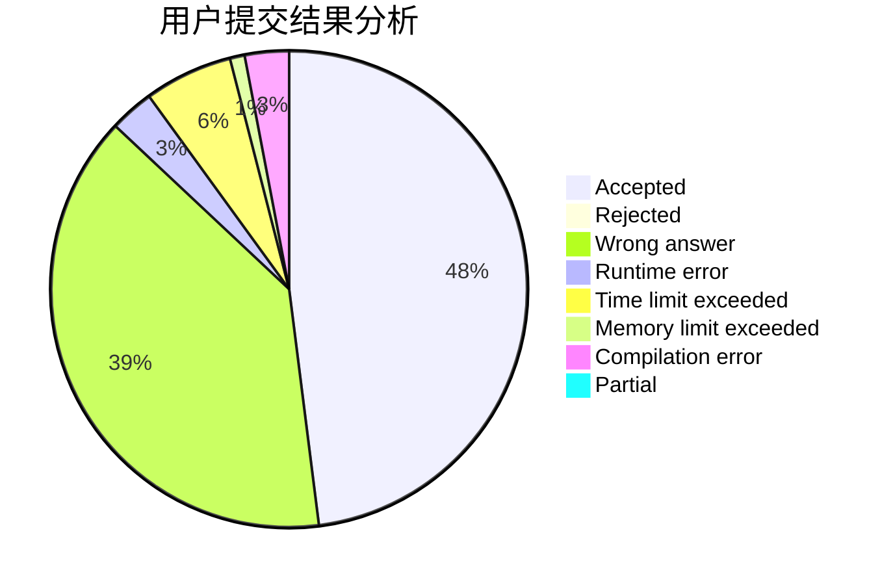
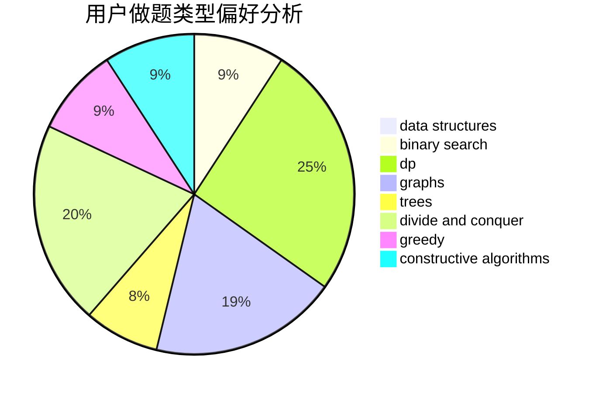
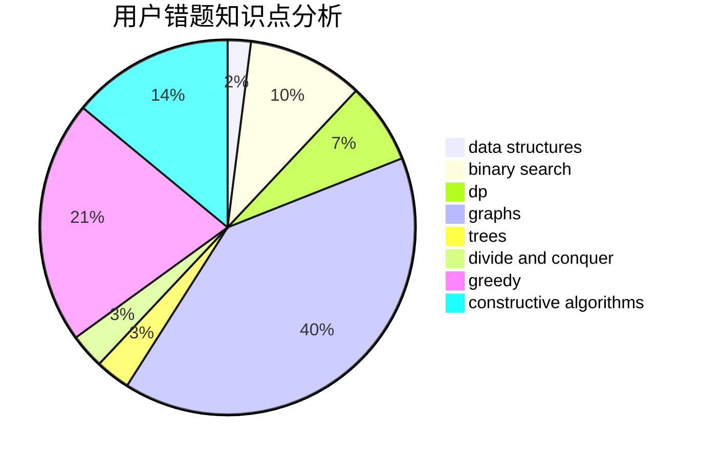

# ZeroHL

<!-- tabs:start -->

#### **用户提交结果分析**

#### **用户做题类型偏好分析**

#### **用户错题知识点分析**

<!-- tabs:end -->
# 推荐题目
[1139D](https://codeforces.com/contest/1139/problem/D)		dp,
                        math,
                        number theory,
                        probabilities		  
[1015E2](https://codeforces.com/contest/1015E/problem/2)		binary search,
                        dp,
                        greedy		  
[571D](https://codeforces.com/contest/571/problem/D)		binary search,
                        data structures,
                        dsu,
                        trees		  
[464B](https://codeforces.com/contest/464/problem/B)		brute force,
                        geometry		  
[459E](https://codeforces.com/contest/459/problem/E)		dp,
                        sortings		  
[233A](https://codeforces.com/contest/233/problem/A)		implementation,
                        math		  
[1040D](https://codeforces.com/contest/1040/problem/D)		dsu,graphs,sortings,trees		  
[514E](https://codeforces.com/contest/514/problem/E)		dp,
                        matrices		  
[1206D](https://codeforces.com/contest/1206/problem/D)		dsu,graphs,sortings,trees		  
[343D](https://codeforces.com/contest/343/problem/D)		data structures,
                        dfs and similar,
                        graphs,
                        trees		  
