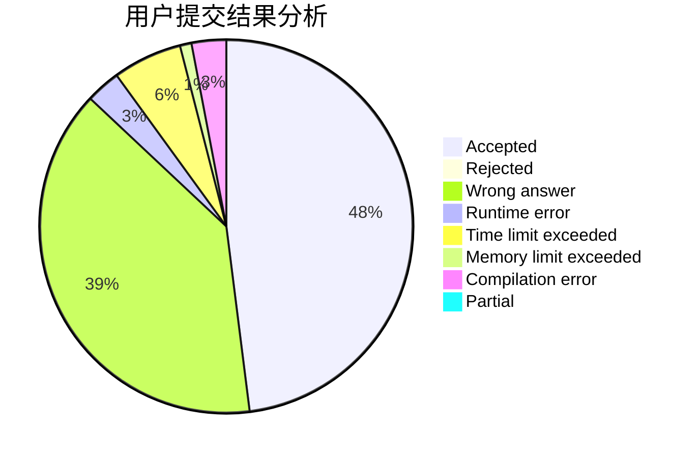
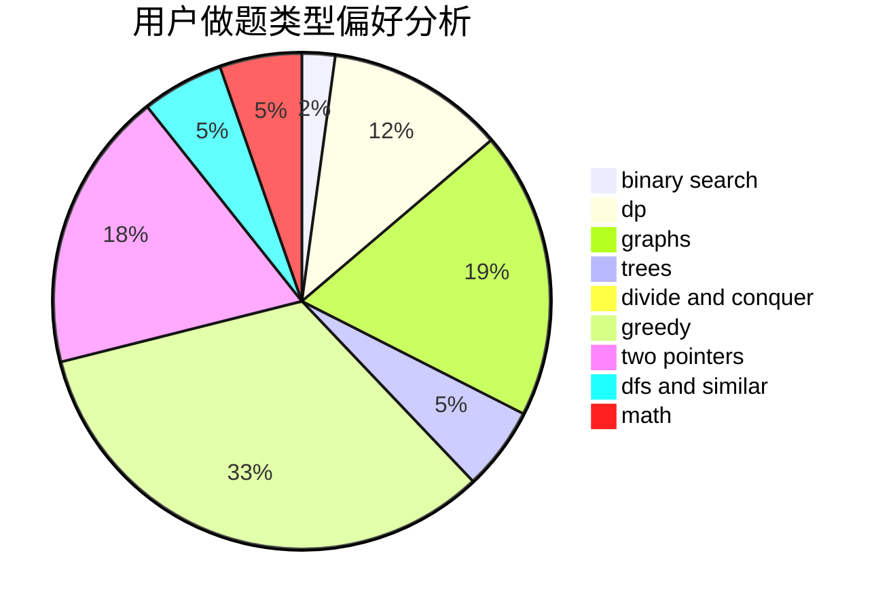

# ZeroHL

<!-- tabs:start -->

#### **用户提交结果分析**

#### **用户做题类型偏好分析**

<!-- tabs:end -->
# 推荐题目
[11411](https://codeforces.com/contest/1141/problem/1)
[1016B](https://codeforces.com/contest/1016/problem/B)
[592A](https://codeforces.com/contest/592/problem/A)
[484A](https://codeforces.com/contest/484/problem/A)
[478D](https://codeforces.com/contest/478/problem/D)
[255C](https://codeforces.com/contest/255/problem/C)
[1041C](https://codeforces.com/contest/1041/problem/C)
[540C](https://codeforces.com/contest/540/problem/C)
[1210E](https://codeforces.com/contest/1210/problem/E)
[36E](https://codeforces.com/contest/36/problem/E)
