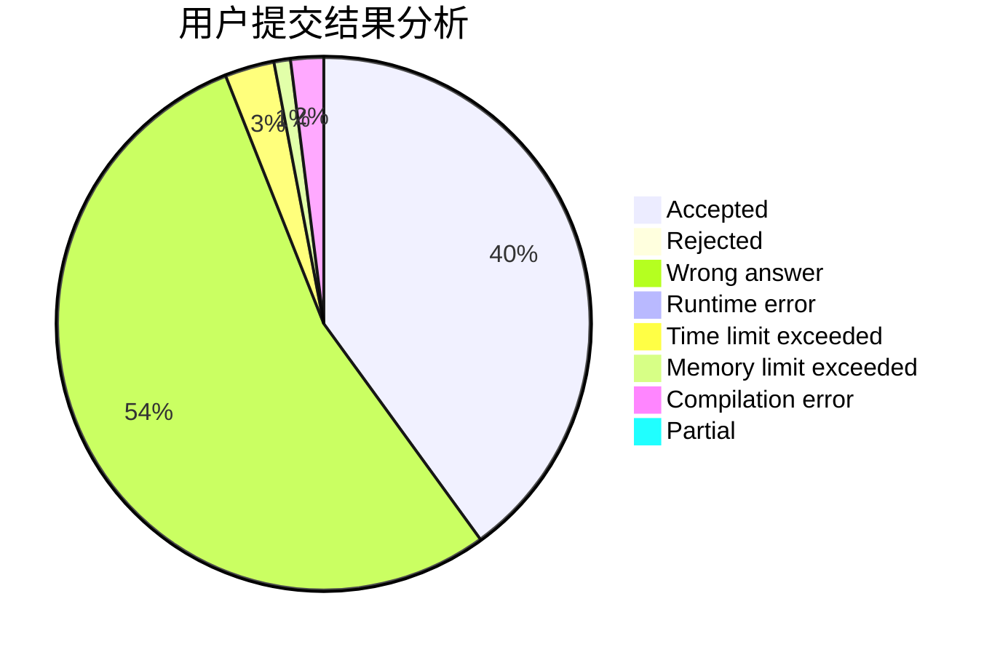
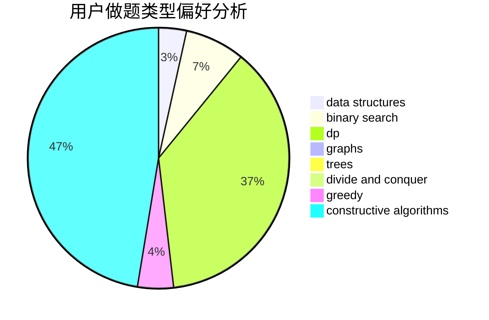

# Zeyush

<!-- tabs:start -->

#### **用户提交结果分析**

#### **用户做题类型偏好分析**

#### **用户错题知识点分析**

<!-- tabs:end -->
# 推荐题目
[1499F](https://codeforces.com/contest/1499/problem/F)		combinatorics,
                        dfs and similar,
                        dp,
                        trees		  
[1408H](https://codeforces.com/contest/1408/problem/H)		binary search,
                        data structures,
                        flows,
                        greedy		  
[295B](https://codeforces.com/contest/295/problem/B)		dp,
                        graphs,
                        shortest paths		  
[1161E](https://codeforces.com/contest/1161/problem/E)		dsu,graphs,sortings,trees		  
[897B](https://codeforces.com/contest/897/problem/B)		brute force		  
[523D](https://codeforces.com/contest/523/problem/D)		*special problem,
                        data structures,
                        implementation		  
[1164F](https://codeforces.com/contest/1164/problem/F)		dsu,graphs,sortings,trees		  
[1010E](https://codeforces.com/contest/1010/problem/E)		data structures		  
[424A](https://codeforces.com/contest/424/problem/A)		implementation		  
[269C](https://codeforces.com/contest/269/problem/C)		constructive algorithms,
                        flows,
                        graphs,
                        greedy		  
