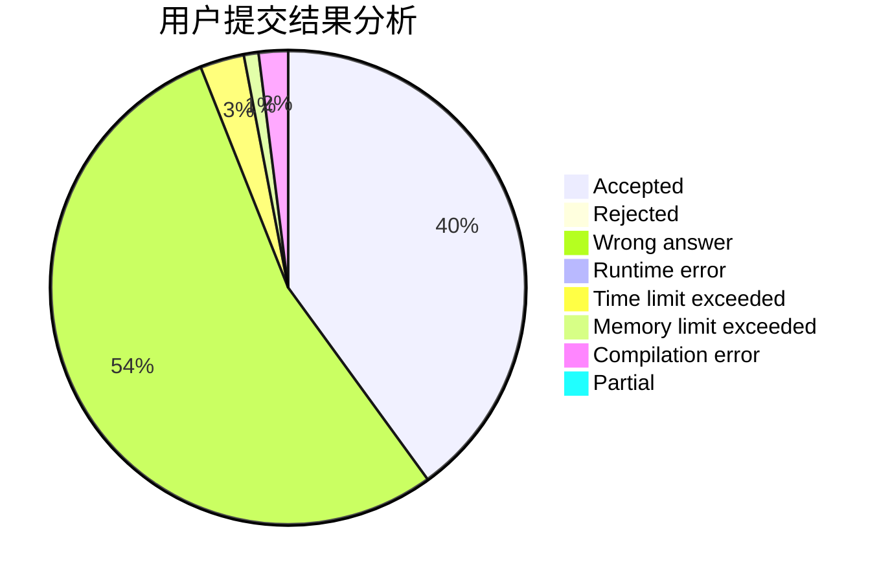
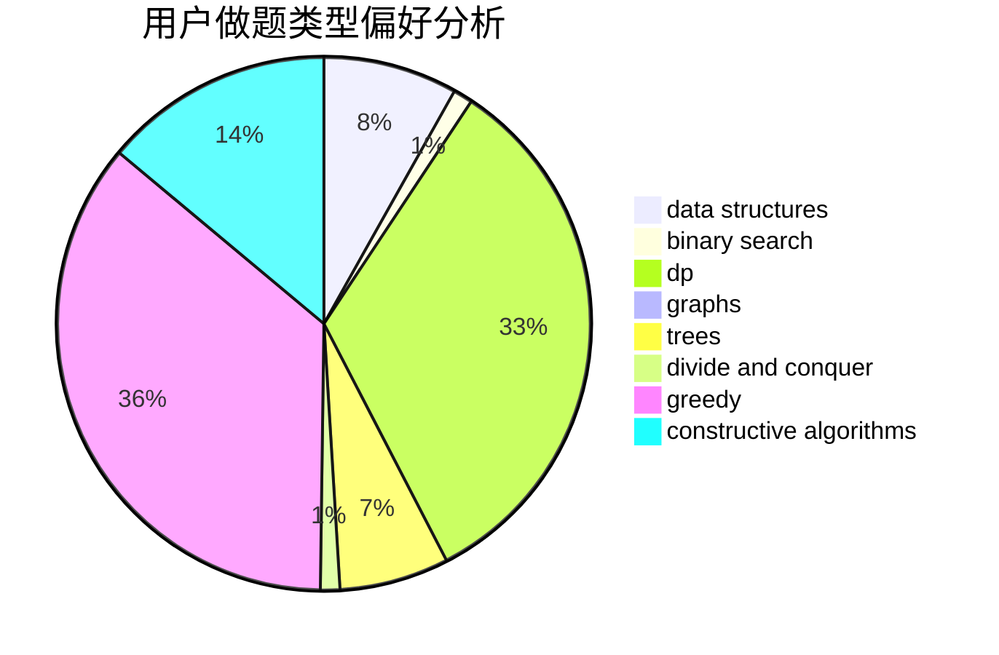

# Zeyush

<!-- tabs:start -->

#### **用户提交结果分析**

#### **用户做题类型偏好分析**

#### **用户错题知识点分析**

<!-- tabs:end -->
# 推荐题目
[1490G](https://codeforces.com/contest/1490/problem/G)		binary search,
                        data structures,
                        math		  
[1399F](https://codeforces.com/contest/1399/problem/F)		data structures,
                        dp,
                        graphs,
                        sortings		  
[27C](https://codeforces.com/contest/27/problem/C)		constructive algorithms,
                        greedy		  
[1159A](https://codeforces.com/contest/1159/problem/A)		implementation,
                        math		  
[876F](https://codeforces.com/contest/876/problem/F)		dsu,graphs,sortings,trees		  
[501E](https://codeforces.com/contest/501/problem/E)		binary search,
                        combinatorics,
                        implementation		  
[1161D](https://codeforces.com/contest/1161/problem/D)		dsu,graphs,sortings,trees		  
[1010B](https://codeforces.com/contest/1010/problem/B)		binary search,
                        interactive		  
[394C](https://codeforces.com/contest/394/problem/C)		constructive algorithms,
                        greedy		  
[251A](https://codeforces.com/contest/251/problem/A)		binary search,
                        combinatorics,
                        two pointers		  
