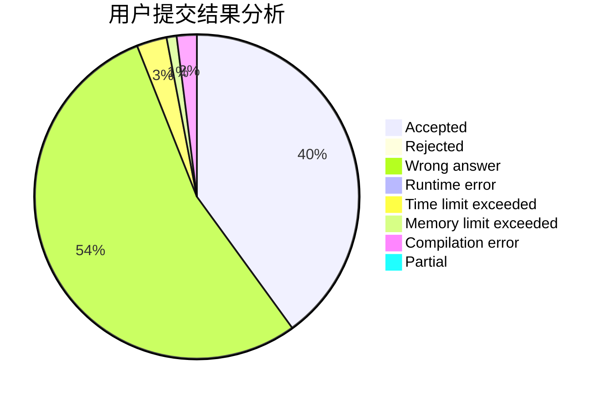
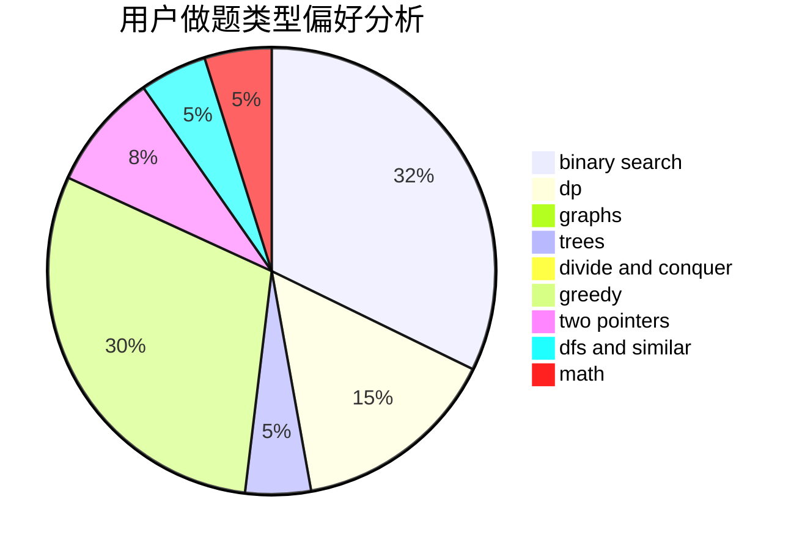

# Zeyush

<!-- tabs:start -->

#### **用户提交结果分析**

#### **用户做题类型偏好分析**

<!-- tabs:end -->
# 推荐题目
[1499F](https://codeforces.com/contest/1499/problem/F)
[1408H](https://codeforces.com/contest/1408/problem/H)
[295B](https://codeforces.com/contest/295/problem/B)
[1161E](https://codeforces.com/contest/1161/problem/E)
[897B](https://codeforces.com/contest/897/problem/B)
[523D](https://codeforces.com/contest/523/problem/D)
[1164F](https://codeforces.com/contest/1164/problem/F)
[1010E](https://codeforces.com/contest/1010/problem/E)
[424A](https://codeforces.com/contest/424/problem/A)
[269C](https://codeforces.com/contest/269/problem/C)
