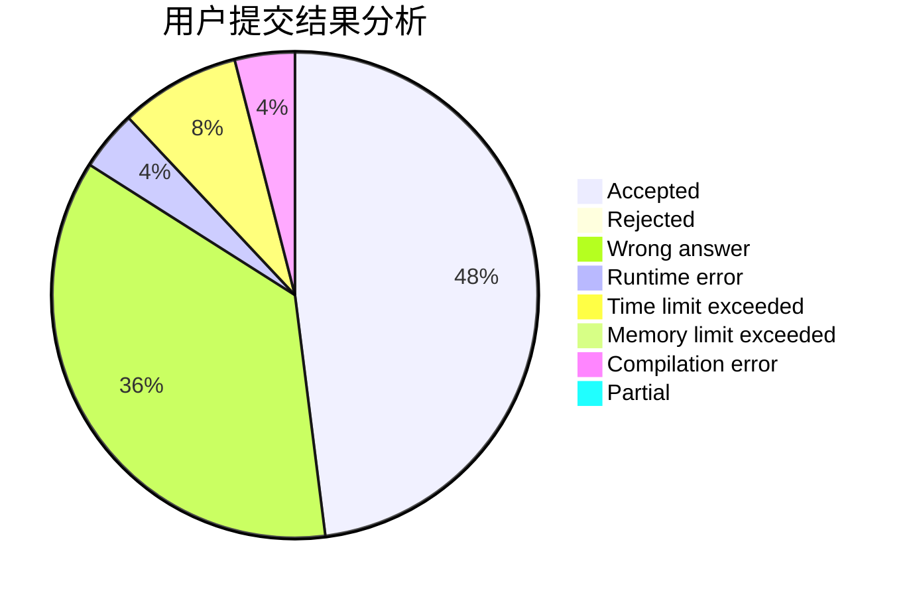
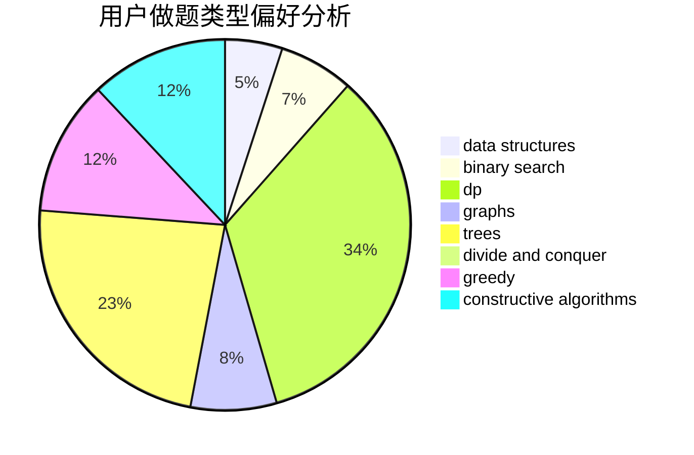

# ZhaoChongyan

<!-- tabs:start -->

#### **用户提交结果分析**

#### **用户做题类型偏好分析**

#### **用户错题知识点分析**

<!-- tabs:end -->
# 推荐题目
[808A](https://codeforces.com/contest/808/problem/A)		implementation		  
[42C](https://codeforces.com/contest/42/problem/C)		brute force,
                        constructive algorithms		  
[1016B](https://codeforces.com/contest/1016/problem/B)		brute force,
                        implementation		  
[1298D](https://codeforces.com/contest/1298/problem/D)		dsu,graphs,sortings,trees		  
[814D](https://codeforces.com/contest/814/problem/D)		dfs and similar,
                        dp,
                        geometry,
                        greedy,
                        trees		  
[845D](https://codeforces.com/contest/845/problem/D)		data structures,
                        dp,
                        greedy		  
[166A](https://codeforces.com/contest/166/problem/A)		binary search,
                        implementation,
                        sortings		  
[997D](https://codeforces.com/contest/997/problem/D)		combinatorics,
                        divide and conquer,
                        trees		  
[371D](https://codeforces.com/contest/371/problem/D)		data structures,
                        dsu,
                        implementation,
                        trees		  
[1362E](https://codeforces.com/contest/1362/problem/E)		dsu,graphs,sortings,trees		  
