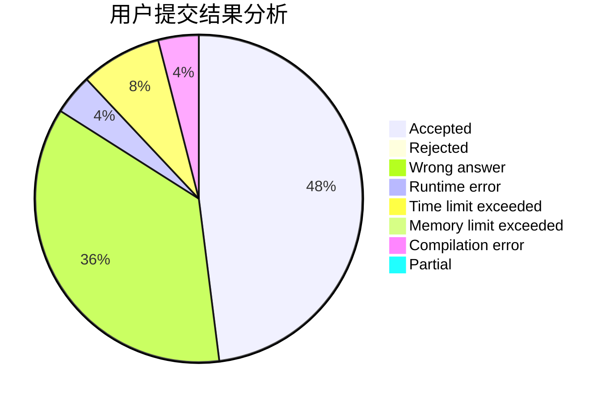
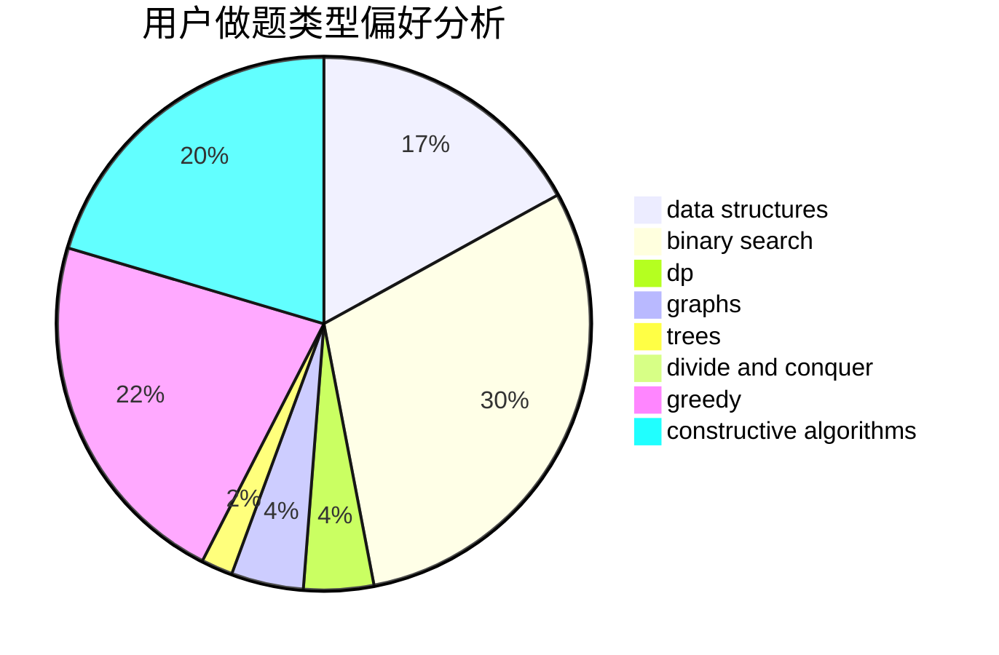

# ZhaoChongyan
<!-- tabs:start -->
#### **用户提交结果分析**

#### **用户做题类型偏好分析**

#### **用户错题知识点分析**

<!-- tabs:end -->
# 推荐题目
[Counting-out Rhyme](http://codeforces.com/problemset/problem/792/B)		implementation		  
[Prefix Enlightenment](https://codeforces.com/contest/1291/problem/E)		dfs and similar,
                        dsu,
                        graphs		  
[Okabe and Banana Trees](http://codeforces.com/problemset/problem/821/B)		brute force,
                        math		  
[Line](http://codeforces.com/problemset/problem/7/C)		math,
                        number theory		  
[Simplified Nonogram](http://codeforces.com/problemset/problem/534/F)		bitmasks,
                        dp,
                        hashing,
                        meet-in-the-middle		  
[Queue](http://codeforces.com/problemset/problem/490/B)		dsu,
                        implementation		  
[Row](http://codeforces.com/problemset/problem/982/A)		brute force,
                        constructive algorithms		  
[Tanya and Candies](http://codeforces.com/problemset/problem/1118/B)		implementation		  
[Little Artem and Time Machine](https://codeforces.com/contest/668/problem/D)		data structures		  
[Alice and Bob](http://codeforces.com/problemset/problem/346/A)		games,
                        math,
                        number theory		  
<!-- tabs:start -->
#### **data structures**
[Counting-out Rhyme](https://codeforces.com/contest/668/problem/D)		data structures		  
[Prefix Enlightenment](http://codeforces.com/problemset/problem/226/E)		data structures,
                        trees		  
[Okabe and Banana Trees](http://codeforces.com/problemset/problem/1172/F)		data structures		  
[Line](http://codeforces.com/problemset/problem/830/B)		data structures,
                        implementation,
                        sortings		  
[Simplified Nonogram](http://codeforces.com/problemset/problem/827/A)		data structures,
                        greedy,
                        sortings,
                        strings		  
[Queue](http://codeforces.com/problemset/problem/1511/G)		bitmasks,
                        brute force,
                        data structures,
                        games,
                        two pointers		  
[Row](http://codeforces.com/problemset/problem/1492/C)		binary search,
                        data structures,
                        dp,
                        greedy,
                        two pointers		  
[Tanya and Candies](http://codeforces.com/problemset/problem/1490/G)		binary search,
                        data structures,
                        math		  
[Little Artem and Time Machine](http://codeforces.com/problemset/problem/1479/D)		binary search,
                        bitmasks,
                        brute force,
                        data structures,
                        probabilities,
                        trees		  
[Alice and Bob](http://codeforces.com/problemset/problem/1497/A)		brute force,
                        data structures,
                        greedy,
                        sortings		  
#### **binary search**
[Counting-out Rhyme](http://codeforces.com/problemset/problem/1015/E2)		binary search,
                        dp,
                        greedy		  
[Prefix Enlightenment](http://codeforces.com/problemset/problem/1492/C)		binary search,
                        data structures,
                        dp,
                        greedy,
                        two pointers		  
[Okabe and Banana Trees](http://codeforces.com/problemset/problem/1463/D)		binary search,
                        constructive algorithms,
                        greedy,
                        two pointers		  
[Line](http://codeforces.com/problemset/problem/1490/G)		binary search,
                        data structures,
                        math		  
[Simplified Nonogram](http://codeforces.com/problemset/problem/1479/D)		binary search,
                        bitmasks,
                        brute force,
                        data structures,
                        probabilities,
                        trees		  
[Queue](http://codeforces.com/problemset/problem/1436/E)		binary search,
                        data structures,
                        two pointers		  
[Row](http://codeforces.com/problemset/problem/1461/D)		binary search,
                        brute force,
                        data structures,
                        divide and conquer,
                        implementation,
                        sortings		  
[Tanya and Candies](http://codeforces.com/problemset/problem/1493/C)		binary search,
                        brute force,
                        constructive algorithms,
                        greedy,
                        strings		  
[Little Artem and Time Machine](http://codeforces.com/problemset/problem/1487/D)		binary search,
                        brute force,
                        math,
                        number theory		  
[Alice and Bob](http://codeforces.com/problemset/problem/1486/B)		binary search,
                        geometry,
                        shortest paths,
                        sortings		  
#### **dp**
[Counting-out Rhyme](http://codeforces.com/problemset/problem/534/F)		bitmasks,
                        dp,
                        hashing,
                        meet-in-the-middle		  
[Prefix Enlightenment](http://codeforces.com/problemset/problem/1015/E2)		binary search,
                        dp,
                        greedy		  
[Okabe and Banana Trees](http://codeforces.com/problemset/problem/1204/E)		combinatorics,
                        dp,
                        math,
                        number theory		  
[Line](http://codeforces.com/problemset/problem/1038/D)		dp,
                        greedy,
                        implementation		  
[Simplified Nonogram](https://codeforces.com/contest/116/problem/C)		bitmasks,
                        brute force,
                        dp,
                        graphs		  
[Queue](http://codeforces.com/problemset/problem/459/E)		dp,
                        sortings		  
[Row](http://codeforces.com/problemset/problem/494/B)		dp,
                        strings		  
[Tanya and Candies](http://codeforces.com/problemset/problem/1492/C)		binary search,
                        data structures,
                        dp,
                        greedy,
                        two pointers		  
[Little Artem and Time Machine](https://codeforces.com/contest/1457/problem/C)		brute force,
                        dp,
                        implementation		  
[Alice and Bob](http://codeforces.com/problemset/problem/1491/C)		brute force,
                        data structures,
                        dp,
                        greedy,
                        implementation		  
#### **graph**
[Counting-out Rhyme](https://codeforces.com/contest/1291/problem/E)		dfs and similar,
                        dsu,
                        graphs		  
[Prefix Enlightenment](http://codeforces.com/problemset/problem/575/C)		bitmasks,
                        brute force,
                        graph matchings		  
[Okabe and Banana Trees](https://codeforces.com/contest/116/problem/C)		bitmasks,
                        brute force,
                        dp,
                        graphs		  
[Line](http://codeforces.com/problemset/problem/1487/C)		brute force,
                        constructive algorithms,
                        dfs and similar,
                        graphs,
                        greedy,
                        implementation,
                        math		  
[Simplified Nonogram](http://codeforces.com/problemset/problem/1437/C)		dp,
                        flows,
                        graph matchings,
                        greedy,
                        math,
                        sortings		  
[Queue](http://codeforces.com/problemset/problem/1470/D)		constructive algorithms,
                        dfs and similar,
                        graph matchings,
                        graphs,
                        greedy		  
[Row](http://codeforces.com/problemset/problem/1476/C)		dp,
                        graphs,
                        greedy		  
[Tanya and Candies](http://codeforces.com/problemset/problem/1304/D)		constructive algorithms,
                        graphs,
                        greedy,
                        two pointers		  
[Little Artem and Time Machine](http://codeforces.com/problemset/problem/1475/C)		combinatorics,
                        graphs,
                        math		  
[Alice and Bob](http://codeforces.com/problemset/problem/553/E)		dp,
                        fft,
                        graphs,
                        math,
                        probabilities		  
#### **trees**
[Counting-out Rhyme](http://codeforces.com/problemset/problem/226/E)		data structures,
                        trees		  
[Prefix Enlightenment](http://codeforces.com/problemset/problem/1479/D)		binary search,
                        bitmasks,
                        brute force,
                        data structures,
                        probabilities,
                        trees		  
[Okabe and Banana Trees](http://codeforces.com/problemset/problem/1511/C)		brute force,
                        data structures,
                        implementation,
                        trees		  
[Line](http://codeforces.com/problemset/problem/1499/F)		combinatorics,
                        dfs and similar,
                        dp,
                        trees		  
[Simplified Nonogram](http://codeforces.com/problemset/problem/1491/E)		brute force,
                        dfs and similar,
                        divide and conquer,
                        number theory,
                        trees		  
[Queue](http://codeforces.com/problemset/problem/1466/D)		data structures,
                        greedy,
                        sortings,
                        trees		  
[Row](http://codeforces.com/problemset/problem/1495/D)		combinatorics,
                        dfs and similar,
                        graphs,
                        math,
                        shortest paths,
                        trees		  
[Tanya and Candies](http://codeforces.com/problemset/problem/1303/G)		data structures,
                        divide and conquer,
                        geometry,
                        trees		  
[Little Artem and Time Machine](http://codeforces.com/problemset/problem/1454/E)		combinatorics,
                        dfs and similar,
                        graphs,
                        trees		  
[Alice and Bob](http://codeforces.com/problemset/problem/1494/D)		constructive algorithms,
                        data structures,
                        dfs and similar,
                        divide and conquer,
                        dsu,
                        greedy,
                        sortings,
                        trees		  
#### **divide and conquer**
[Counting-out Rhyme](http://codeforces.com/problemset/problem/1461/D)		binary search,
                        brute force,
                        data structures,
                        divide and conquer,
                        implementation,
                        sortings		  
[Prefix Enlightenment](http://codeforces.com/problemset/problem/1466/G)		combinatorics,
                        divide and conquer,
                        hashing,
                        math,
                        string suffix structures,
                        strings		  
[Okabe and Banana Trees](http://codeforces.com/problemset/problem/1490/D)		dfs and similar,
                        divide and conquer,
                        implementation		  
[Line](https://codeforces.com/contest/1483/problem/C)		data structures,
                        divide and conquer,
                        dp		  
[Simplified Nonogram](http://codeforces.com/problemset/problem/1491/E)		brute force,
                        dfs and similar,
                        divide and conquer,
                        number theory,
                        trees		  
[Queue](http://codeforces.com/problemset/problem/1303/G)		data structures,
                        divide and conquer,
                        geometry,
                        trees		  
[Row](http://codeforces.com/problemset/problem/1494/D)		constructive algorithms,
                        data structures,
                        dfs and similar,
                        divide and conquer,
                        dsu,
                        greedy,
                        sortings,
                        trees		  
[Tanya and Candies](http://codeforces.com/problemset/problem/1482/E)		data structures,
                        divide and conquer,
                        dp		  
[Little Artem and Time Machine](http://codeforces.com/problemset/problem/566/C)		dfs and similar,
                        divide and conquer,
                        trees		  
[Alice and Bob](http://codeforces.com/problemset/problem/1428/F)		binary search,
                        data structures,
                        divide and conquer,
                        dp,
                        two pointers		  
#### **greedy**
[Counting-out Rhyme](http://codeforces.com/problemset/problem/1015/E2)		binary search,
                        dp,
                        greedy		  
[Prefix Enlightenment](http://codeforces.com/problemset/problem/1195/A)		greedy,
                        math		  
[Okabe and Banana Trees](http://codeforces.com/problemset/problem/1038/D)		dp,
                        greedy,
                        implementation		  
[Line](http://codeforces.com/problemset/problem/500/C)		constructive algorithms,
                        greedy,
                        implementation,
                        math		  
[Simplified Nonogram](http://codeforces.com/problemset/problem/401/C)		constructive algorithms,
                        greedy,
                        implementation		  
[Queue](http://codeforces.com/problemset/problem/912/C)		brute force,
                        greedy,
                        sortings		  
[Row](http://codeforces.com/problemset/problem/909/A)		brute force,
                        greedy,
                        sortings		  
[Tanya and Candies](http://codeforces.com/problemset/problem/827/A)		data structures,
                        greedy,
                        sortings,
                        strings		  
[Little Artem and Time Machine](http://codeforces.com/problemset/problem/1117/B)		greedy,
                        math,
                        sortings		  
[Alice and Bob](http://codeforces.com/problemset/problem/1015/D)		constructive algorithms,
                        greedy		  
#### **constructive algorithms**
[Counting-out Rhyme](http://codeforces.com/problemset/problem/982/A)		brute force,
                        constructive algorithms		  
[Prefix Enlightenment](http://codeforces.com/problemset/problem/1355/F)		constructive algorithms,
                        interactive,
                        number theory		  
[Okabe and Banana Trees](http://codeforces.com/problemset/problem/500/C)		constructive algorithms,
                        greedy,
                        implementation,
                        math		  
[Line](http://codeforces.com/problemset/problem/401/C)		constructive algorithms,
                        greedy,
                        implementation		  
[Simplified Nonogram](http://codeforces.com/problemset/problem/1438/D)		bitmasks,
                        constructive algorithms,
                        math		  
[Queue](http://codeforces.com/problemset/problem/1015/D)		constructive algorithms,
                        greedy		  
[Row](http://codeforces.com/problemset/problem/1473/C)		constructive algorithms,
                        math		  
[Tanya and Candies](http://codeforces.com/problemset/problem/1493/A)		constructive algorithms,
                        greedy		  
[Little Artem and Time Machine](http://codeforces.com/problemset/problem/1463/D)		binary search,
                        constructive algorithms,
                        greedy,
                        two pointers		  
[Alice and Bob](https://codeforces.com/contest/1456/problem/B)		bitmasks,
                        brute force,
                        constructive algorithms		  
#### **sortings**
[Counting-out Rhyme](http://codeforces.com/problemset/problem/830/B)		data structures,
                        implementation,
                        sortings		  
[Prefix Enlightenment](http://codeforces.com/problemset/problem/459/E)		dp,
                        sortings		  
[Okabe and Banana Trees](http://codeforces.com/problemset/problem/912/C)		brute force,
                        greedy,
                        sortings		  
[Line](http://codeforces.com/problemset/problem/909/A)		brute force,
                        greedy,
                        sortings		  
[Simplified Nonogram](http://codeforces.com/problemset/problem/827/A)		data structures,
                        greedy,
                        sortings,
                        strings		  
[Queue](http://codeforces.com/problemset/problem/1117/B)		greedy,
                        math,
                        sortings		  
[Row](https://codeforces.com/contest/1496/problem/C)		geometry,
                        greedy,
                        math,
                        sortings		  
[Tanya and Candies](http://codeforces.com/problemset/problem/1495/A)		geometry,
                        greedy,
                        math,
                        sortings		  
[Little Artem and Time Machine](http://codeforces.com/problemset/problem/1497/A)		brute force,
                        data structures,
                        greedy,
                        sortings		  
[Alice and Bob](http://codeforces.com/problemset/problem/1427/A)		math,
                        sortings		  
<!-- tabs:end -->
