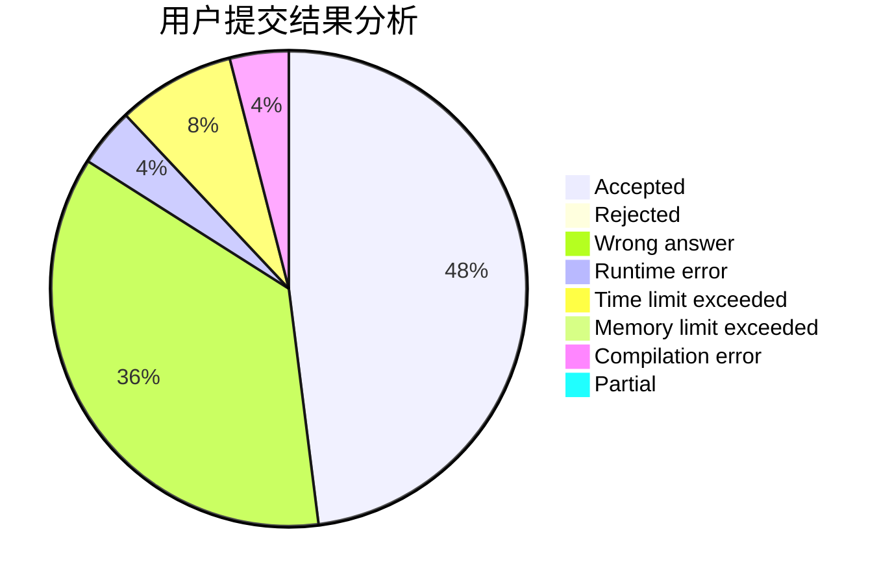
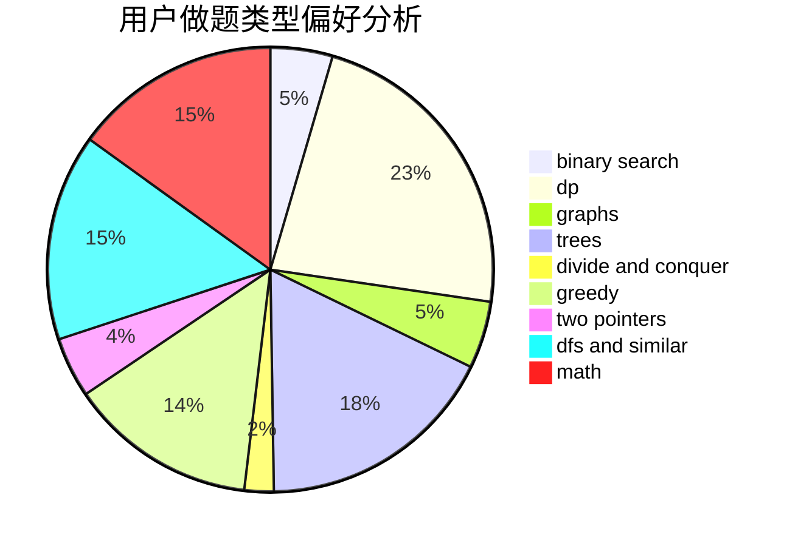

# ZhaoChongyan

<!-- tabs:start -->

#### **用户提交结果分析**

#### **用户做题类型偏好分析**

<!-- tabs:end -->
# 推荐题目
[808A](https://codeforces.com/contest/808/problem/A)
[42C](https://codeforces.com/contest/42/problem/C)
[1016B](https://codeforces.com/contest/1016/problem/B)
[1298D](https://codeforces.com/contest/1298/problem/D)
[814D](https://codeforces.com/contest/814/problem/D)
[845D](https://codeforces.com/contest/845/problem/D)
[166A](https://codeforces.com/contest/166/problem/A)
[997D](https://codeforces.com/contest/997/problem/D)
[371D](https://codeforces.com/contest/371/problem/D)
[1362E](https://codeforces.com/contest/1362/problem/E)
