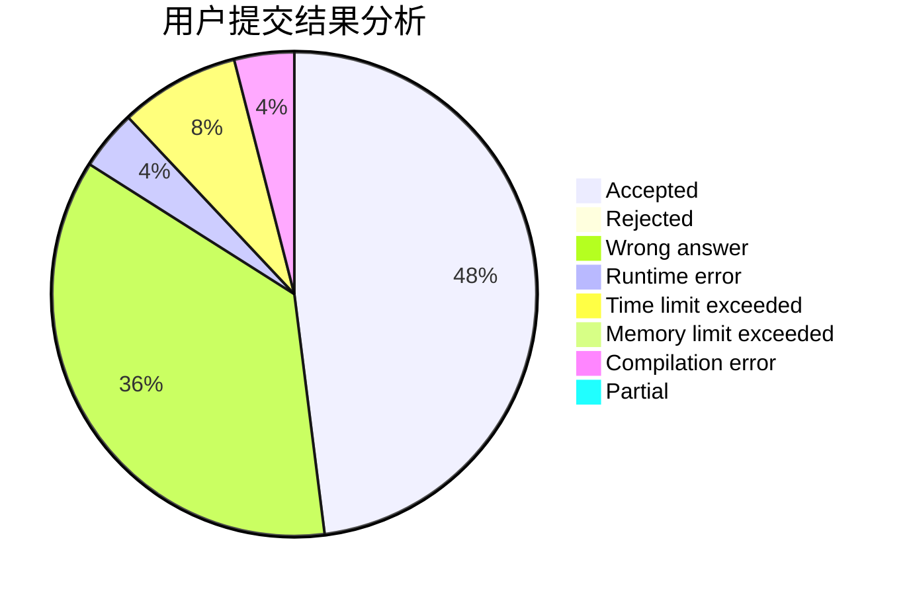
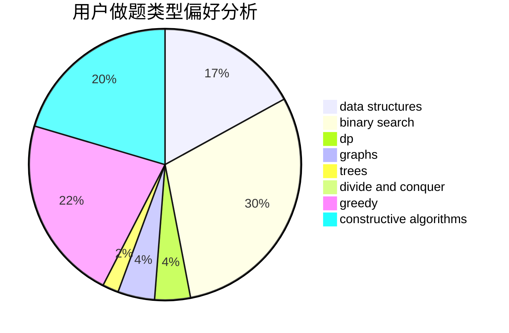

# ZhaoChongyan

<!-- tabs:start -->

#### **用户提交结果分析**

#### **用户做题类型偏好分析**

#### **用户错题知识点分析**

<!-- tabs:end -->
# 推荐题目
[792B](https://codeforces.com/contest/792/problem/B)		implementation		  
[401C](https://codeforces.com/contest/401/problem/C)		constructive algorithms,
                        greedy,
                        implementation		  
[1015E2](https://codeforces.com/contest/1015E/problem/2)		binary search,
                        dp,
                        greedy		  
[1291E](https://codeforces.com/contest/1291/problem/E)		dsu,graphs,sortings,trees		  
[7C](https://codeforces.com/contest/7/problem/C)		math,
                        number theory		  
[827A](https://codeforces.com/contest/827/problem/A)		data structures,
                        greedy,
                        sortings,
                        strings		  
[1510I](https://codeforces.com/contest/1510/problem/I)		greedy,
                        interactive,
                        math,
                        probabilities		  
[982A](https://codeforces.com/contest/982/problem/A)		brute force,
                        constructive algorithms		  
[346A](https://codeforces.com/contest/346/problem/A)		games,
                        math,
                        number theory		  
[1355F](https://codeforces.com/contest/1355/problem/F)		constructive algorithms,
                        interactive,
                        number theory		  
