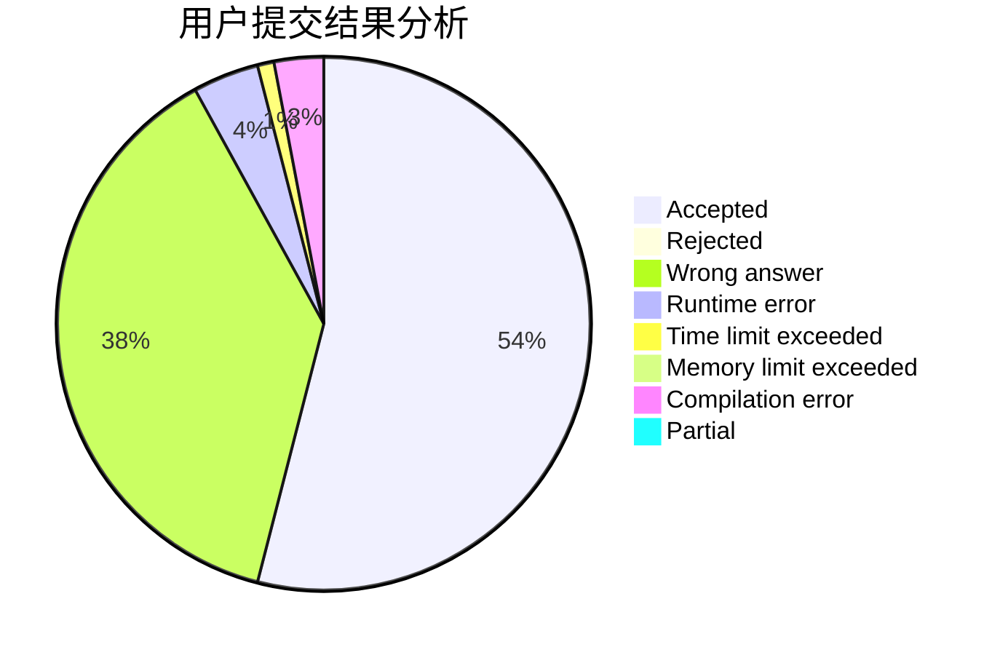
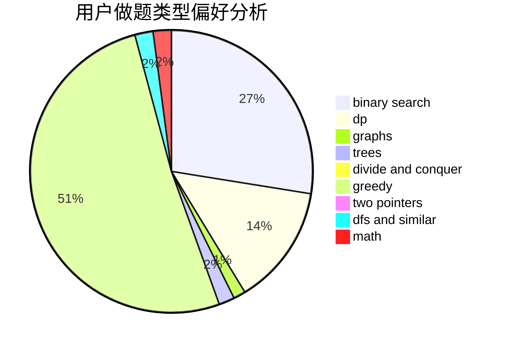

# Zhaoyz

<!-- tabs:start -->

#### **用户提交结果分析**

#### **用户做题类型偏好分析**

<!-- tabs:end -->
# 推荐题目
[467A](https://codeforces.com/contest/467/problem/A)
[1058D](https://codeforces.com/contest/1058/problem/D)
[1237G](https://codeforces.com/contest/1237/problem/G)
[53D](https://codeforces.com/contest/53/problem/D)
[816D](https://codeforces.com/contest/816/problem/D)
[297A](https://codeforces.com/contest/297/problem/A)
[120J](https://codeforces.com/contest/120/problem/J)
[772E](https://codeforces.com/contest/772/problem/E)
[1350B](https://codeforces.com/contest/1350/problem/B)
[966B](https://codeforces.com/contest/966/problem/B)
