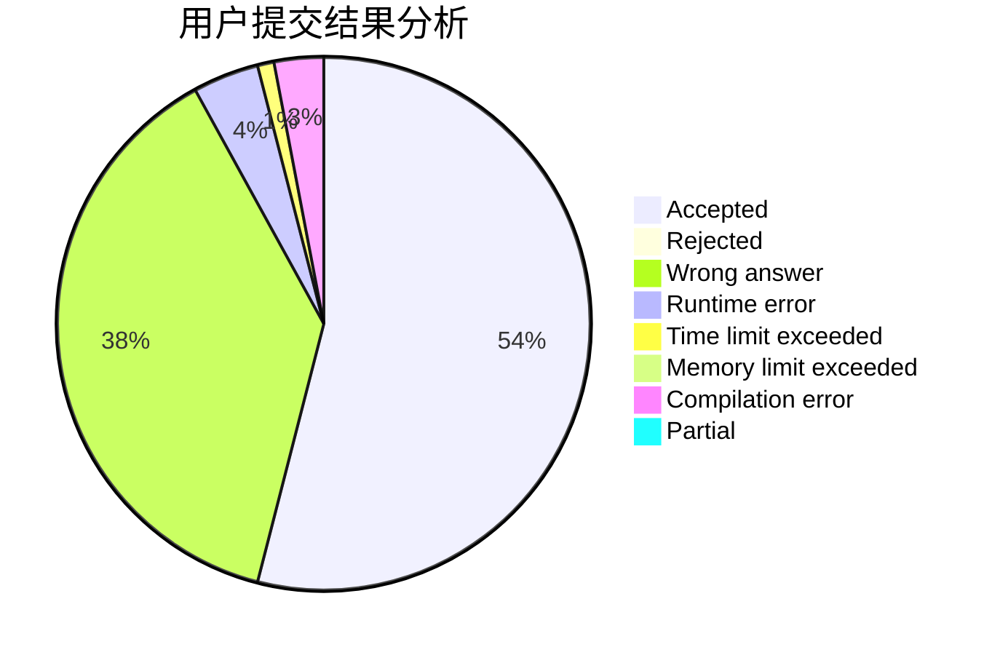
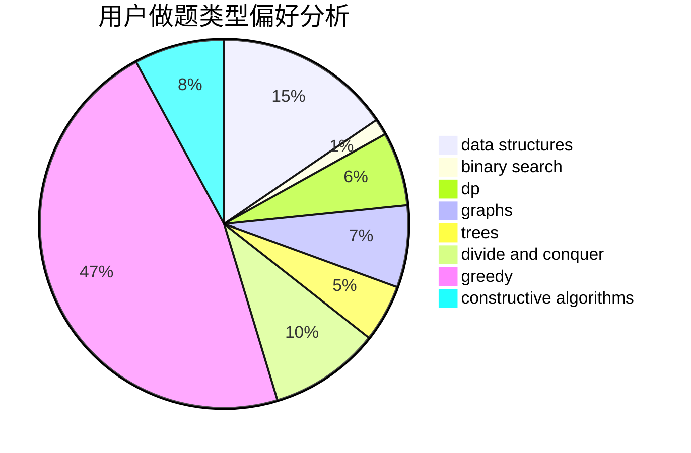
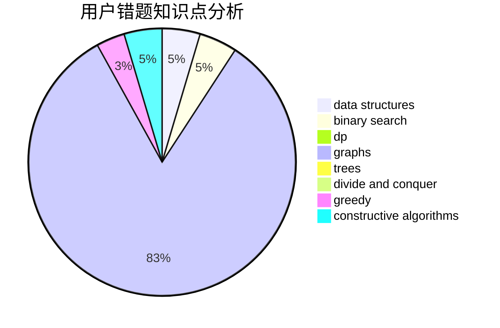

# Zhaoyz

<!-- tabs:start -->

#### **用户提交结果分析**

#### **用户做题类型偏好分析**

#### **用户错题知识点分析**

<!-- tabs:end -->
# 推荐题目
[446E](https://codeforces.com/contest/446/problem/E)		math,
                        matrices		  
[1058A](https://codeforces.com/contest/1058/problem/A)		dsu,graphs,sortings,trees		  
[1229C](https://codeforces.com/contest/1229/problem/C)		dsu,graphs,sortings,trees		  
[513G1](https://codeforces.com/contest/513G/problem/1)		brute force,
                        dfs and similar,
                        dp,
                        meet-in-the-middle		  
[801D](https://codeforces.com/contest/801/problem/D)		dsu,graphs,sortings,trees		  
[280D](https://codeforces.com/contest/280/problem/D)		data structures,
                        flows,
                        graphs,
                        implementation		  
[1205F](https://codeforces.com/contest/1205/problem/F)		constructive algorithms,
                        math		  
[754D](https://codeforces.com/contest/754/problem/D)		binary search,
                        data structures,
                        greedy,
                        sortings		  
[1343D](https://codeforces.com/contest/1343/problem/D)		brute force,
                        data structures,
                        greedy,
                        two pointers		  
[949C](https://codeforces.com/contest/949/problem/C)		dfs and similar,
                        graphs		  
