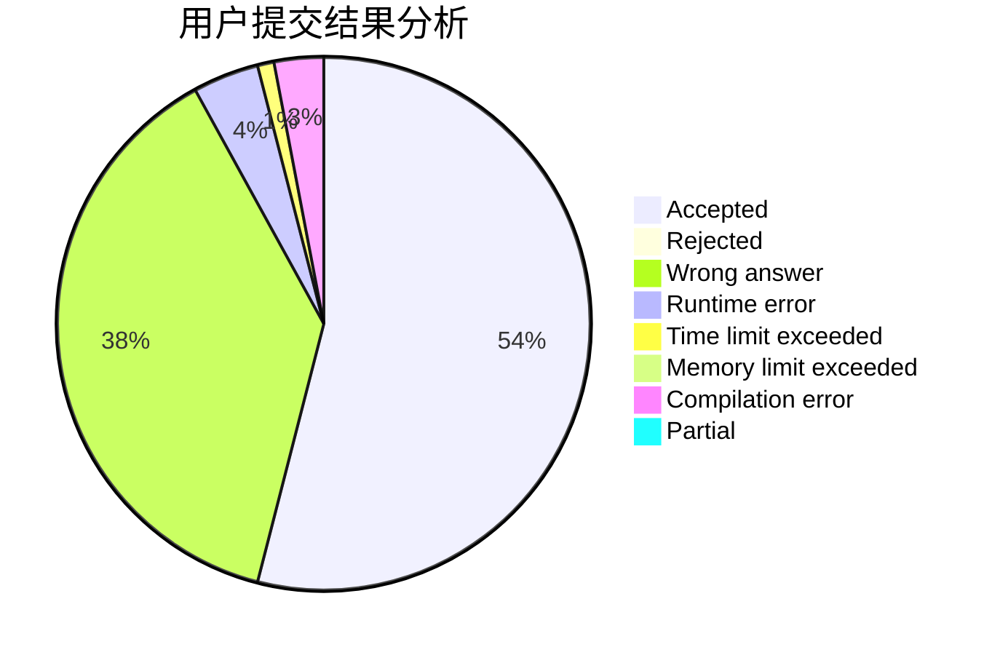
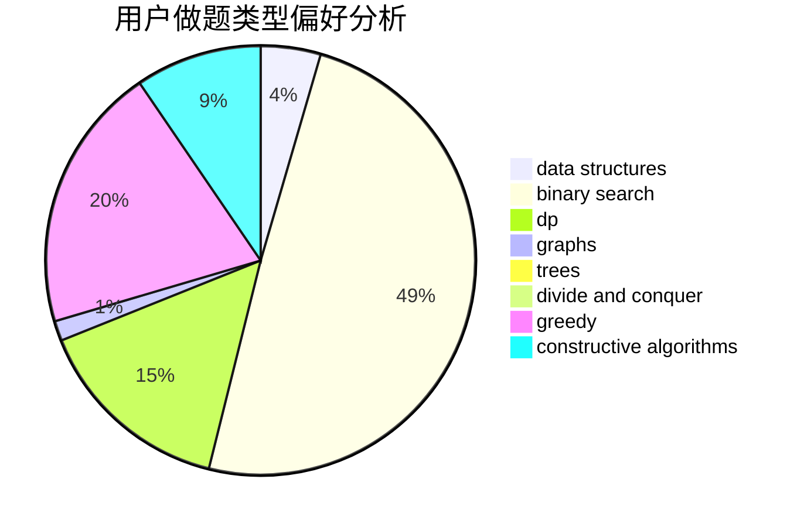
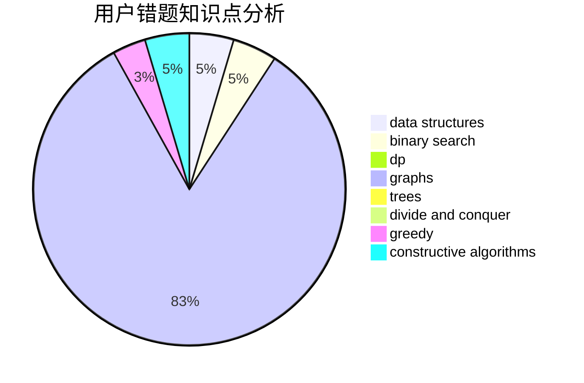

# Zhaoyz

<!-- tabs:start -->

#### **用户提交结果分析**

#### **用户做题类型偏好分析**

#### **用户错题知识点分析**

<!-- tabs:end -->
# 推荐题目
[467A](https://codeforces.com/contest/467/problem/A)		implementation		  
[1058D](https://codeforces.com/contest/1058/problem/D)		dsu,graphs,sortings,trees		  
[1237G](https://codeforces.com/contest/1237/problem/G)		data structures,
                        dp,
                        greedy		  
[53D](https://codeforces.com/contest/53/problem/D)		sortings		  
[816D](https://codeforces.com/contest/816/problem/D)		dsu,graphs,sortings,trees		  
[297A](https://codeforces.com/contest/297/problem/A)		constructive algorithms		  
[120J](https://codeforces.com/contest/120/problem/J)		divide and conquer,
                        geometry,
                        sortings		  
[772E](https://codeforces.com/contest/772/problem/E)		binary search,
                        divide and conquer,
                        interactive,
                        trees		  
[1350B](https://codeforces.com/contest/1350/problem/B)		dp,
                        math,
                        number theory		  
[966B](https://codeforces.com/contest/966/problem/B)		dsu,graphs,sortings,trees		  
