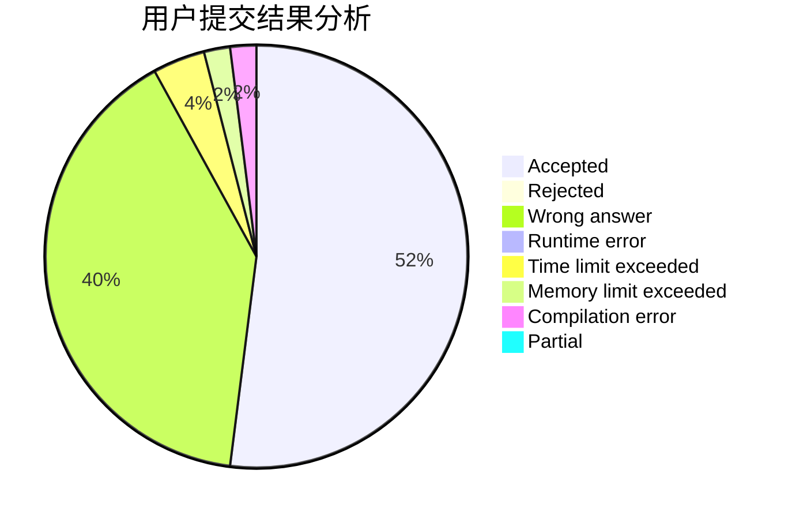
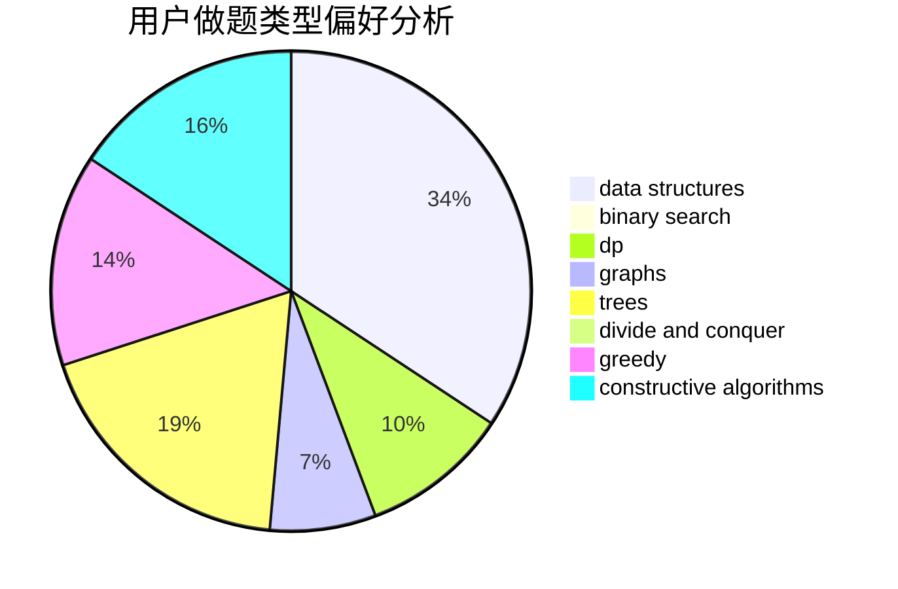
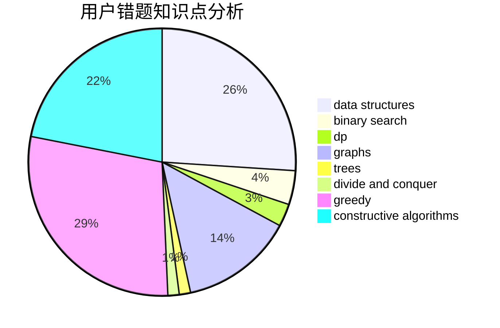

# Zhengenxi

<!-- tabs:start -->

#### **用户提交结果分析**

#### **用户做题类型偏好分析**

#### **用户错题知识点分析**

<!-- tabs:end -->
# 推荐题目
[1062E](https://codeforces.com/contest/1062/problem/E)		binary search,
                        data structures,
                        dfs and similar,
                        greedy,
                        trees		  
[535E](https://codeforces.com/contest/535/problem/E)		geometry,
                        math		  
[837A](https://codeforces.com/contest/837/problem/A)		implementation		  
[1236E](https://codeforces.com/contest/1236/problem/E)		binary search,
                        data structures,
                        dp,
                        dsu		  
[877B](https://codeforces.com/contest/877/problem/B)		brute force,
                        dp		  
[490E](https://codeforces.com/contest/490/problem/E)		binary search,
                        brute force,
                        greedy,
                        implementation		  
[1269D](https://codeforces.com/contest/1269/problem/D)		dsu,graphs,sortings,trees		  
[88A](https://codeforces.com/contest/88/problem/A)		brute force,
                        implementation		  
[993E](https://codeforces.com/contest/993/problem/E)		chinese remainder theorem,
                        fft,
                        math		  
[1398G](https://codeforces.com/contest/1398/problem/G)		bitmasks,
                        fft,
                        math,
                        number theory		  
