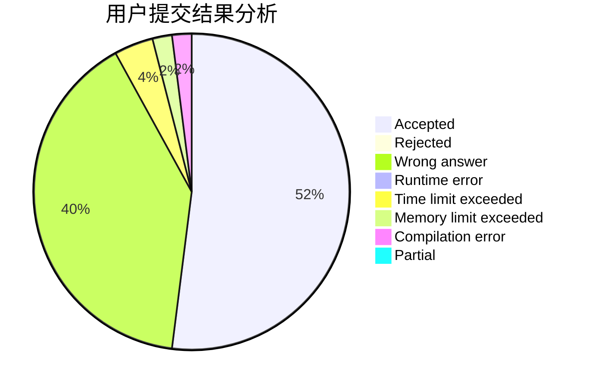
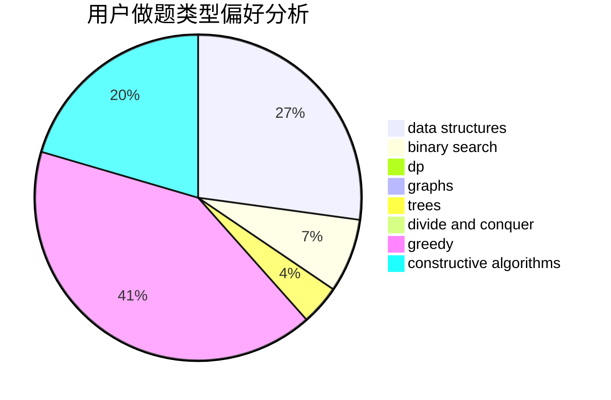
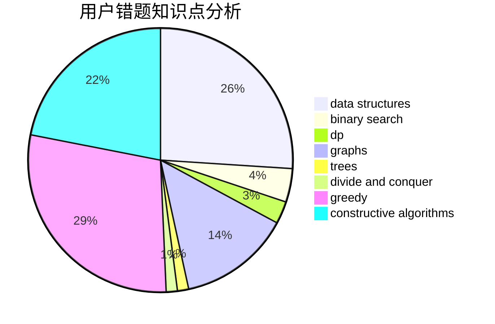

# Zhengenxi

<!-- tabs:start -->

#### **用户提交结果分析**

#### **用户做题类型偏好分析**

#### **用户错题知识点分析**

<!-- tabs:end -->
# 推荐题目
[1062B](https://codeforces.com/contest/1062/problem/B)		greedy,
                        math,
                        number theory		  
[512E](https://codeforces.com/contest/512/problem/E)		constructive algorithms,
                        divide and conquer		  
[817A](https://codeforces.com/contest/817/problem/A)		implementation,
                        math,
                        number theory		  
[1227G](https://codeforces.com/contest/1227/problem/G)		constructive algorithms		  
[859E](https://codeforces.com/contest/859/problem/E)		combinatorics,
                        dfs and similar,
                        dsu,
                        graphs,
                        trees		  
[472B](https://codeforces.com/contest/472/problem/B)		nan		  
[1263F](https://codeforces.com/contest/1263/problem/F)		data structures,
                        dfs and similar,
                        dp,
                        flows,
                        graphs,
                        trees		  
[86C](https://codeforces.com/contest/86/problem/C)		dp,
                        string suffix structures,
                        trees		  
[979E](https://codeforces.com/contest/979/problem/E)		dp		  
[1389D](https://codeforces.com/contest/1389/problem/D)		brute force,
                        greedy,
                        implementation,
                        math		  
