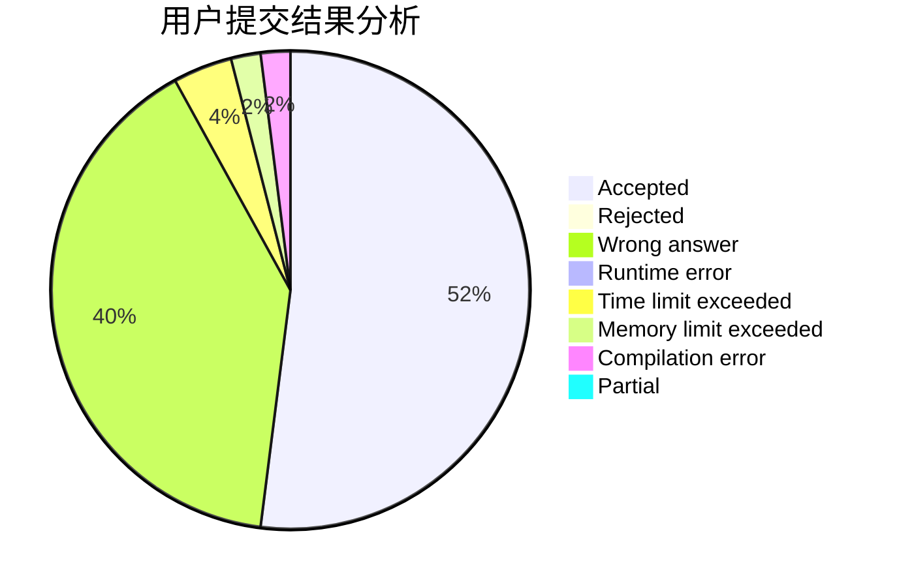
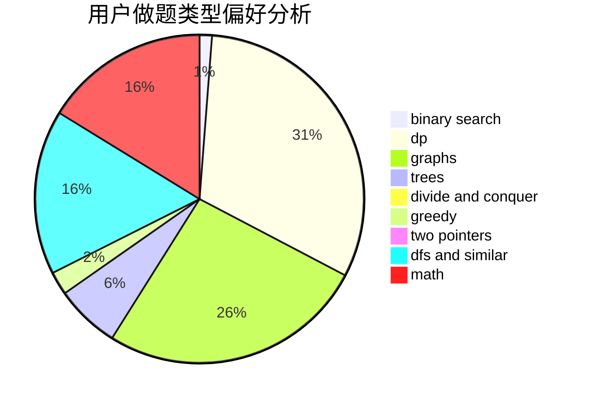

# Zhengenxi

<!-- tabs:start -->

#### **用户提交结果分析**

#### **用户做题类型偏好分析**

<!-- tabs:end -->
# 推荐题目
[1062E](https://codeforces.com/contest/1062/problem/E)
[535E](https://codeforces.com/contest/535/problem/E)
[837A](https://codeforces.com/contest/837/problem/A)
[1236E](https://codeforces.com/contest/1236/problem/E)
[877B](https://codeforces.com/contest/877/problem/B)
[490E](https://codeforces.com/contest/490/problem/E)
[1269D](https://codeforces.com/contest/1269/problem/D)
[88A](https://codeforces.com/contest/88/problem/A)
[993E](https://codeforces.com/contest/993/problem/E)
[1398G](https://codeforces.com/contest/1398/problem/G)
