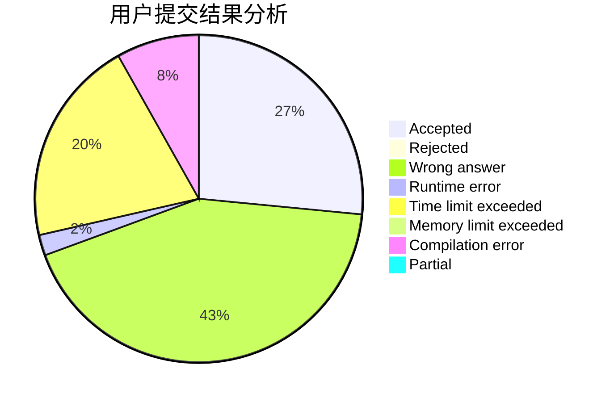
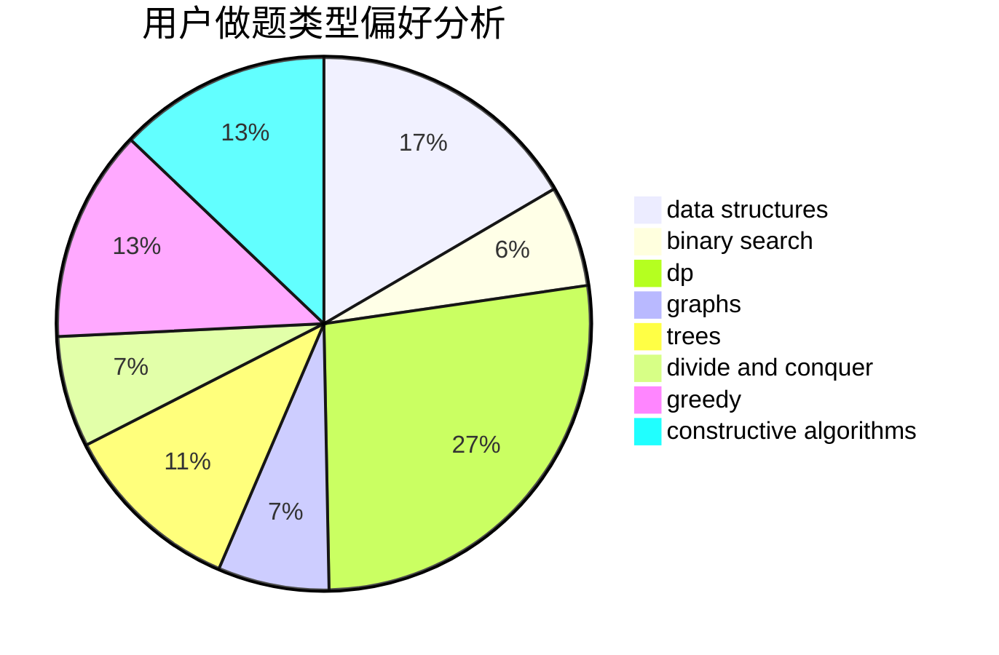
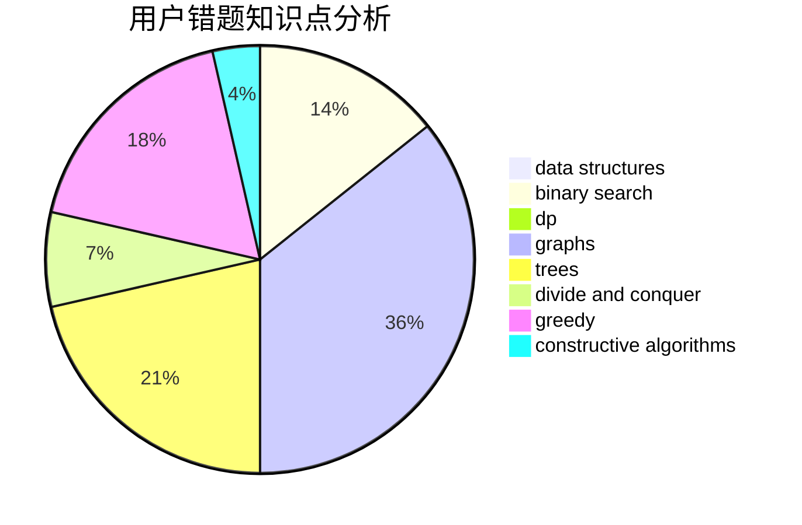

# ZhmTempura

<!-- tabs:start -->

#### **用户提交结果分析**

#### **用户做题类型偏好分析**

#### **用户错题知识点分析**

<!-- tabs:end -->
# 推荐题目
[79D](https://codeforces.com/contest/79/problem/D)		bitmasks,
                        dp,
                        shortest paths		  
[39E](https://codeforces.com/contest/39/problem/E)		dp,
                        games		  
[525C](https://codeforces.com/contest/525/problem/C)		greedy,
                        math,
                        sortings		  
[819D](https://codeforces.com/contest/819/problem/D)		number theory		  
[948B](https://codeforces.com/contest/948/problem/B)		dsu,graphs,sortings,trees		  
[34D](https://codeforces.com/contest/34/problem/D)		dfs and similar,
                        graphs		  
[618A](https://codeforces.com/contest/618/problem/A)		implementation		  
[1234F](https://codeforces.com/contest/1234/problem/F)		bitmasks,
                        dp		  
[782C](https://codeforces.com/contest/782/problem/C)		dsu,graphs,sortings,trees		  
[987F](https://codeforces.com/contest/987/problem/F)		dsu,graphs,sortings,trees		  
