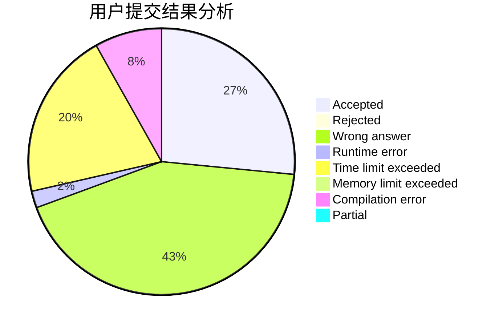
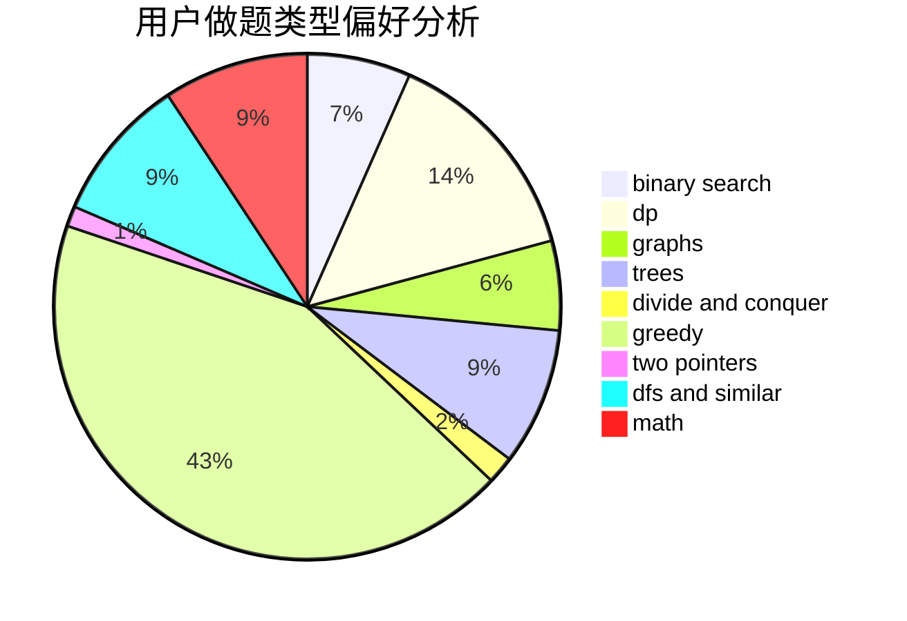

# ZhmTempura

<!-- tabs:start -->

#### **用户提交结果分析**

#### **用户做题类型偏好分析**

<!-- tabs:end -->
# 推荐题目
[79D](https://codeforces.com/contest/79/problem/D)
[39E](https://codeforces.com/contest/39/problem/E)
[525C](https://codeforces.com/contest/525/problem/C)
[819D](https://codeforces.com/contest/819/problem/D)
[948B](https://codeforces.com/contest/948/problem/B)
[34D](https://codeforces.com/contest/34/problem/D)
[618A](https://codeforces.com/contest/618/problem/A)
[1234F](https://codeforces.com/contest/1234/problem/F)
[782C](https://codeforces.com/contest/782/problem/C)
[987F](https://codeforces.com/contest/987/problem/F)
