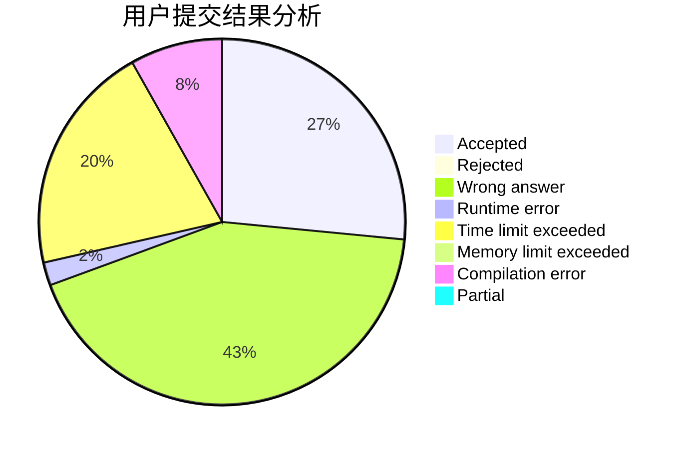
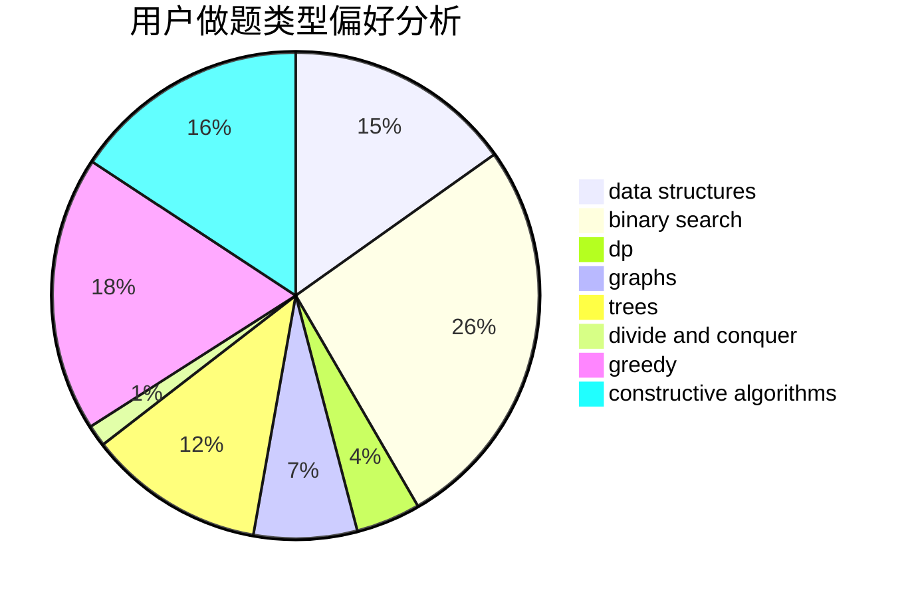
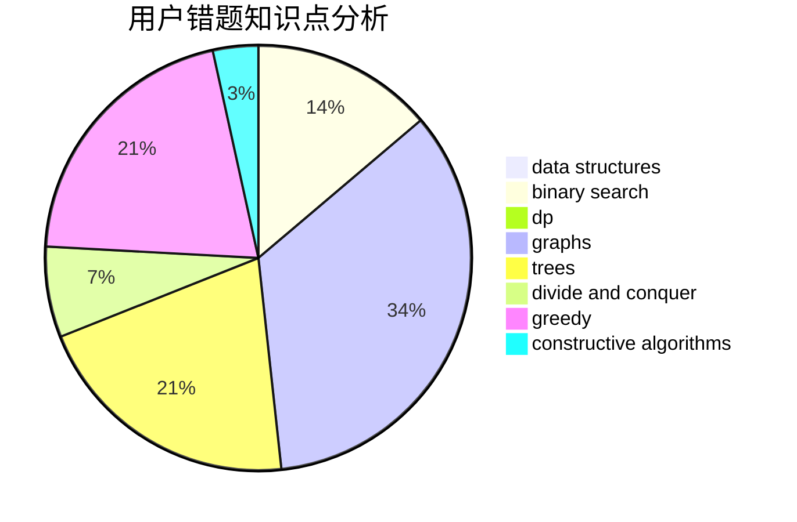

# ZhmTempura

<!-- tabs:start -->

#### **用户提交结果分析**

#### **用户做题类型偏好分析**

#### **用户错题知识点分析**

<!-- tabs:end -->
# 推荐题目
[780H](https://codeforces.com/contest/780/problem/H)		binary search,
                        geometry,
                        implementation,
                        two pointers		  
[369C](https://codeforces.com/contest/369/problem/C)		dfs and similar,
                        graphs,
                        trees		  
[505A](https://codeforces.com/contest/505/problem/A)		brute force,
                        implementation,
                        strings		  
[803E](https://codeforces.com/contest/803/problem/E)		dp,
                        graphs		  
[924D](https://codeforces.com/contest/924/problem/D)		nan		  
[319D](https://codeforces.com/contest/319/problem/D)		greedy,
                        hashing,
                        string suffix structures,
                        strings		  
[599E](https://codeforces.com/contest/599/problem/E)		bitmasks,
                        dp,
                        trees		  
[1227B](https://codeforces.com/contest/1227/problem/B)		constructive algorithms		  
[763E](https://codeforces.com/contest/763/problem/E)		data structures,
                        divide and conquer,
                        dsu		  
[966A](https://codeforces.com/contest/966/problem/A)		dsu,graphs,sortings,trees		  
