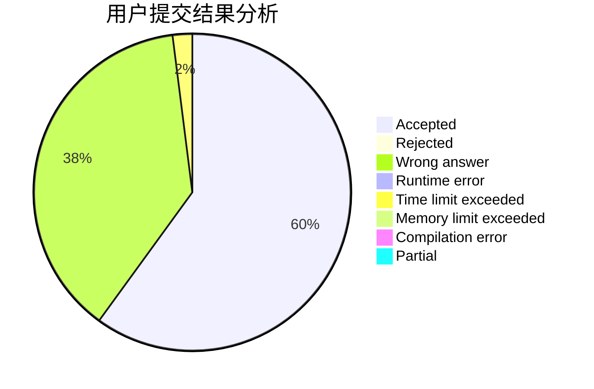
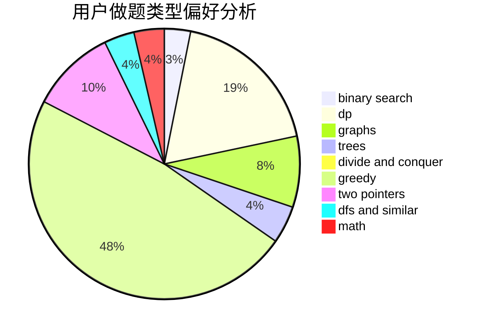

# ZhouShang0817

<!-- tabs:start -->

#### **用户提交结果分析**

#### **用户做题类型偏好分析**

<!-- tabs:end -->
# 推荐题目
[269C](https://codeforces.com/contest/269/problem/C)
[864C](https://codeforces.com/contest/864/problem/C)
[679E](https://codeforces.com/contest/679/problem/E)
[878D](https://codeforces.com/contest/878/problem/D)
[16E](https://codeforces.com/contest/16/problem/E)
[724F](https://codeforces.com/contest/724/problem/F)
[1423I](https://codeforces.com/contest/1423/problem/I)
[935C](https://codeforces.com/contest/935/problem/C)
[234A](https://codeforces.com/contest/234/problem/A)
[36C](https://codeforces.com/contest/36/problem/C)
