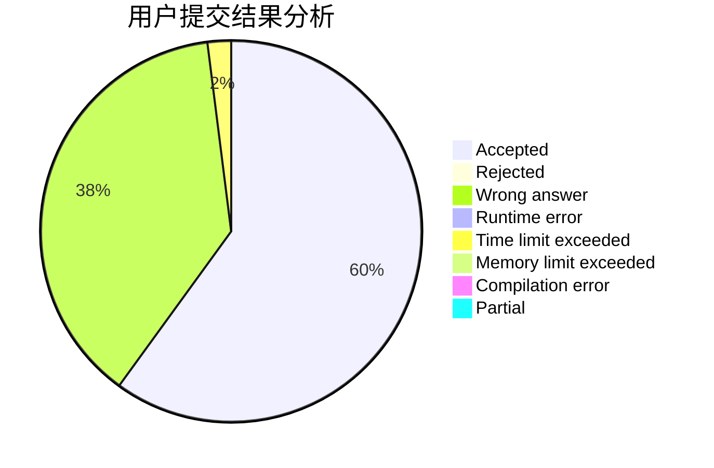
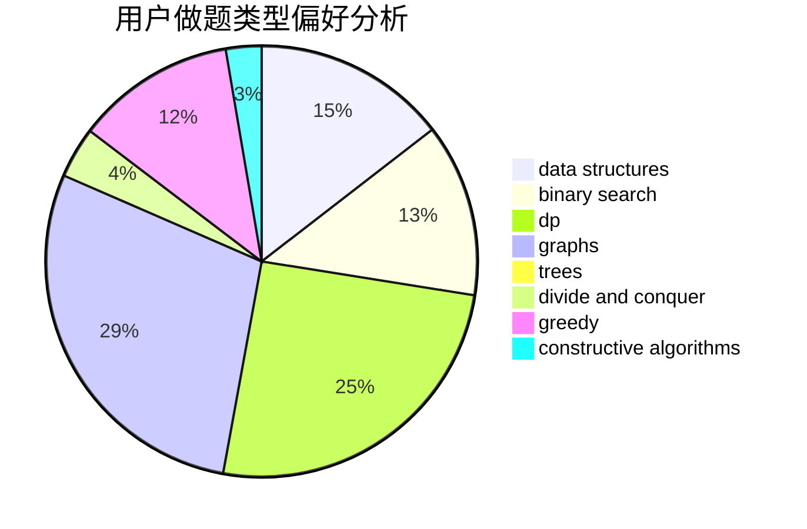
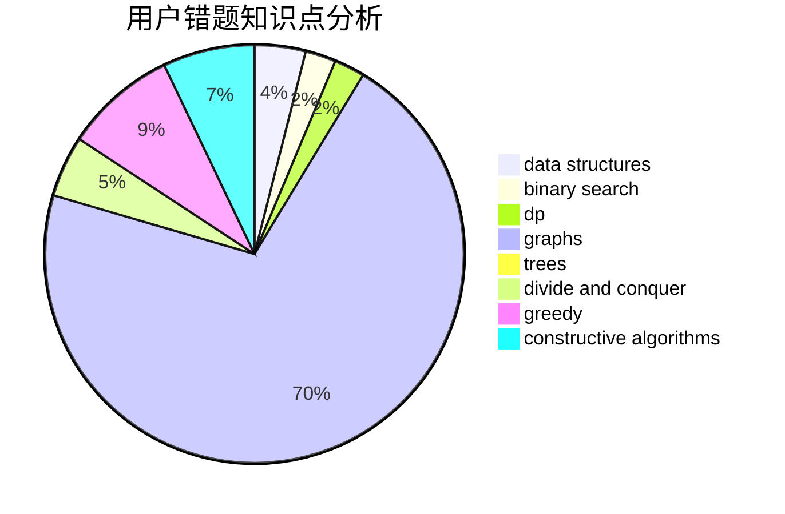

# ZhouShang0817

<!-- tabs:start -->

#### **用户提交结果分析**

#### **用户做题类型偏好分析**

#### **用户错题知识点分析**

<!-- tabs:end -->
# 推荐题目
[251A](https://codeforces.com/contest/251/problem/A)		binary search,
                        combinatorics,
                        two pointers		  
[846A](https://codeforces.com/contest/846/problem/A)		brute force,
                        implementation		  
[659E](https://codeforces.com/contest/659/problem/E)		data structures,
                        dfs and similar,
                        dsu,
                        graphs,
                        greedy		  
[860D](https://codeforces.com/contest/860/problem/D)		dsu,graphs,sortings,trees		  
[1511G](https://codeforces.com/contest/1511/problem/G)		bitmasks,
                        brute force,
                        data structures,
                        games,
                        two pointers		  
[706A](https://codeforces.com/contest/706/problem/A)		brute force,
                        geometry,
                        implementation		  
[1415E](https://codeforces.com/contest/1415/problem/E)		constructive algorithms,
                        greedy,
                        math		  
[915D](https://codeforces.com/contest/915/problem/D)		dfs and similar,
                        graphs		  
[215B](https://codeforces.com/contest/215/problem/B)		greedy,
                        math		  
[343B](https://codeforces.com/contest/343/problem/B)		data structures,
                        greedy,
                        implementation		  
