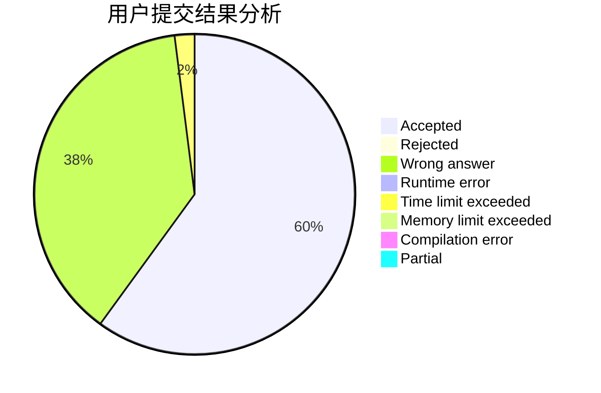
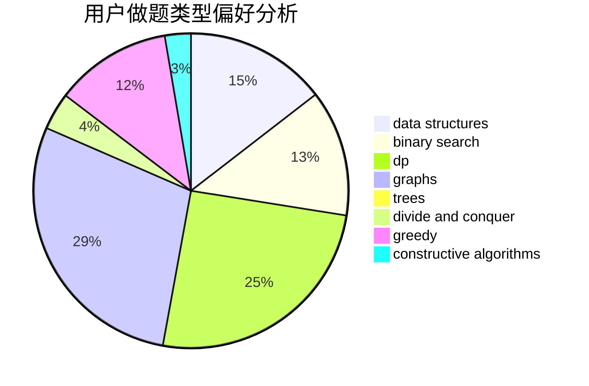
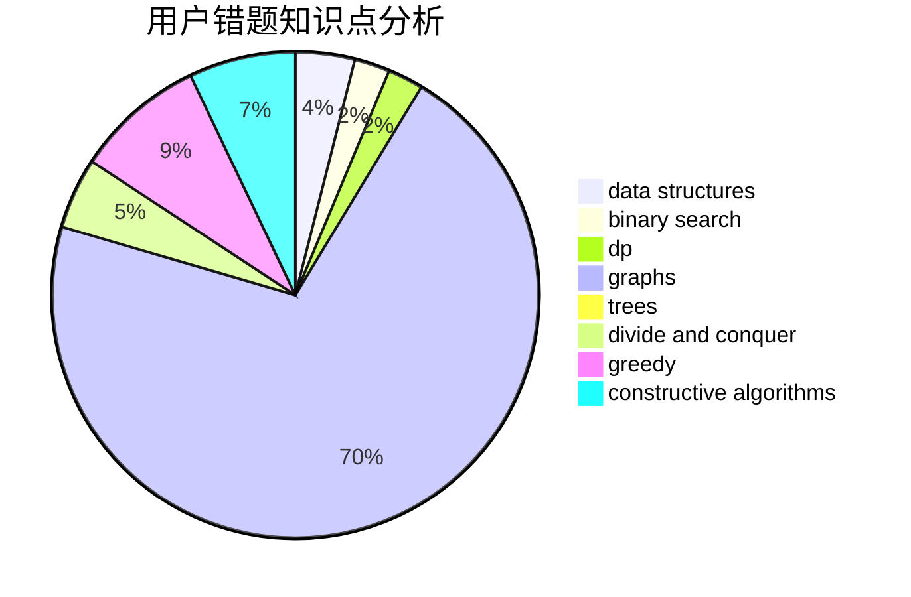

# ZhouShang0817
<!-- tabs:start -->
#### **用户提交结果分析**

#### **用户做题类型偏好分析**

#### **用户错题知识点分析**

<!-- tabs:end -->
# 推荐题目
[Chips on a Board](http://codeforces.com/problemset/problem/1511/G)		bitmasks,
                        brute force,
                        data structures,
                        games,
                        two pointers		  
[Curriculum Vitae](http://codeforces.com/problemset/problem/846/A)		brute force,
                        implementation		  
[Alternating Current](http://codeforces.com/problemset/problem/343/B)		data structures,
                        greedy,
                        implementation		  
[New Reform](http://codeforces.com/problemset/problem/659/E)		data structures,
                        dfs and similar,
                        dsu,
                        graphs,
                        greedy		  
[Megacity](http://codeforces.com/problemset/problem/424/B)		binary search,
                        greedy,
                        implementation,
                        sortings		  
[Multipliers](http://codeforces.com/problemset/problem/615/D)		math,
                        number theory		  
[New Game Plus!](http://codeforces.com/problemset/problem/1415/E)		constructive algorithms,
                        greedy,
                        math		  
[Average Sleep Time](http://codeforces.com/problemset/problem/808/B)		data structures,
                        implementation,
                        math		  
[Ball](http://codeforces.com/problemset/problem/12/D)		data structures,
                        sortings		  
[Wizard's Tour](https://codeforces.com/contest/860/problem/D)		constructive algorithms,
                        dfs and similar,
                        graphs		  
<!-- tabs:start -->
#### **data structures**
[Chips on a Board](http://codeforces.com/problemset/problem/1511/G)		bitmasks,
                        brute force,
                        data structures,
                        games,
                        two pointers		  
[Curriculum Vitae](http://codeforces.com/problemset/problem/343/B)		data structures,
                        greedy,
                        implementation		  
[Alternating Current](http://codeforces.com/problemset/problem/659/E)		data structures,
                        dfs and similar,
                        dsu,
                        graphs,
                        greedy		  
[New Reform](http://codeforces.com/problemset/problem/808/B)		data structures,
                        implementation,
                        math		  
[Megacity](http://codeforces.com/problemset/problem/12/D)		data structures,
                        sortings		  
[Multipliers](https://codeforces.com/contest/1405/problem/E)		binary search,
                        constructive algorithms,
                        data structures,
                        greedy,
                        two pointers		  
[New Game Plus!](http://codeforces.com/problemset/problem/1380/E)		data structures,
                        dsu,
                        implementation,
                        trees		  
[Average Sleep Time](http://codeforces.com/problemset/problem/533/A)		binary search,
                        data structures,
                        dfs and similar,
                        greedy,
                        trees		  
[Ball](http://codeforces.com/problemset/problem/1093/G)		bitmasks,
                        data structures		  
[Wizard's Tour](http://codeforces.com/problemset/problem/609/F)		data structures,
                        greedy		  
#### **binary search**
[Chips on a Board](http://codeforces.com/problemset/problem/424/B)		binary search,
                        greedy,
                        implementation,
                        sortings		  
[Curriculum Vitae](https://codeforces.com/contest/1405/problem/E)		binary search,
                        constructive algorithms,
                        data structures,
                        greedy,
                        two pointers		  
[Alternating Current](http://codeforces.com/problemset/problem/251/A)		binary search,
                        combinatorics,
                        two pointers		  
[New Reform](https://codeforces.com/contest/672/problem/D)		binary search,
                        greedy		  
[Megacity](http://codeforces.com/problemset/problem/533/A)		binary search,
                        data structures,
                        dfs and similar,
                        greedy,
                        trees		  
[Multipliers](http://codeforces.com/problemset/problem/555/D)		binary search,
                        implementation,
                        math		  
[New Game Plus!](http://codeforces.com/problemset/problem/730/C)		binary search,
                        dfs and similar		  
[Average Sleep Time](http://codeforces.com/problemset/problem/734/C)		binary search,
                        dp,
                        greedy,
                        two pointers		  
[Ball](http://codeforces.com/problemset/problem/778/A)		binary search,
                        greedy,
                        strings		  
[Wizard's Tour](http://codeforces.com/problemset/problem/1492/C)		binary search,
                        data structures,
                        dp,
                        greedy,
                        two pointers		  
#### **dp**
[Chips on a Board](http://codeforces.com/problemset/problem/277/D)		dp,
                        probabilities		  
[Curriculum Vitae](http://codeforces.com/problemset/problem/855/G)		dfs and similar,
                        dp,
                        graphs,
                        trees		  
[Alternating Current](http://codeforces.com/problemset/problem/734/C)		binary search,
                        dp,
                        greedy,
                        two pointers		  
[New Reform](https://codeforces.com/contest/956/problem/C)		data structures,
                        dp,
                        greedy		  
[Megacity](http://codeforces.com/problemset/problem/1296/E2)		data structures,
                        dp		  
[Multipliers](http://codeforces.com/problemset/problem/1481/F)		dp,
                        greedy,
                        trees		  
[New Game Plus!](http://codeforces.com/problemset/problem/932/E)		combinatorics,
                        dp,
                        math		  
[Average Sleep Time](http://codeforces.com/problemset/problem/1492/C)		binary search,
                        data structures,
                        dp,
                        greedy,
                        two pointers		  
[Ball](https://codeforces.com/contest/1457/problem/C)		brute force,
                        dp,
                        implementation		  
[Wizard's Tour](http://codeforces.com/problemset/problem/1491/C)		brute force,
                        data structures,
                        dp,
                        greedy,
                        implementation		  
#### **graph**
[Chips on a Board](http://codeforces.com/problemset/problem/659/E)		data structures,
                        dfs and similar,
                        dsu,
                        graphs,
                        greedy		  
[Curriculum Vitae](https://codeforces.com/contest/860/problem/D)		constructive algorithms,
                        dfs and similar,
                        graphs		  
[Alternating Current](http://codeforces.com/problemset/problem/852/I)		brute force,
                        dfs and similar,
                        graphs,
                        trees		  
[New Reform](http://codeforces.com/problemset/problem/855/G)		dfs and similar,
                        dp,
                        graphs,
                        trees		  
[Megacity](http://codeforces.com/problemset/problem/1290/D)		constructive algorithms,
                        graphs,
                        interactive		  
[Multipliers](http://codeforces.com/problemset/problem/915/D)		dfs and similar,
                        graphs		  
[New Game Plus!](http://codeforces.com/problemset/problem/1487/C)		brute force,
                        constructive algorithms,
                        dfs and similar,
                        graphs,
                        greedy,
                        implementation,
                        math		  
[Average Sleep Time](http://codeforces.com/problemset/problem/1437/C)		dp,
                        flows,
                        graph matchings,
                        greedy,
                        math,
                        sortings		  
[Ball](http://codeforces.com/problemset/problem/1470/D)		constructive algorithms,
                        dfs and similar,
                        graph matchings,
                        graphs,
                        greedy		  
[Wizard's Tour](http://codeforces.com/problemset/problem/1476/C)		dp,
                        graphs,
                        greedy		  
#### **trees**
[Chips on a Board](http://codeforces.com/problemset/problem/1380/E)		data structures,
                        dsu,
                        implementation,
                        trees		  
[Curriculum Vitae](http://codeforces.com/problemset/problem/852/I)		brute force,
                        dfs and similar,
                        graphs,
                        trees		  
[Alternating Current](http://codeforces.com/problemset/problem/533/A)		binary search,
                        data structures,
                        dfs and similar,
                        greedy,
                        trees		  
[New Reform](http://codeforces.com/problemset/problem/855/G)		dfs and similar,
                        dp,
                        graphs,
                        trees		  
[Megacity](http://codeforces.com/problemset/problem/1481/F)		dp,
                        greedy,
                        trees		  
[Multipliers](http://codeforces.com/problemset/problem/1479/D)		binary search,
                        bitmasks,
                        brute force,
                        data structures,
                        probabilities,
                        trees		  
[New Game Plus!](http://codeforces.com/problemset/problem/1511/C)		brute force,
                        data structures,
                        implementation,
                        trees		  
[Average Sleep Time](http://codeforces.com/problemset/problem/1499/F)		combinatorics,
                        dfs and similar,
                        dp,
                        trees		  
[Ball](http://codeforces.com/problemset/problem/1491/E)		brute force,
                        dfs and similar,
                        divide and conquer,
                        number theory,
                        trees		  
[Wizard's Tour](http://codeforces.com/problemset/problem/1466/D)		data structures,
                        greedy,
                        sortings,
                        trees		  
#### **divide and conquer**
[Chips on a Board](http://codeforces.com/problemset/problem/1461/D)		binary search,
                        brute force,
                        data structures,
                        divide and conquer,
                        implementation,
                        sortings		  
[Curriculum Vitae](http://codeforces.com/problemset/problem/1466/G)		combinatorics,
                        divide and conquer,
                        hashing,
                        math,
                        string suffix structures,
                        strings		  
[Alternating Current](http://codeforces.com/problemset/problem/1490/D)		dfs and similar,
                        divide and conquer,
                        implementation		  
[New Reform](https://codeforces.com/contest/1483/problem/C)		data structures,
                        divide and conquer,
                        dp		  
[Megacity](http://codeforces.com/problemset/problem/1491/E)		brute force,
                        dfs and similar,
                        divide and conquer,
                        number theory,
                        trees		  
[Multipliers](http://codeforces.com/problemset/problem/1303/G)		data structures,
                        divide and conquer,
                        geometry,
                        trees		  
[New Game Plus!](http://codeforces.com/problemset/problem/1494/D)		constructive algorithms,
                        data structures,
                        dfs and similar,
                        divide and conquer,
                        dsu,
                        greedy,
                        sortings,
                        trees		  
[Average Sleep Time](http://codeforces.com/problemset/problem/1482/E)		data structures,
                        divide and conquer,
                        dp		  
[Ball](http://codeforces.com/problemset/problem/566/C)		dfs and similar,
                        divide and conquer,
                        trees		  
[Wizard's Tour](http://codeforces.com/problemset/problem/1428/F)		binary search,
                        data structures,
                        divide and conquer,
                        dp,
                        two pointers		  
#### **greedy**
[Chips on a Board](http://codeforces.com/problemset/problem/343/B)		data structures,
                        greedy,
                        implementation		  
[Curriculum Vitae](http://codeforces.com/problemset/problem/659/E)		data structures,
                        dfs and similar,
                        dsu,
                        graphs,
                        greedy		  
[Alternating Current](http://codeforces.com/problemset/problem/424/B)		binary search,
                        greedy,
                        implementation,
                        sortings		  
[New Reform](http://codeforces.com/problemset/problem/1415/E)		constructive algorithms,
                        greedy,
                        math		  
[Megacity](https://codeforces.com/contest/1405/problem/E)		binary search,
                        constructive algorithms,
                        data structures,
                        greedy,
                        two pointers		  
[Multipliers](http://codeforces.com/problemset/problem/215/B)		greedy,
                        math		  
[New Game Plus!](http://codeforces.com/problemset/problem/1172/A)		greedy,
                        implementation		  
[Average Sleep Time](https://codeforces.com/contest/672/problem/D)		binary search,
                        greedy		  
[Ball](http://codeforces.com/problemset/problem/533/A)		binary search,
                        data structures,
                        dfs and similar,
                        greedy,
                        trees		  
[Wizard's Tour](http://codeforces.com/problemset/problem/508/B)		greedy,
                        math,
                        strings		  
#### **constructive algorithms**
[Chips on a Board](http://codeforces.com/problemset/problem/1415/E)		constructive algorithms,
                        greedy,
                        math		  
[Curriculum Vitae](https://codeforces.com/contest/860/problem/D)		constructive algorithms,
                        dfs and similar,
                        graphs		  
[Alternating Current](https://codeforces.com/contest/1405/problem/E)		binary search,
                        constructive algorithms,
                        data structures,
                        greedy,
                        two pointers		  
[New Reform](http://codeforces.com/problemset/problem/1088/D)		bitmasks,
                        constructive algorithms,
                        implementation,
                        interactive		  
[Megacity](http://codeforces.com/problemset/problem/1290/D)		constructive algorithms,
                        graphs,
                        interactive		  
[Multipliers](http://codeforces.com/problemset/problem/1493/A)		constructive algorithms,
                        greedy		  
[New Game Plus!](http://codeforces.com/problemset/problem/1463/D)		binary search,
                        constructive algorithms,
                        greedy,
                        two pointers		  
[Average Sleep Time](https://codeforces.com/contest/1456/problem/B)		bitmasks,
                        brute force,
                        constructive algorithms		  
[Ball](http://codeforces.com/problemset/problem/1492/D)		bitmasks,
                        constructive algorithms,
                        greedy,
                        math		  
[Wizard's Tour](https://codeforces.com/contest/1504/problem/D)		constructive algorithms,
                        games,
                        interactive		  
#### **sortings**
[Chips on a Board](http://codeforces.com/problemset/problem/424/B)		binary search,
                        greedy,
                        implementation,
                        sortings		  
[Curriculum Vitae](http://codeforces.com/problemset/problem/12/D)		data structures,
                        sortings		  
[Alternating Current](http://codeforces.com/problemset/problem/1088/B)		implementation,
                        sortings		  
[New Reform](https://codeforces.com/contest/1496/problem/C)		geometry,
                        greedy,
                        math,
                        sortings		  
[Megacity](http://codeforces.com/problemset/problem/1495/A)		geometry,
                        greedy,
                        math,
                        sortings		  
[Multipliers](http://codeforces.com/problemset/problem/1497/A)		brute force,
                        data structures,
                        greedy,
                        sortings		  
[New Game Plus!](http://codeforces.com/problemset/problem/1427/A)		math,
                        sortings		  
[Average Sleep Time](http://codeforces.com/problemset/problem/1461/D)		binary search,
                        brute force,
                        data structures,
                        divide and conquer,
                        implementation,
                        sortings		  
[Ball](http://codeforces.com/problemset/problem/1437/C)		dp,
                        flows,
                        graph matchings,
                        greedy,
                        math,
                        sortings		  
[Wizard's Tour](http://codeforces.com/problemset/problem/1473/A)		greedy,
                        implementation,
                        math,
                        sortings		  
<!-- tabs:end -->
