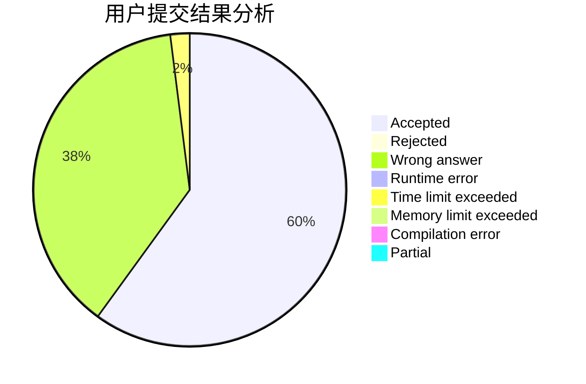
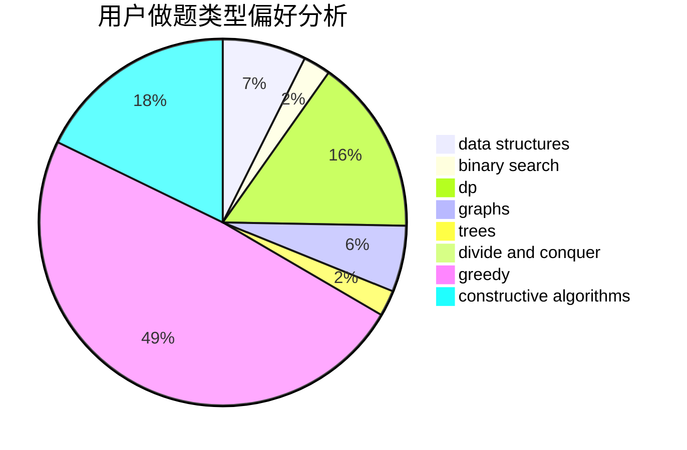
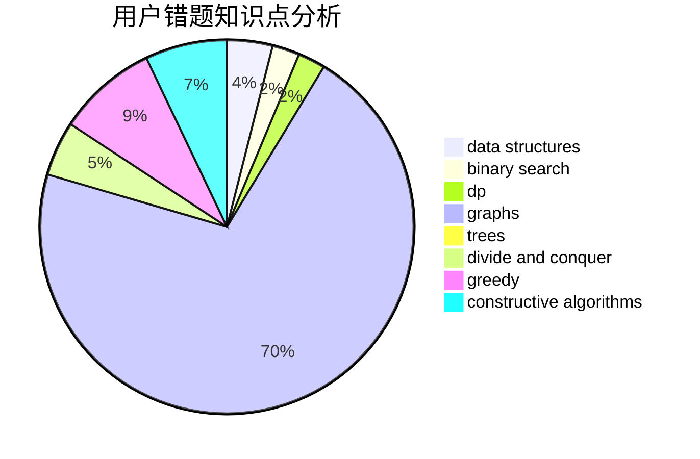

# ZhouShang0817

<!-- tabs:start -->

#### **用户提交结果分析**

#### **用户做题类型偏好分析**

#### **用户错题知识点分析**

<!-- tabs:end -->
# 推荐题目
[269C](https://codeforces.com/contest/269/problem/C)		constructive algorithms,
                        flows,
                        graphs,
                        greedy		  
[864C](https://codeforces.com/contest/864/problem/C)		greedy,
                        implementation,
                        math		  
[679E](https://codeforces.com/contest/679/problem/E)		data structures		  
[878D](https://codeforces.com/contest/878/problem/D)		bitmasks		  
[16E](https://codeforces.com/contest/16/problem/E)		bitmasks,
                        dp,
                        probabilities		  
[724F](https://codeforces.com/contest/724/problem/F)		combinatorics,
                        dp,
                        trees		  
[1423I](https://codeforces.com/contest/1423/problem/I)		bitmasks		  
[935C](https://codeforces.com/contest/935/problem/C)		geometry		  
[234A](https://codeforces.com/contest/234/problem/A)		implementation		  
[36C](https://codeforces.com/contest/36/problem/C)		geometry,
                        implementation		  
