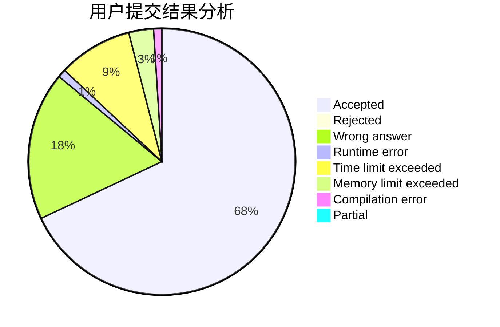
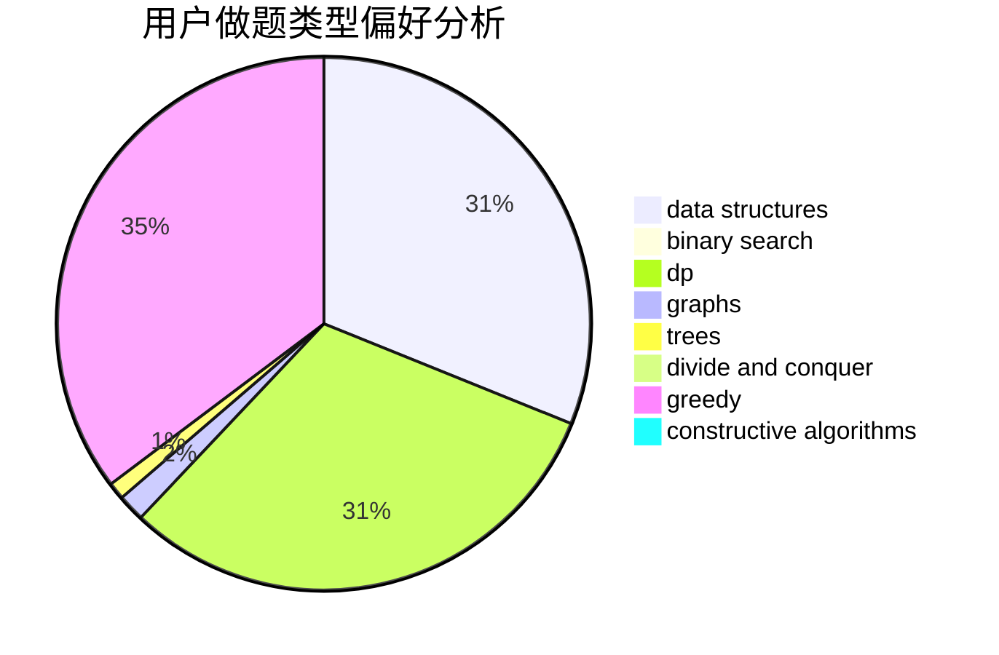
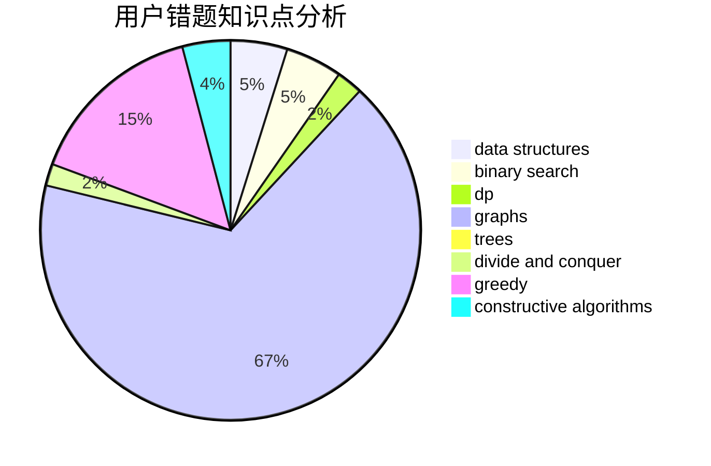

# ZhouShang2003

<!-- tabs:start -->

#### **用户提交结果分析**

#### **用户做题类型偏好分析**

#### **用户错题知识点分析**

<!-- tabs:end -->
# 推荐题目
[976E](https://codeforces.com/contest/976/problem/E)		greedy,
                        sortings		  
[611F](https://codeforces.com/contest/611/problem/F)		binary search,
                        implementation		  
[1156B](https://codeforces.com/contest/1156/problem/B)		dfs and similar,
                        greedy,
                        implementation,
                        sortings,
                        strings		  
[1339A](https://codeforces.com/contest/1339/problem/A)		brute force,
                        dp,
                        implementation,
                        math		  
[699C](https://codeforces.com/contest/699/problem/C)		dsu,graphs,sortings,trees		  
[277B](https://codeforces.com/contest/277/problem/B)		constructive algorithms,
                        geometry		  
[1201B](https://codeforces.com/contest/1201/problem/B)		greedy,
                        math		  
[825G](https://codeforces.com/contest/825/problem/G)		dfs and similar,
                        graphs,
                        trees		  
[311B](https://codeforces.com/contest/311/problem/B)		data structures,
                        dp		  
[551E](https://codeforces.com/contest/551/problem/E)		binary search,
                        data structures,
                        implementation		  
