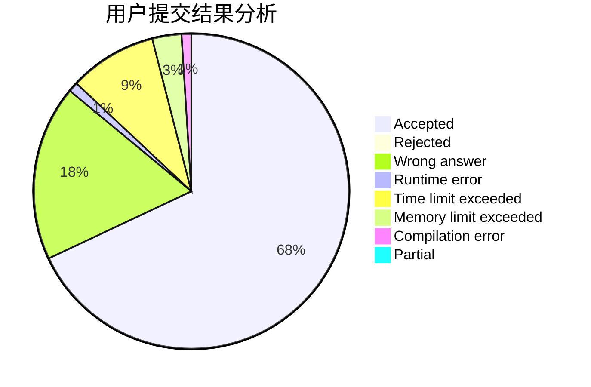
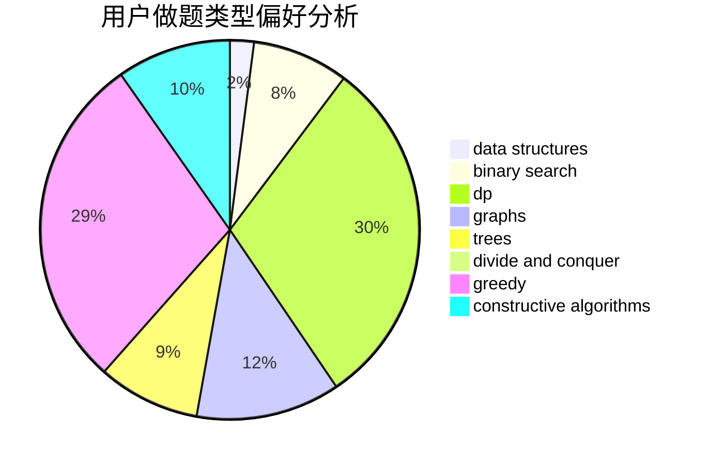
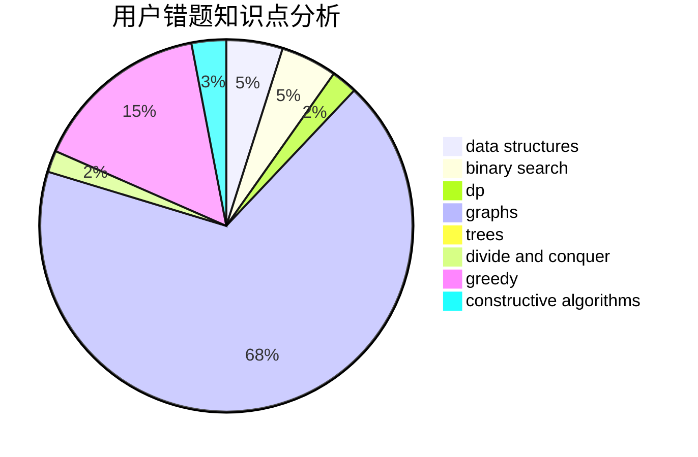

# ZhouShang2003

<!-- tabs:start -->

#### **用户提交结果分析**

#### **用户做题类型偏好分析**

#### **用户错题知识点分析**

<!-- tabs:end -->
# 推荐题目
[990D](https://codeforces.com/contest/990/problem/D)		constructive algorithms,
                        graphs,
                        implementation		  
[630J](https://codeforces.com/contest/630/problem/J)		math,
                        number theory		  
[1157G](https://codeforces.com/contest/1157/problem/G)		brute force,
                        constructive algorithms		  
[1346A](https://codeforces.com/contest/1346/problem/A)		*special problem,
                        math		  
[716B](https://codeforces.com/contest/716/problem/B)		greedy,
                        two pointers		  
[292A](https://codeforces.com/contest/292/problem/A)		implementation		  
[1205F](https://codeforces.com/contest/1205/problem/F)		constructive algorithms,
                        math		  
[845C](https://codeforces.com/contest/845/problem/C)		data structures,
                        greedy,
                        sortings		  
[334B](https://codeforces.com/contest/334/problem/B)		sortings		  
[577A](https://codeforces.com/contest/577/problem/A)		implementation,
                        number theory		  
