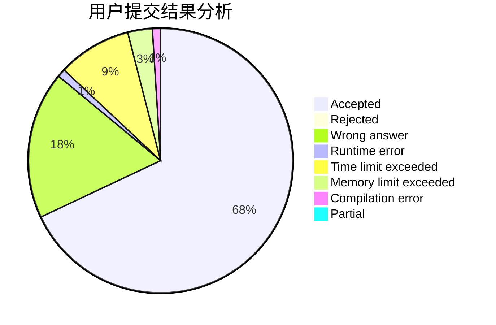
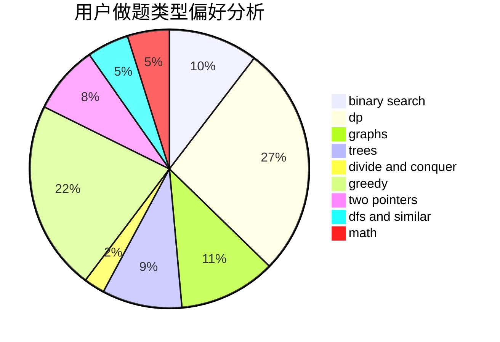

# ZhouShang2003

<!-- tabs:start -->

#### **用户提交结果分析**

#### **用户做题类型偏好分析**

<!-- tabs:end -->
# 推荐题目
[990D](https://codeforces.com/contest/990/problem/D)
[630J](https://codeforces.com/contest/630/problem/J)
[1157G](https://codeforces.com/contest/1157/problem/G)
[1346A](https://codeforces.com/contest/1346/problem/A)
[716B](https://codeforces.com/contest/716/problem/B)
[292A](https://codeforces.com/contest/292/problem/A)
[1205F](https://codeforces.com/contest/1205/problem/F)
[845C](https://codeforces.com/contest/845/problem/C)
[334B](https://codeforces.com/contest/334/problem/B)
[577A](https://codeforces.com/contest/577/problem/A)
